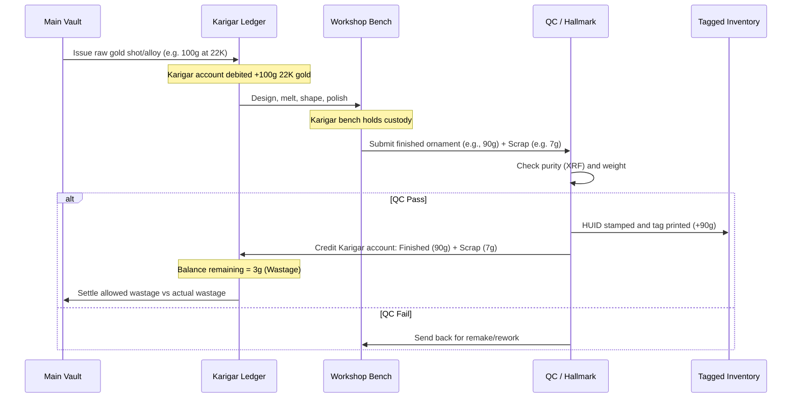
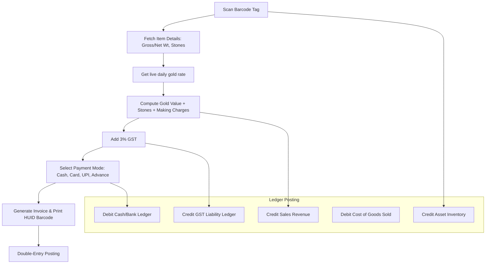
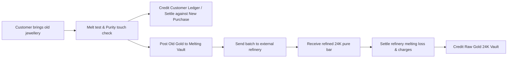

# APPIT Jewel ERP — Business Workflow Map

**Date:** 2026-08-12

This document maps the flow of physical gold and money through the systems during core transactions.

---

## 1. Manufacturing Lifecycle & Karigar Gold Flow

The lifecycle of workshop production tracks raw metal to finished, tagged jewellery:

### Metal Balancing Rules:

- **Karigar Ledger**: Maintained in pure gold equivalent (or specific Karat weights).
- **Metal Settlement**: If actual wastage exceed allowable limit (e.g. 2%), Karigar is debited with the cash equivalent of the excess gold weight, or must pay back in pure gold.

---

## 2. Retail Sale & Financial Accounting Flow

Traces how customer payments, live gold rates, and finished inventory reconcile during check-out:

---

## 3. Old Gold Exchange & Refinery Flow

Tracks old gold ornaments purchased from retail customers, melted, refined, and rolled back into the raw vault:

### Material Accounting:

1. **Old Gold Intake**: Added as `Old Gold Scrap` asset at cost price (live rate - appraiser discount).
2. **Refinery Shipment**: Transferred to WIP - Refinery (reduces Scrap inventory, debits Refinery asset account).
3. **Refinery Return**: Credits Refinery asset account with refined weight, debits Main Vault (24K Gold Bar), records refining charges as expense, melting loss as scrap loss.
