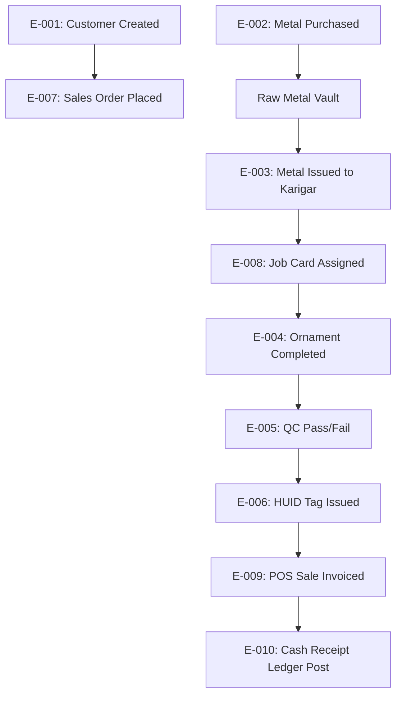
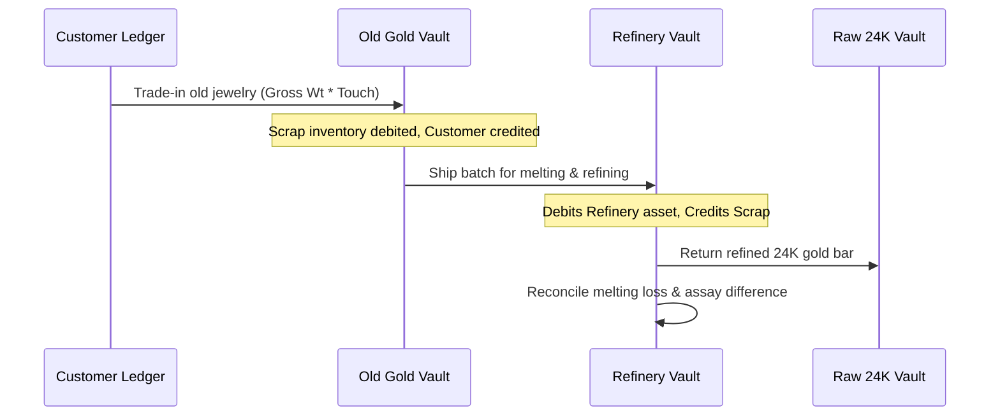
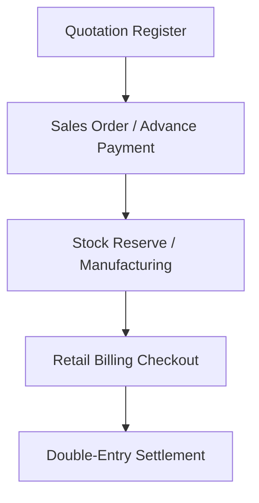
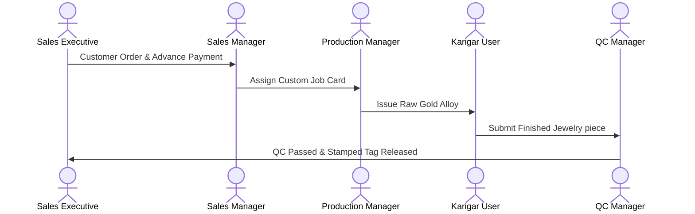
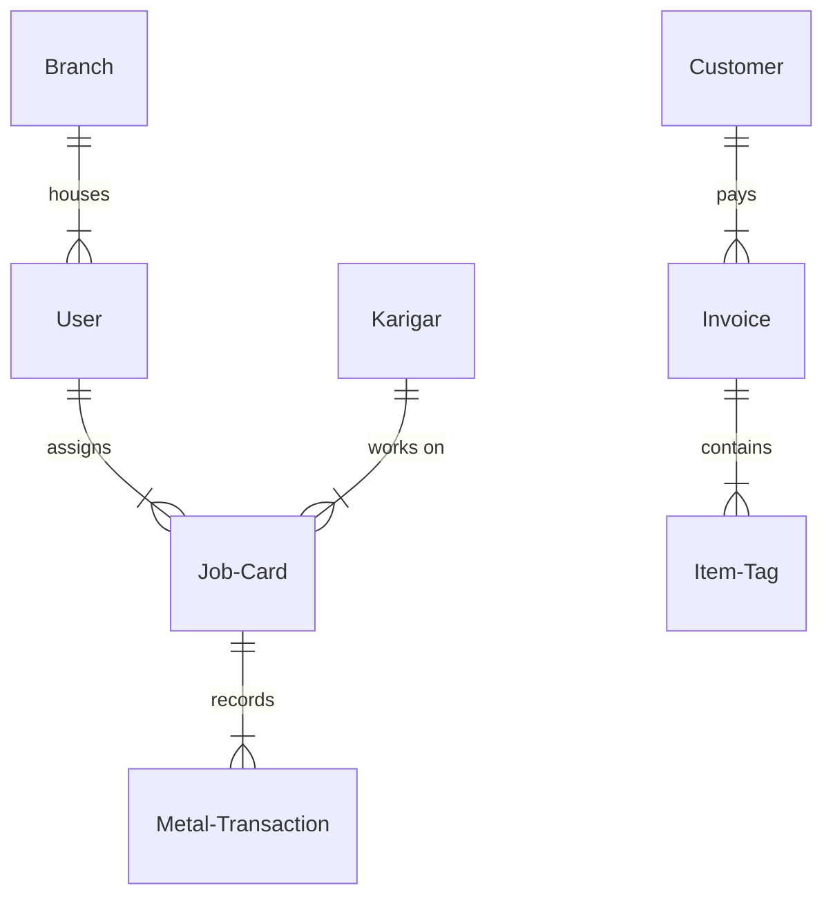

# APPIT Jewellery ERP — Complete Business Workflow Reverse-Audit

**Date:** 2026-08-12  
**Target System:** Appitsoft Jewel ERP (https://jewelerp.appitsoft.net)

---

## Executive Overview

This audit document details the operational mechanics of the **Appitsoft Jewel ERP** platform. It provides a formal system specification tracing the flow of physical metals, cash positions, organizational permissions, and exception handlers. The analysis is structured to inform the functional and technical target design of **Ornexa (AVS Gold ERP)**.

---

## 1. Role Architecture

APPIT enforces a rigid role-based access control system across 11 roles, segregating duties as follows:

- **Super Admin & Owner**: Complete system visibility. Can edit system locks, delete master records, override daily rates, and approve financial exceptions.
- **Branch Manager**: Operational supervisor for a branch. Manages daily close operations and local stock transfers.
- **Sales Manager & Sales Executive**: Handles POS checkout, custom orders, quotations, and old gold appraisals. Sales Executives are blocked from reviewing CRM dashboards and ledger totals.
- **Inventory Manager**: Custodian of vaults (raw, scrap, and finished) and is responsible for HUID tag generation and barcode printing.
- **Purchase Manager**: Places orders with bullion and stone vendors, creating goods receipt notes (GRN).
- **Production Manager**: Manages workshop job assignments, metal issues, and settlements.
- **QC Manager**: Validates finished pieces against checklists (e.g., XRF weight tests, stones seating).
- **Accountant**: Core finance controller. Reviews double-entry ledgers, manages cash/bank receipts, and processes tax returns.
- **Karigar User**: Authenticates via dynamic OTP link to view pending jobs, update statuses, and submit material returns.

---

## 2. Complete Business Event Catalogue

Traces the specific metadata, validations, calculations, and downstream effects of critical operational events:



### Event Grid & Lifecycle Specifications:

#### E-001: Customer Profile Creation

- **Who & Where**: Sales Executive or CRM Manager on `/customer-crm/customer-list`.
- **Inputs**: Customer Name, Primary Mobile, PAN Card (mandatory for transactions > ₹2,00,000), Date of Birth.
- **Validations**: Checks for duplicate mobile numbers.
- **Accounting**: None.
- **Audit Trail**: Logs creation timestamp and active executive ID.
- **Reversal**: Profile can be archived, but not deleted if linked to a posted ledger invoice.

#### E-002: Bullion Purchase Receipt (GRN)

- **Who & Where**: Purchase Manager on `/purchases/goods-receipt`.
- **Inputs**: Supplier Name, Invoice Number, Gross Weight, Touch purity %, Live Rate per gram.
- **Calculations**:
  $$\text{Fine Gold Weight} = \text{Gross Weight} \times \left(\frac{\text{Touch Purity}}{100}\right)$$
  $$\text{Taxable Value} = \text{Fine Weight} \times \text{Live Purchase Rate}$$
  $$\text{GST Input (3\%)} = \text{Taxable Value} \times 0.03$$
  $$\text{Voucher Total} = \text{Taxable Value} + \text{GST} - \text{Discounts}$$
- **Ledger Postings**:
  - Debits Raw Metal Vault (Fine weight asset increase).
  - Credits Supplier Payable Ledger (Accounts Payable cash liability).
  - Debits Input GST Tax Ledger.
- **Reversal**: Post a Purchase Return Voucher (Debit Note) linked to the GRN to offset inventory and liability.

#### E-003: Metal Issue to Karigar

- **Who & Where**: Production Manager on `/manufacturing/job-cards`.
- **Inputs**: Job Card ID, Karigar ID, Metal Type (Gold/Silver), Karat Purity, Weight Issued.
- **Validations**:
  - Blocks issue if the Karigar's outstanding balance exceeds their credit limit (e.g. 200g).
  - Blocks issue if raw inventory is insufficient.
- **Ledger Postings**:
  - Credits Raw Vault inventory.
  - Debits Karigar Workshop Bench custody ledger (no cash posting).
- **Reversal**: Material Return Voucher offsets the outstanding bench weight.

#### E-004: Finished Ornament Receipt & Settlement

- **Who & Where**: Production Manager & Accountant on `/manufacturing/job-work-settlement`.
- **Inputs**: Job Card Reference, Finished Weight, Scrap Returned, Allowed Wastage %, Making Labor Rate.
- **Calculations**:
  $$\text{Actual Loss} = \text{Issued Weight} - (\text{Finished Weight} + \text{Scrap Returned})$$
  $$\text{Allowed Loss} = \text{Finished Weight} \times \text{Allowed Wastage \%}$$
  $$\text{Variance (Excess Loss)} = \text{Actual Loss} - \text{Allowed Loss}$$
- **Ledger Postings**:
  - Credits Karigar Bench Custody (Finished Weight + Scrap Weight + Allowed Loss).
  - Debits Finished Vault (Finished Wt) and Scrap Vault (Scrap Wt).
  - Debits Karigar labor ledger for making charge payable.
  - If Variance > 0: Debits Karigar cash ledger for variance $\times$ daily rate.
- **Reversal**: Restructure job settlement via supervisor override.

---

## 3. Gold Lifecycle (Follow-the-Gram)

To trace **one gram of gold** from intake to checkout, the system tracks parameters at every transition:

```
Supplier GRN
  --> Raw Metal Vault (Fine Gold, Available)
  --> Issue to Karigar (Gross/Fine, WIP)
  --> Finished Ornament Received (Gross/Net, QC/Lock)
  --> Hallmark/HUID (Net Wt, Registered/HUID Stamped)
  --> Finished Stock (Tagged, Available)
  --> Retail Checkout POS (Sold)
```

| Lifecycle Stage   | Physical Weight (g) | Recorded Purity | Calculated Fine Weight | Metal Ownership | Physical Custody   | Valuation Attachment      |
| ----------------- | ------------------- | --------------- | ---------------------- | --------------- | ------------------ | ------------------------- |
| **Intake (GRN)**  | 100.000g (Gross)    | 99.9% (24K)     | 99.900g                | Company         | Vault              | ₹7,31,600 (Purchase Cost) |
| **Alloy Mixing**  | 109.000g (Gross)    | 91.6% (22K)     | 99.844g                | Company         | Vault              | Reference rate only       |
| **Issue to Job**  | 50.000g (Gross)     | 91.6% (22K)     | 45.800g                | Company         | Karigar            | Reference rate only       |
| **Finished Item** | 48.000g (Net)       | 91.6% (22K)     | 43.968g                | Company         | Workshop Manager   | reference rate only       |
| **Hallmark Out**  | 48.000g (Net)       | 91.6% (22K)     | 43.968g                | Company         | Hallmark Center    | reference rate only       |
| **Tagged Stock**  | 48.000g (Net)       | 91.6% (22K)     | 43.968g                | Company         | Store Display Case | ₹3,21,792 (Retail Asset)  |
| **POS Checkout**  | 48.000g (Net)       | 91.6% (22K)     | 43.968g                | Customer        | Customer           | ₹3,41,000 (Invoice Sale)  |

---

## 4. Manufacturing & Karigar Lifecycle

The Karigar workflow manages metal accountability and labor settlements:

- **Issued Gross & Fine**: Calculated automatically upon material release.
- **Allowed vs. Actual Wastage**: Reconciled during the settlement event.
- **Labour Payable**: Computed on either a flat, per-gram, or percentage basis, and credited to the Karigar's ledger.
- **Partial Return Handling**: If a Karigar returns 5 out of 10 items on a single job, the system registers a **Partial Receipt Voucher**. The Karigar's outstanding weight balance is credited for the completed pieces and scrap returned, while the remaining items stay on the active job card.

---

## 5. Production Process Flow & Stages

APPIT implements a configurable manufacturing pipeline. The standard workflow progresses through the following stages:

```
[Designing] ──> [Wax / CAD] ──> [Casting] ──> [Filing] ──> [Setting] ──> [Polishing] ──> [QC]
```

- **Handoff Rules**: Each stage transfer requires the initiator to record: **Net weight**, **Item count**, **Receiving artisan**, and **Timestamp**.
- **Wastage Audits**: Scrap and dust losses are logged per process. If cumulative process loss exceeds the allowed stage deviation, the pipeline blocks transfer until approved by the Production Manager.

---

## 6. Loss, Wastage, & Recovery Engine

The calculation engine accounts for metal deviations during production:

### Example Scenario:

- **Gold Issued**: 10.000 g
- **Finished Return**: 9.800 g
- **Scrap Recovered**: 0.100 g
- **Allowed Wastage (1.5%)**: 0.147 g
- **Calculations**:
  - $\text{Actual Loss} = 10.000 - (9.800 + 0.100) = \text{0.100g}$
  - $\text{Allowed Loss Limit} = 9.800 \times 0.015 = \text{0.147g}$
  - $\text{Variance} = 0.100 - 0.147 = \text{-0.047g}$ (Within limit)

### Deviation Categorization:

- **Normal / Allowed Wastage**: Absorbed by the company as a manufacturing expense and factored into finished inventory cost valuation.
- **Excess Loss / Variance**: If the variance is positive (e.g. actual loss > allowed loss), the difference is debited to the Karigar's metal ledger.
- **Dust Recovery**: Recovered sweepings are posted to the raw scrap vault during weekly workshop cleaning.

---

## 7. Old Gold to Refinery Workflow

This workflow manages customer trade-ins and refinery processing:



- **Ownership**: Transfers to the company immediately upon appraisal approval and customer signature.
- **Appraisal Math**:
  $$\text{Net Pure Gold} = (\text{Gross Weight} - \text{Melting Loss}) \times \text{Appraised Touch \%}$$
  $$\text{Customer Credit Value} = \text{Net Pure Gold} \times (\text{Live 24K Rate} - \text{Markdown Margin})$$

---

## 8. QC & Hallmark Workflow

Quality Control and Hallmarking ensure compliance and retail readiness:

### 8.1. QC Pipeline:

- **QC Fail**: Redirected to a rework pipeline. The Production Manager can either assign it to the same Karigar (retaining original job card history) or scrap the item and charge the Karigar for metal loss.
- **QC Pass**: Releases the item for HUID barcoding and tag printing.

### 8.2. Hallmark Workflow:

- **Transit Tracking**: When shipped to the hallmark center, the status of the item is marked as `Transit - Hallmark`. Physical custody is transferred to the hallmark vendor ledger.
- **HUID Stamp**: Upon return, the unique 6-character HUID is recorded against the item record before moving it to `Finished Tagged Stock`.

---

## 9. Purchase & Vendor Workflows

APPIT segregates purchase operations into:

1.  **Bullion Purchases**: Increases raw metal inventory (Gold/Silver in grams).
2.  **Jewellery Purchases**: Procures finished tagged stock from manufacturers.
3.  **Diamonds & Stones**: Stocked by count and carat, and issued to workshop jobs.

- **Ownership Transfer**: Takes place upon GRN validation, updating stock balances.

---

## 10. Sales & Customer Order Workflows

Tracks the retail customer purchase journey:



- **Rate Locking**: Customers can lock gold rates by paying a configured advance (typically 10% to 50%). If rates rise, the lock rate is applied; if rates drop, settings dictate whether the lower rate is used.
- **Discounts**: Restricted by role thresholds:
  - Sales Executive: Up to 2% on making charges.
  - Sales Manager: Up to 10% on making charges.
  - Owner/Super Admin: Unlimited.

---

## 11. Rate / Bhav Workflow

- **Historical Consistency**: When a daily metal rate changes, historical transactions retain their original locked rates.
- **Purity Mappings**: Buying and selling rates are mapped per Karat purity (24K, 22K, 18K) based on the daily bullion rate.

---

## 12. Branch Transfer & In-Transit Workflows

- **In-Transit State**: When Branch A transfers stock to Branch B, the items are marked as `Transit - Branch`. They are deducted from Branch A's available stock but do not appear in Branch B's inventory until Branch B scans and accepts them.
- **Discrepancies**: If Branch B records a weight mismatch during receiving, the system flags a **Stock Discrepancy Exception**, requiring approval from the Owner.

---

## 13. Accounting Posting Map

Details the double-entry accounting effects for core events:

| Business Event    | Financial Ledger | Metal Ledger       | Inventory Stock     | Party Balance     | GST Tax Posting    |
| ----------------- | ---------------- | ------------------ | ------------------- | ----------------- | ------------------ |
| **Gold Purchase** | No Cash effect   | Debits Raw Vault   | Raw Gold increase   | Credits Supplier  | Debits GST Input   |
| **Metal Issue**   | No Cash effect   | Credits Raw Vault  | Raw Gold decrease   | Debits Karigar Wt | None               |
| **Sale Invoice**  | Credits Revenue  | None               | Credits Finished    | Debits Customer   | Credits GST Output |
| **Old Gold In**   | Credits Advance  | Debits Scrap Vault | Scrap Gold increase | Credits Customer  | None               |

---

## 14. Document Flow & Share Lifecycle

- **Formats**: System generates standard PDF formats for Tax Invoices, Metal Issue Memos, and Customer Receipts.
- **Share Engine**: Native integrations support sharing invoices directly via WhatsApp API or email.
- **Revisions**: Document cancellations or revisions generate a linked credit/debit memo, preserving the original invoice history for audit purposes.

---

## 15. Approval Engine & Thresholds

An action-driven engine validates transactions against role authorization levels:

```
[Sales Executive Discount request]
  ──> Check threshold limit (e.g. 2%)
  ──> If exceeded, suspend transaction
  ──> Push notification to Manager Dashboard
  ──> Manager approves/denies
  ──> Release/Cancel checkout
```

| Action                     | Initiator          | Approval Threshold    | Approver               |
| -------------------------- | ------------------ | --------------------- | ---------------------- |
| **Making Charge Discount** | Sales Executive    | $> 2\%$               | Sales Manager          |
| **Invoice Cancellation**   | Sales Executive    | All requests          | Branch Manager / Owner |
| **Metal Issue Over Limit** | Production Manager | Exceeds Karigar limit | Owner                  |
| **Manual Ledger Adjust**   | Accountant         | All requests          | Owner / Super Admin    |

---

## 16. Exception Workflows

Safeguards to handle exceptions and operational errors:

- **Wrong Weights**: If actual finished weights deviate from expected weights by more than a configured tolerance (e.g. $\pm 0.5\%$), the settlement voucher is flagged for review.
- **Negative Vault Balances**: System blocks sales checkouts or workshop issues that would result in a negative vault balance.
- **QC / Hallmark Rejections**: Rejected items are flagged as `QC Fail` and cannot be moved to finished tagged stock. They must be routed through a rework workflow or marked as scrap.

---

## 17. Role Swimlanes & Handoff Map

The flow of a custom retail order through the organization's roles:



---

## 18. Notifications & Follow-up Flows

- **Karigar Overdue**: Automated alerts trigger on the dashboard when a job card exceeds its expected completion date.
- **Low Stock Alerts**: Notifications trigger when raw metal vaults or specific finished jewelry categories fall below safety thresholds.

---

## 19. AI Copilot & Automated Intelligence

- **Dashboard Queries**: The AI Copilot panel answers natural-language business queries (e.g., "Which Karigar has the highest outstanding gold balance?").
- **Delay Risk Model**: An algorithm estimates delay risk percentages on job cards based on worker history and job priority.

---

## 20. Automation Map

- **Trigger-Action Rules**:
  - _Low Stock Trigger_: Generates draft purchase orders when inventory falls below minimum levels.
  - _Payment Pending Trigger_: Sends automated reminders to customers with outstanding balances on custom orders.

---

## 21. Business Data Relationships

Conceptual relationship map derived from system workflows:



---

## 22. Workflow Score Card

| Workflow Vector           | Score (1-10) | Evaluation & Notes                                           |
| ------------------------- | :----------: | ------------------------------------------------------------ |
| **Gold Weight Lifecycle** |      8       | Good tracking of raw to finished weights.                    |
| **Karigar Accounting**    |      9       | Metal and cash balances are tracked accurately.              |
| **Sales & Billing POS**   |      8       | Responsive billing calculations.                             |
| **Refinery Batches**      |      6       | Simple ledger postings; lacks step-by-step custody tracking. |
| **Exceptions Audit**      |      8       | Prevents negative balances and enforces limits effectively.  |

- **Copy the Principle**: Implement the dual-currency cash and metal ledger accounting design.
- **Improve**: Streamline the multi-stage refinery tracking interface.
- **Do Differently**: Keep core accounting logic deterministic rather than relying on generative model predictions.

---

## 23. Recommended Ornexa Target Workflows

### 23.1. Old Gold Melt Appraisal Integration:

- **Proposed Target**: Build the appraisal calculator directly into the checkout sales screen, allowing trade-ins to automatically reduce invoice totals.

### 23.2. Automated Refinery Batches:

- **Proposed Target**: Implement a dedicated module to manage scrap shipments, tracking refining losses and returning pure bars under secure custodian control.
