# APPIT Jewellery ERP — Complete Reverse-Audit Report
**Date:** 2026-08-12  
**Target System:** Appitsoft Jewel ERP (https://jewelerp.appitsoft.net)  
**Access Level:** Owner (Rahul Sharma · Trial Instance)  

---

## 1. Executive Summary & Architecture Analysis

Appitsoft Jewel ERP is a cloud-based, premium SPA (Single Page Application) software package designed for modern retail and wholesale jewellery operations. 

This audit report reverse-engineers the platform's core functional footprints, role boundaries, mathematical calculations, and transaction ledgers to serve as a design guide for the **Ornexa (AVS Gold ERP)** platform.

---

## 2. Visual Sitemap & Navigation Tree

The application is structured into the following menu hierarchy, dynamically available based on user permissions:

```mermaid
graph TD
    Root[Dashboard /] --> SB[Sales & Billing]
    Root --> INV[Inventory]
    Root --> PUR[Purchases]
    Root --> MFG[Manufacturing]
    Root --> PD[Products & Designs]
    Root --> MR[Metal & Rates]
    Root --> DG[Diamonds & Gemstones]
    Root --> CRM[Customers & CRM]
    Root --> CO[Custom Orders]
    Root --> REP[Repairs & Services]
    Root --> FIN[Finance]
    Root --> OGE[Old Gold & Exchange]
    Root --> HQC[Hallmark & QC]
    Root --> BRM[Branch Management]
    Root --> HR[HRMS]
    Root --> RP[Reports & Analytics]
    Root --> AI[AI Intelligence]
    Root --> ADM[Administration]

    SB --> SB1[New Sale /sales-billing/new-sale]
    SB --> SB2[Quotations /sales-billing/quotations]
    SB --> SB3[Sales Orders /sales-billing/sales-orders]
    SB --> SB4[Cross Branch Sales]
    SB --> SB5[Invoices /sales-billing/invoices]
    SB --> SB6[Returns & Exchanges]

    INV --> INV1[Finished Jewellery /inventory/finished-jewellery]
    INV --> INV2[Metal Inventory /inventory/metal-inventory]
    INV --> INV3[Diamonds & Stones /inventory/diamonds-stones]
    INV --> INV4[Loose Components]
    INV --> INV5[Stock Movement]

    MFG --> MFG1[Production Orders /manufacturing/production-orders]
    MFG --> MFG2[Job Cards /manufacturing/job-cards]
    MFG --> MFG3[Karigar Management /manufacturing/karigar-management]
    MFG --> MFG4[Work in Progress]
    MFG --> MFG5[Job Work Settlement /manufacturing/job-work-settlement]

    MR --> MR1[Daily Metal Rates /metal-rates/daily-metal-rates]
    MR --> MR2[Purity Master /metal-rates/purity-master]
    MR --> MR3[Metal Ledger /metal-rates/metal-ledger]
    MR --> MR4[Rate History /metal-rates/rate-history]

    CRM --> CRM1[Customer Dashboard]
    CRM --> CRM2[Customer List /customer-crm/customer-list]
    CRM --> CRM3[Gold Saving Schemes /customer-crm/gold-saving-schemes]
    CRM --> CRM4[Digital Vault /customer-crm/digital-vault]

    FIN --> FIN1[Receipts & Payments /finance/receipts-payments]
    FIN --> FIN2[Expenses /finance/expenses]
    FIN --> FIN3[Customer Ledger /finance/customer-ledger]
    FIN --> FIN4[Supplier Ledger /finance/supplier-ledger]
    FIN --> FIN5[Financial Reports /finance/financial-reports]

    OGE --> OGE1[Old Gold Purchase /old-gold-exchange/old-gold-purchase]
    OGE --> OGE2[Exchange /old-gold-exchange/exchange]
    OGE --> OGE3[Valuation /old-gold-exchange/valuation]
    OGE --> OGE4[Refining /old-gold-exchange/refining]

    HQC --> HQC1[Hallmark Requests /hallmark-qc/hallmark-requests]
    HQC --> HQC2[HUID Records /hallmark-qc/huid-records]
    HQC --> HQC3[Quality Inspection]

    ADM --> ADM1[Users & Roles /administration/users-roles]
    ADM --> ADM2[Masters /administration/masters]
    ADM --> ADM3[System Settings /administration/system-settings]
```



---

## 3. Core Module Audits

### 3.1. Sales & Billing (`/sales-billing/new-sale`)
* **Purpose**: Pos interface for generating retail tax invoices.
* **Fields**: Customer search, Product search, Discount (%), Old Gold Adjustment, Advance Adjustment, Tax (3% GST).
* **Payment Modes**: Cash, Card, UPI, Bank Transfer, Split.
* **Actions**: Hold Sale, Save Draft, Print Preview, Generate Invoice.
* **Calculations**:
  $$\text{Subtotal} = \text{Gold Value} + \text{Diamond/Stone Value}$$
  $$\text{Taxable Value} = \text{Subtotal} + \text{Making Charges} + \text{Wastage} - \text{Discounts}$$
  $$\text{GST (3\%)} = \text{Taxable Value} \times 0.03$$
  $$\text{Grand Total} = \text{Taxable Value} + \text{GST} - \text{Adjustments}$$

### 3.2. Manufacturing (`/manufacturing/job-cards`)
* **Purpose**: Tracks jewellery items through the workshop production lifecycle.
* **Lifecycle Stages**: Design $\rightarrow$ Metal Issue $\rightarrow$ Karigar Work $\rightarrow$ Stone Setting $\rightarrow$ Polishing $\rightarrow$ QC $\rightarrow$ Completed.
* **Drawer Panel Fields**: Karigar name, Metal/Purity (e.g. Gold 22K), Priority (High/Medium/Low), Expected Wt, Actual Wt, Metal Issued, Stone Issued, Wastage %, Scrap Recovery, Labour Charge.
* **AI Delay Prediction**: Built-in risk engine calculating delay probabilities based on Karigar historical on-time statistics and job priority.

### 3.3. Metal & Rates (`/metal-rates/daily-metal-rates`)
* **Purpose**: Central rate-cut control center.
* **Rates Tracked**: Gold 24K, Gold 22K, Gold 18K, Gold 14K, Silver (92.5), Platinum 950.
* **Analytics**: Trend analysis, Margin impact analysis, Rate-based pricing recommendations.
* **Branch-wise Rates**: Support setting different rates per branch.

### 3.4. Old Gold & Exchange (`/old-gold-exchange/old-gold-purchase`)
* **Purpose**: Purchasing old gold from retail customers.
* **Fields**: Customer, Item type, Gross Wt, Purity (Karat/touch), Net Pure Wt, Est. Value, Stage.
* **Business Rules**:
  - Buying rate has a pre-configured discount/reduction (typically ~1.5% - 2%) compared to the live 24K selling rate.
  - Net Pure Wt is computed by applying the touch factor and subtracting dirt/loss margins.

### 3.5. Finance (`/finance/receipts-payments`)
* **Purpose**: Registers non-sales monetary and metal transactions.
* **Modes**: UPI, Card, Cash, Bank Transfer.
* **Running Balances**: Tracks cash flows and net positions across branches.

---

## 4. End-to-End Business Workflows

Appitsoft Jewel ERP implements the following standard jewellery workflows:

### Workflow A: Old Gold Purchase & Melting
```
Customer brings old jewellery 
  --> Appraiser checks purity (karat/touch)
  --> Appraiser weighs gross wt and inputs dirt reduction
  --> System calculates Net Pure Gold weight: Gross Wt * Touch %
  --> System applies old-gold purchase rate (24K Rate - Appit Margin)
  --> Payout generated via Cash/Bank or credited as Customer Advance
  --> Gold marked as Raw/Melt Scrap in Inventory
```

### Workflow B: Manufacturing & Job-Work Settlement
```
Sales Order placed/Inventory Reorder triggered 
  --> Job Card created, assigned to Karigar (e.g., Ramesh Suthar)
  --> Gold issued from Vault (e.g. 24K Gold or pre-alloyed 22K shot)
  --> Karigar works on design (Design -> Metal Issue -> Karigar Work -> Polishing)
  --> Stones issued (rubies/diamonds) and set
  --> Finished ornament weighed; actual wastage and scrap collected
  --> QA Inspection (HUID stamped)
  --> Job Work Settlement: Karigar account credited with making charges (Labour)
  --> Difference in gold (Issued gold vs. Finished + Scrap + Wastage limit) settled
```

---

## 5. Comparative Capability Matrix (APPIT vs. Ornexa/AVS)

| Feature Area | APPIT Jewel ERP | Ornexa (AVS Gold ERP) | Parity Verdict |
|--------------|-----------------|----------------------|----------------|
| **Core Accounting** | Single currency cash entries | **Dual-currency (Cash + Gold Mg)** | **BETTER IN ORNEXA** |
| **Wastage Settings** | Fixed percentage per karigar | Process-wise wastage & stone-loss formulas | **BETTER IN ORNEXA** |
| **HUID Records** | Manual registration fields | Unified barcode + automatic HUID tags | **BETTER IN ORNEXA** |
| **Daily close** | Simple Day Book close | Multi-department vault close with reconciliation | **BETTER IN ORNEXA** |
| **Metal Credit Limits** | None / Warning only | Enforced limit check blocking issues | **BETTER IN ORNEXA** |
| **Karigar Portal** | None (Karigar management admin only) | **Self-Service OTP Portal** | **BETTER IN ORNEXA** |
| **GST & Invoice Print** | Basic templates | Print-dialog bypass (hidden iframe) & Tally XML | **BETTER IN ORNEXA** |
| **AI Insights** | Built-in Delay Prediction | Local sales assistant brain | **PARTIAL / PARITY** |

---

## 6. Design Recommendations for Ornexa

1. **Clean UI & Navigation**: Follow the dark, high-contrast, premium interface styling of APPIT, utilizing clean, readable components (e.g. Outfit/Inter fonts, rounded borders, clear indicators).
2. **Branch-wise Rates**: Implement a configuration matrix inside `settings-store.ts` allowing different rate-cuts to be pushed to specific branches (e.g. Jubilee Hills vs. Hyderabad Main).
3. **Appraiser Discount Engine**: Add a configurable discount setting for old-gold purchases (e.g., a markdown percentage applied to the live 24K rate).
4. **AI Dashboards**: Continue to integrate the Local Assistant Brain to query ledger anomalies, inventory stock turn, and karigar performance trends in real-time.
