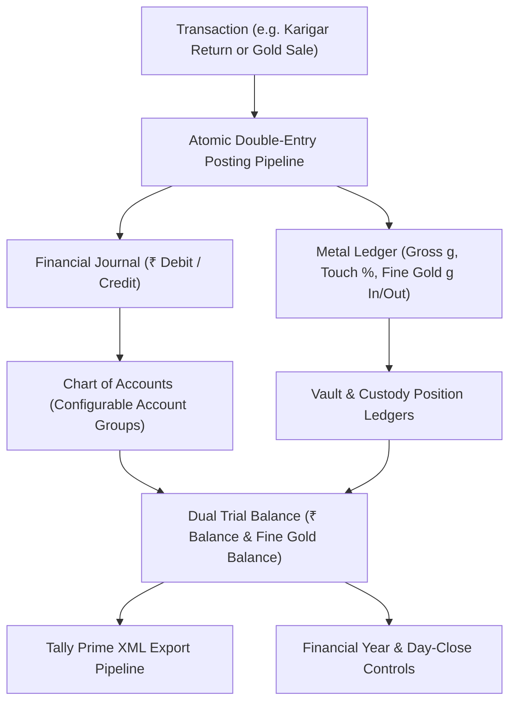
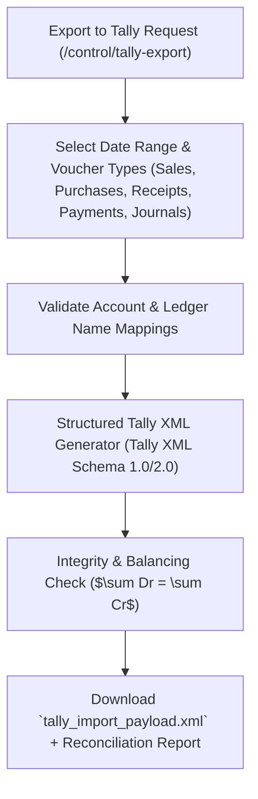

# ORNEXA — ACCOUNTING, PERIOD CONTROLS & TALLY EXPORT MASTER
**Authoritative Architectural Specification for Dual Cash/Metal Ledgers, Configurable Account Groups, Period Locks, and Structured Tally XML Interoperability**
*Version: 3.1.0 (Approved Source of Truth)*
*Last Updated: August 2026*

---

## 1. Dual Cash & Metal Accounting Architecture

### 1.1 The Core Operating Principle
> **"ORNEXA MAINTAINS PARALLEL DOUBLE-ENTRY BOOKKEEPING FOR MONETARY CURRENCY (₹) AND PHYSICAL PRECIOUS METALS (GROSS GRAMS & FINE GOLD GRAMS)."**
>
> In the jewellery trade, bullion dealers, wholesale manufacturers, and karigars frequently settle transactions in physical metal grams rather than currency. Ornexa integrates metal accounting into standard chart-of-accounts bookkeeping without creating disconnected ledgers.

---

## 2. Configurable Account Groups & Chart of Accounts

While routine party creation auto-generates underlying ledgers, the accounting engine supports customizable, nested **Account Groups (`/control/accounts`)**:

| Primary Nature | Core Standard Account Groups | Typical Child Groups in Jewellery ERP |
|---|---|---|
| **Assets** | `Current Assets`, `Fixed Assets`, `Investments` | `Cash-in-Hand`, `Bank Accounts`, `Sundry Debtors`, `Finished Tag Stock`, `Raw Gold Bullion Vault`, `Workshop WIP Stock`, `Gold with Karigars`, `Gold at Refinery` |
| **Liabilities** | `Current Liabilities`, `Loans & Advances`, `Capital` | `Sundry Creditors`, `Supplier Metal Payable`, `Customer Metal Deposits`, `Karigar Labour Payable`, `GST Payable (CGST/SGST/IGST)`, `TDS Payable` |
| **Income** | `Direct Income (Trading)`, `Indirect Income` | `Gold Jewellery Sales`, `Diamond Studded Sales`, `Making Charges Revenue`, `Melting Recovery Surplus`, `Discount Received` |
| **Expenses** | `Direct Expenses (COGS)`, `Operating Expenses` | `Gold Bullion Purchases`, `Old Gold Purchase Cost`, `Artisan Labour / Making Cost`, `Outside Processing (Mina/Polish)`, `Hallmark Charges`, `Showroom Rent & Salaries` |

---

## 3. Financial Year, Day-Close & Period Controls

To guarantee compliance and eliminate retrospective fraud, Ornexa enforces strict time-boundary controls:

### 3.1 Financial Year Lifecycle
- **Active Financial Year:** (e.g. `2026-2027` from *01-Apr-2026* to *31-Mar-2027*).
- **Year-End Carry Forward:** Closing financial ledger balances, metal gram balances, and active inventory tags automatically roll over into the opening position of the next financial year.

### 3.2 Period Locks & Day-Close Checklists
1. **Daily Day-Close Gate:** At the end of each business day, the cashier/vault officer runs the **Day Close Wizard**:
   - Reconciles physical drawer cash vs system cash book balance.
   - Reconciles physical vault safe scale weight vs system gold book balance.
   - Generates and locks the Daily Day Sheet.
2. **Freeze Before Date (Period Lock):** Administrators can freeze past records (e.g. *Freeze all transactions prior to 30-June-2026*).
3. **Controlled Reopen Protocol:** Modifying a frozen transaction requires CEO / Partner multi-factor authentication, and records an unalterable audit log entry stating user, timestamp, old values, new values, and explicit justification.

---

## 4. Structured Tally Prime XML Export Pipeline

Ornexa provides enterprise-grade accounting interoperability with **Tally Prime**:

### 4.1 Exported Voucher Mapping Schema
- **Sales Invoices:** Maps to Tally `Sales` voucher class, splitting line items into `Sales Ledger`, `Making Charges Ledger`, and statutory `Output CGST / SGST / IGST` accounts.
- **Purchase Vouchers:** Maps to Tally `Purchase` voucher class, linking vendor credits to `Input CGST / SGST / IGST` tax ledgers.
- **Payment & Receipt Vouchers:** Maps to Tally `Payment` and `Receipt` vouchers, including bank reference numbers and Cheque/NEFT clearing dates.
- **Journal & Metal Conversion Vouchers:** Maps to standard Tally `Journal` entries.
- **Reconciliation Audit Sheet:** Accompanies the XML export, allowing external Chartered Accountants to verify total debits, credits, and tax totals against Ornexa's internal Trial Balance.
