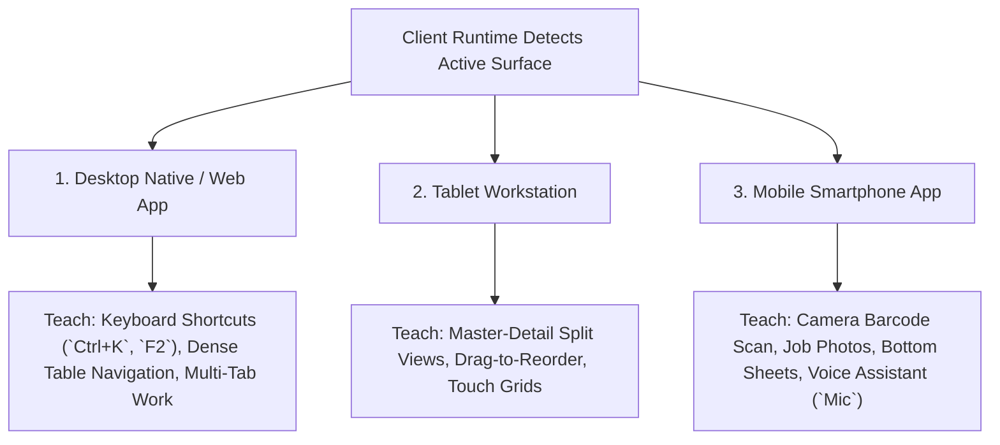

# ORNEXA — ADAPTIVE TUTORIAL & PORTAL ONBOARDING MASTER
**Authoritative Architectural Specification for Device-Specific Tutorial Ergonomics, Portal Onboarding, and Dynamic Terminology Binding**
*Version: 3.3.0 (Approved Source of Truth)*
*Last Updated: August 2026*

---

## 1. Intentional Device-Specific Tutorial Ergonomics

### 1.1 The Core Operating Principle
> **"TUTORIAL OVERLAYS ARE INTENTIONALLY CRAFTED FOR EACH DEVICE SURFACE. DESKTOP TUTORIALS NEVER DUMP PHONE POPUPS, AND MOBILE APPS NEVER SHOW DESKTOP KEYBOARD TOOLTIPS."**



---

## 2. External Subsystem Portal Onboarding

External portal users receive lightweight, specialized onboarding when first accepting an invitation:

| External Portal Surface | Primary Onboarding Milestones Taught | Technical Constraint |
|---|---|---|
| **Customer VIP Portal (`/customer/*`)** | View pending orders, Review & Approve CAD 3D renders, Download GST invoices, Pay via UPI | ❌ No AI Chatbot Overlay<br>Simple, elegant, brand-focused |
| **Karigar Workshop Portal (`/karigar/*`)** | View assigned job bags, Accept metal custody, Log stage completion, Submit scrap/returns | ❌ No AI Chatbot Overlay<br>High-contrast, large touch buttons |
| **Supplier Bullion Portal (`/supplier/*`)**| Confirm purchase orders, Submit dispatch challans, View payment statement | ❌ No AI Chatbot Overlay<br>Clean B2B trade layout |

---

## 3. Dynamic Terminology & Trade Pack Binding

Tutorial content never uses hardcoded business words. Every string dynamically resolves through the **Terminology Engine** defined in [`JEWELLERY_TERMINOLOGY_MASTER.md`](./JEWELLERY_TERMINOLOGY_MASTER.md):

```
┌─────────────────────────────────────────────────────────────────────────────┐
│                    TUTORIAL VOCABULARY ADAPTATION                           │
├──────────────────────────────────────┬──────────────────────────────────────┤
│ 🇮🇳 INDIAN JEWELLERY TRADE PACK       │ 🌐 INTERNATIONAL STANDARD PACK       │
├──────────────────────────────────────┼──────────────────────────────────────┤
│ • "Step 4: Issue 24K to the Karigar" │ • "Step 4: Issue 24K to the Worker"  │
│ • "Step 6: Confirm today's Bhav"     │ • "Step 6: Confirm today's Gold Rate"│
│ • "Step 8: Review Worker's Hisab"    │ • "Step 8: Review Worker Settlement" │
│ • "Step 12: Verify Ghat Allowance"   │ • "Step 12: Verify Wastage Allowance"│
└──────────────────────────────────────┴──────────────────────────────────────┘
```
