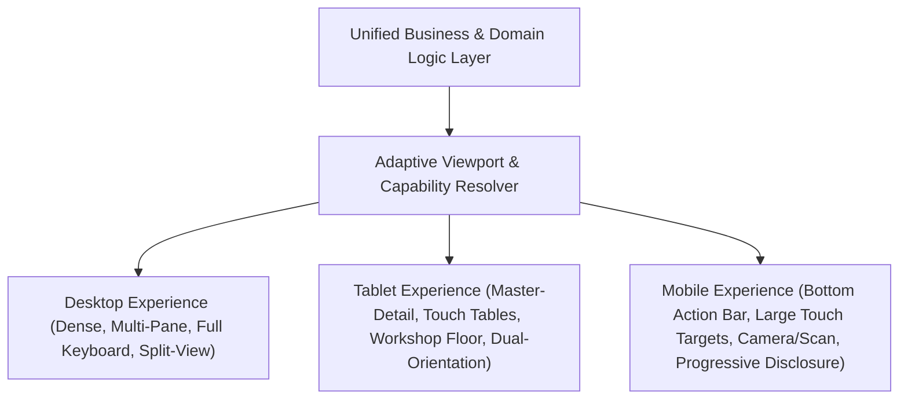

# ORNEXA — ADAPTIVE UI & DEVICE-SPECIFIC EXPERIENCE MASTER
**Authoritative Architectural Specification for Desktop, Tablet, Mobile, and Unified Design Systems**
*Version: 3.1.0 (Approved Source of Truth)*
*Last Updated: August 2026*

---

## 1. Intentional Device-Class Architecture

### 1.1 The Core Operating Principle
> **"EVERY DEVICE CLASS SHOULD RECEIVE AN INTENTIONALLY DESIGNED UI, NOT A SHRUNK VERSION OF ANOTHER UI."**
>
> Desktop, Tablet, and Mobile are **three distinct ergonomic operational models**, not one single responsive layout stretched or squeezed into arbitrary widths.

---

## 2. Desktop Experience: High-Efficiency Professional ERP

Desktop ERP is engineered for professional, all-day continuous operation by accountants, managers, vault operators, and administrators.

### 2.1 Key Desktop Ergonomics
- **Dense Professional Tables:** High row density (32px / 36px row heights), sortable/filterable multi-column headers, fixed header scrolling, and column width customization.
- **Split Panes & Resizable Panels:** Side-by-side ledger inspection, order slip details alongside line-item entry, and resizable transaction drawers.
- **Context Menus & Right-Click:** Safe contextual actions (Duplicate, Print Preview, View Ledger, Re-print Barcode) without obscuring primary workflows.
- **Multi-Column High-Speed Forms:** 3-to-4 column data entry grids with deterministic `Tab` indexing for lightning-fast invoice and voucher creation.
- **Sticky Headers & Action Bars:** Primary form actions (`Save Draft`, `Post Transaction`, `Print`, `Cancel`) remain permanently docked and accessible during deep vertical scrolling.
- **Command Palette & Global Search (`Ctrl/Cmd + K`):** Instant jumping to any party, transaction, job card, stock tag, or settings page.
- **Batch Operations:** Multi-row checkbox selection for bulk gold issue, bulk stage completion, bulk payment allocation, and bulk tag printing.

### 2.2 Power-User Mode (Optional High-Density Experience)
For veteran data entry operators:
- **Ultra-Compact Density:** 28px row heights, reduced component padding, and tight typographic rhythm.
- **Keyboard-First Form Flow:** Auto-advance to next line-item upon hitting `Enter` on weight or purity inputs.
- **Sticky Quick-Action Bar:** Direct keyboard shortcut triggers for high-frequency actions without mouse interaction.
- **Quick-Create Flyout Menu:** Instant creation modals without navigating away from current workspace.

---

## 3. Tablet Experience: Workshop Floor & Point-of-Sale

Tablets serve specialized operational environments: Karigar workshop supervisors, counter sales staff, inventory audit teams, and executive briefings.

### 3.1 Key Tablet Ergonomics
- **Master / Detail Dual Pane:** Left-hand list of job cards or customer orders with right-hand live inspector and action panel.
- **Touch-Friendly Tables:** 48px row heights with large touchable badges and unambiguous row selection.
- **Two-Column Data Entry:** Balanced layout optimized for on-screen virtual keyboards and physical keyboard attachments.
- **Split-Pane Ledger + Transaction Details:** Direct verification of physical gold weight versus ledger balance on one screen.
- **Large Document Preview:** High-resolution invoice and job ticket inspection with pinch-to-zoom and one-tap thermal print.
- **Dual-Orientation Support:** Seamless fluidity between Landscape (Master-Detail workspace) and Portrait (Document inspection / Job signing mode).

---

## 4. Mobile Experience: Purpose-Built Native Web Flow

Mobile is NOT the desktop ERP compressed to 390px. It is a streamlined, touch-first operational console designed for karigars, travelling sales executives, customer self-service, and floor approvals.

### 4.1 Key Mobile Ergonomics
- **Touch Target Integrity:** Minimum 44 × 44 pt (48 × 48 px) touch targets on all interactive elements.
- **Bottom Navigation Hierarchy:** 5 primary tabs with progressive disclosure:
  `[ Home ] | [ Work / Orders ] | [ (+) Quick Action ] | [ Search ] | [ More ]`
- **Bottom Action Sheets & Drawers:** Critical transaction actions and filter panels slide from bottom for single-thumb reachability.
- **Swipe-Friendly Lists & Record Cards:** Compact, information-rich cards replacing horizontal scrolling tables.
- **Hardware Integration:**
  - Integrated Camera for physical jewellery photos and proof of delivery.
  - Native Barcode / QR / RFID tag scanner for lightning-fast stock count and job check-in.
  - Built-in Voice Assistant for quick hands-free gold status lookups.
- **Rapid Drill-Down Workflows:** Shallow, focused screens for CAD approvals, job stage advance, payment confirmations, and document viewing.

---

## 5. Responsive & Adaptive Component Transformation Matrix

The underlying data model remains identical; presentation adapts automatically:

| Component | Desktop Presentation | Tablet Presentation | Mobile Presentation |
|---|---|---|---|
| **Customer / Party List** | Dense 10-column table with multi-sort & filters | Compact 5-column table / Master-Detail | Searchable card list with quick call/WhatsApp buttons |
| **Job Card Workflow** | Multi-pane board with drag-and-drop & dense table | Master-Detail stage checklist & sign-off pane | Single-job focus card with camera upload & stage buttons |
| **Invoice Entry** | 4-column multi-row grid with instant autocomplete | 2-column touch form with item picker drawer | Step-by-step wizard with barcode scanner input |
| **Gold Vault Custody** | Split-pane ledger with real-time fine calculation | Touch ledger with physical scale Bluetooth input | Vault summary card with quick transfer / receive actions |
| **Document Preview** | Wide modal with zoom, multi-page thumbnails | Fullscreen sheet with touch zoom & wireless print | Mobile PDF viewer with native WhatsApp share sheet |

---

## 6. Unified Design System & Anti-AI Cliché Standards

All Ornexa portals (Main ERP, CEO, Customer, Karigar, Supplier, Platform Owner, Support) must strictly adhere to the same canonical design system.

### 6.1 Shared Design Tokens
- **Typography:** Unified typographic scale using modern, highly legible system fonts (Inter, SF Pro, Roboto) with meticulous letter-spacing and tabular numeral alignment.
- **Harmonious Color Palette:** Strict HSL-based tokens for backgrounds, neutral borders, primary action shades, and semantic status indicators (Success, Warning, Danger, Info).
- **Consistent Elevation & Borders:** Subtle 1px neutral borders (`border-neutral-200 / border-neutral-800`), crisp container depth, and standard 6px/8px border radii.
- **Predictable States:** Standardized loading skeletons, empty state illustrations, error alerts, and validation tooltips.

### 6.2 Strict Anti-AI Cliché Design Rules
Ornexa is an authoritative enterprise manufacturing system. The following decorative gimmicks are strictly forbidden across all portals:
- ❌ **NO Glowing AI Blobs or Gradient Overlays:** No glowing neon borders, ambient pulsating halos, or gradient mesh backgrounds.
- ❌ **NO Floating Glassmorphism Panels:** No blurry frosted glass panels that compromise text contrast and readability.
- ❌ **NO Oversized Empty Cards:** No massive cards with vast unused whitespace mimicking consumer tech mockups.
- ❌ **NO Decorative Chatbot Avatars & Emoji:** The Assistant is an efficient functional capability, not a cartoon mascot.
- ❌ **NO Purple-on-Dark Clichés:** No neon violet or magenta typography on dark backgrounds.
- ❌ **NO Arbitrary Status Pills:** Statuses must be clear, semantic, and standardized (e.g. `Draft`, `Issued`, `In Production`, `QC Passed`, `Settled`).

---

## 7. Accessibility, Focus Management & Motion Standards

1. **Keyboard Focus States:** High-visibility 2px focus rings (`focus-visible:ring-2 focus-visible:ring-primary-500`) on all interactive components.
2. **Logical Tab Indexing:** Natural left-to-right, top-to-bottom tab progression through all form fields.
3. **Screen Reader Semantic Hierarchy:** Strict HTML5 landmarks (`<main>`, `<nav>`, `<header>`, `<section>`, `<article>`), ARIA labels on icon buttons, and live regions for notifications.
4. **Contrast Compliance:** WCAG 2.1 AA compliant contrast ratios (minimum 4.5:1 for normal text, 3:1 for large text and UI components).
5. **Reduced Motion Respect:** Full support for `prefers-reduced-motion: reduce`, disabling decorative transitions while preserving operational responsiveness.
