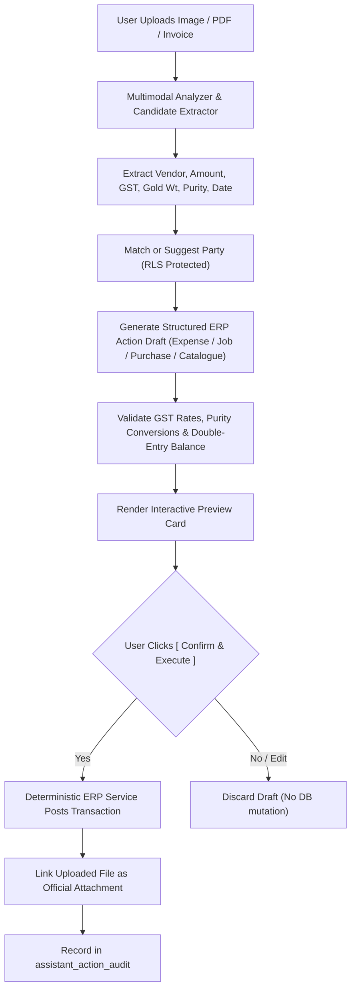

# ORNEXA — MULTIMODAL ACTION ENGINE MASTER
**Specification for Document/Image Vision, Candidate Extraction, and Safe Transaction Drafts**
*Version: 4.0.0*

---

## 1. Operating Flow

## 2. Supported Multimodal Scenarios

1. **Photo of Expense Receipt:** $\to$ Extracts payee, amount, 18% GST $\to$ Prepares Expense Draft $\to$ Posts to Financial Ledger upon confirmation.
2. **Photo of Bullion Supplier Bill:** $\to$ Extracts gross weight, 995/999 touch, 3% GST $\to$ Prepares Purchase Inward Voucher $\to$ Updates Vault Stock upon confirmation.
3. **Photo of Handwritten Job Card:** $\to$ Extracts customer order reference, karigar name, target gold weight $\to$ Prepares Manufacturing Job Draft $\to$ Issues metal upon confirmation.
4. **Photo of Jewellery Design / CAD:** $\to$ Extracts estimated weight and purity $\to$ Prepares Design Catalogue Record.
