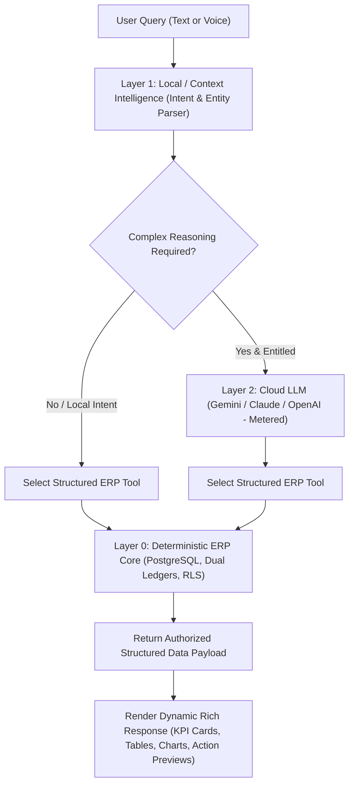
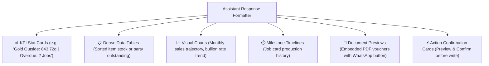
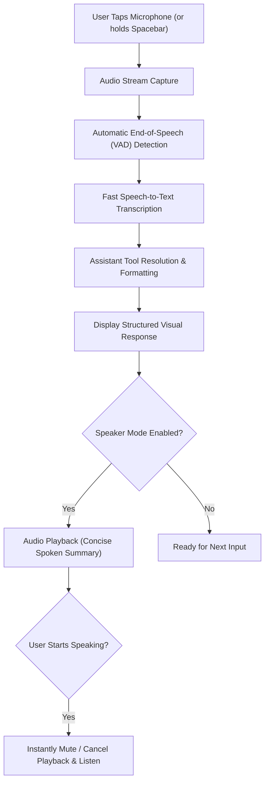

# ORNEXA — AI RUNTIME & ASSISTANT ARCHITECTURE MASTER
**Authoritative Specification for Layered AI Runtime, Permission-Aware Tool Registry, Context Optimization, Voice Flow, and Write Action Confirmations**
*Version: 3.2.0 (Approved Source of Truth)*
*Last Updated: August 2026*

---

## 1. The 3-Layer AI Architecture

### 1.1 The Core Operating Principle
> **"ORNEXA AI IS A TOOL-DRIVEN, PERMISSION-AWARE BUSINESS ASSISTANT, NOT AN UNRESTRICTED CHATBOT. ALL GOLD, ACCOUNTING, AND INVENTORY CALCULATIONS REMAIN 100% DETERMINISTIC."**
>
> Under no circumstances does an LLM directly generate accounting postings, calculate fine gold conversion, or guess database balances. The AI interacts with the ERP exclusively through structured, authorized **ERP Tools**.



### 1.2 The Three Discrete Layers
1. **Layer 0 — Deterministic ERP Core (Authoritative Truth):** Executes math, double-entry ledgers, metal purity conversions, tax rounding, and RLS security. Truth is always here.
2. **Layer 1 — Local / Context Intelligence (Zero API Cost):** Runs on-device or on lightweight edge compute for intent classification, command routing, language detection, search expansion, and terminology adaptation.
3. **Layer 2 — Cloud LLM (Metered Commercial Add-On):** Engaged only for complex executive summaries, narrative explanations, cross-module trend analysis, and conversational Q&A when the tenant holds the `feature.cloud_ai` entitlement.

---

## 2. Permission-Aware AI Tool Registry

The Assistant accesses business data exclusively through a strict registry of authorized tools that enforce tenant, branch, and role permissions:

| # | Tool Identifier | Description & Business Purpose | Required Role Permission | Returned Payload Structure |
|---|---|---|---|---|
| **1** | `GetWhereIsMyGold` | Resolves total gold breakdown across Vaults, Benches, Outside Mina, Refinery, and Trays | `inventory.view` \| `workshop.view` | Multi-location gross & fine weight summary table |
| **2** | `GetGoldPosition` | Real-time firm net gold exposure (Bullion, Scrap, Customer Advance, Karigar Custody) | `accounts.view` \| `owner` | Fine gold balance KPI cards + risk status |
| **3** | `GetKarigarGoldBalance` | Fetches specific worker's active metal custody, issued jobs, and pending scrap | `workshop.view` \| `accounts.view` | Worker balance card + active job list |
| **4** | `GetCustomerGoldBalance`| Fetches customer's advance metal deposits and pending custom order requirements | `billing.view` \| `sales.view` | Customer metal balance & deposit schedule |
| **5** | `SearchParty` | Finds customers, dealers, suppliers, or karigars by name, phone, GSTIN, or alias | `party.view` | Party list with contact cards & balance badges |
| **6** | `GetParty360` | Full 360-degree party dossier: financial ledger, gold ledger, active orders, bills | `party.view` | Deep party overview with drill-down links |
| **7** | `SearchJobs` | Queries manufacturing jobs by status, karigar, product category, or due date | `production.view` | Job table with thumbnail images & stage badges |
| **8** | `GetJobTimeline` | Chronological production history for a specific Job Card (Issue $\to$ Melting $\to$ QC) | `production.view` | Visual milestone timeline with timestamps |
| **9** | `SearchReadyStock` | Queries showroom tagged stock by category, karat, weight range, and tray location | `stock.view` | Item gallery/list with barcode tags & prices |
| **10**| `SearchInvoices` | Finds sales invoices, estimates, or purchase bills by invoice number or date range | `billing.view` | Invoice cards with status & download links |
| **11**| `GetOutstanding` | Outstanding receivables/payables ageing analysis (<30, 31–60, 61–90, >90 days) | `accounts.view` | Ageing breakdown chart + dealer list |
| **12**| `GetDocument` | Generates secure temporary download link for a PDF invoice, voucher, or job card | `document.view` | High-fidelity PDF preview modal & URL |
| **13**| `SearchCatalogue` | Queries B2B/B2C design catalogue by collection, metal purity, and gross weight | `sales.view` | Product cards with CAD images & specifications |

---

## 3. Dynamic Rich Response Types

The Assistant avoids walls of unformatted text by rendering structured visual components:



---

## 4. Performance & Startup Lazy Loading

```
┌─────────────────────────────────────────────────────────────────────────────┐
│                       AI PERFORMANCE & STARTUP POLICY                       │
├─────────────────────────────────────────────────────────────────────────────┤
│ 1. ZERO STARTUP OVERHEAD:                                                   │
│    The AI runtime, local model weights, and speech engines NEVER load       │
│    during login or dashboard boot. Initial ERP First Paint remains < 1.2s.  │
│                                                                             │
│ 2. ASYNCHRONOUS INITIALIZATION:                                             │
│    Only when the user clicks the Assistant icon or presses `Cmd/Ctrl+J`:    │
│     • The Assistant modal slides in instantly (< 100ms).                    │
│     • Lightweight context (active route, selected party/job) attaches.      │
│     • Local/Cloud intelligence engine initializes in the background.        │
│                                                                             │
│ 3. MINIMAL CONTEXT RETRIEVAL:                                               │
│    Context payloads sent to LLMs are tightly filtered by tool outputs       │
│    (average < 1.5 KB), preventing latency spikes and high token costs.      │
└─────────────────────────────────────────────────────────────────────────────┘
```

---

## 5. Voice Interaction Flow with Speech Interruption



---

## 6. Safe Write Action Confirmations (No Blind Actions)

When a user requests a write operation via voice or chat (*"Send Raj Jewellers invoice 1024 on WhatsApp"*):
1. **Resolution:** Assistant resolves Party ID, Invoice ID, Template, Verified Phone, and Message Cost.
2. **Visual Confirmation Card:** Displays an interactive preview card with invoice details, recipient phone, and message text.
3. **Explicit User Confirmation:** The user must click **[ Confirm & Send ]** (or speak *"Confirm"*).
4. **Execution & Audit:** The ERP executes the API call and logs the action in `system_audit_logs`.

---

## 7. Tenant Privacy & External Portal Isolation

- **Tenant Isolation:** All AI prompts and tool executions are strictly scoped to the authenticated `tenant_id`. Cross-tenant prompt injection is mathematically impossible.
- **External Portal Isolation:** AI Chat is **disabled across external Customer, Karigar, and Supplier portals** in current release gates to prevent unauthorized access or token abuse.
