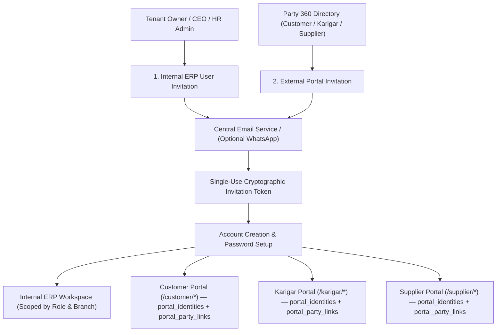
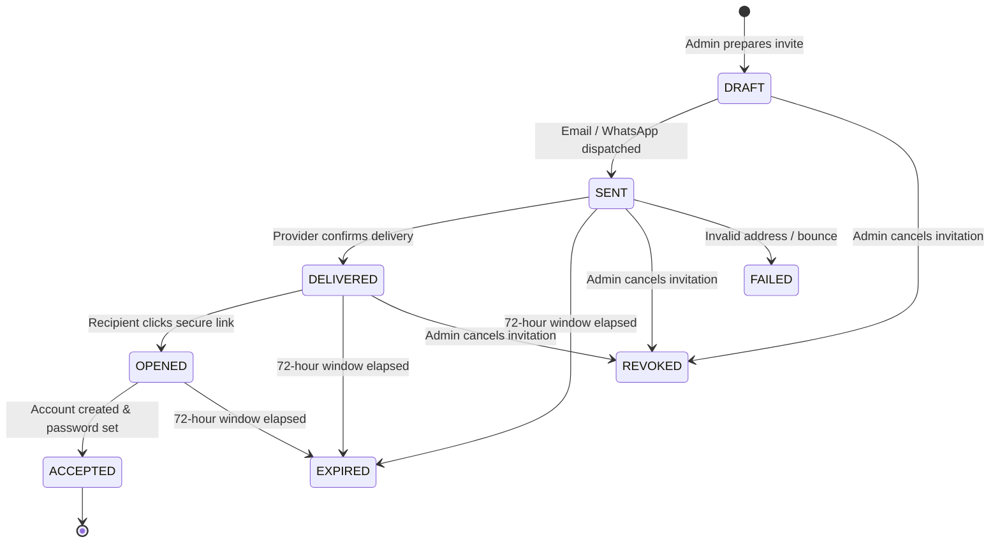
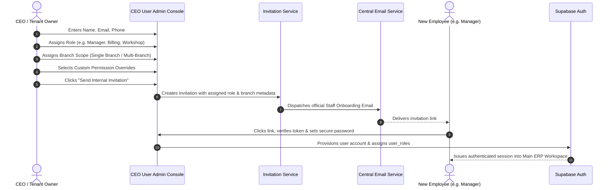

# ORNEXA — AUTHENTICATION, INVITATIONS & USER PROVISIONING MASTER
**Authoritative Specification for User Onboarding, Invitations & Access Lifecycles**
*Version: 3.0.0 (Approved Source of Truth)*
*Last Updated: August 2026*

---

## 1. Core Authentication & Provisioning Architecture

Ornexa enforces a strict separation between **Internal ERP Operators** (staff, managers, accountants, CEOs) and **External Subsystem Portal Users** (customers, artisans, suppliers).



> **Portal provisioning invariant:** External portal accounts must receive a `portal_identities` row (tenant + portal type) and at least one active `portal_party_links` row before portal RPCs succeed. Legacy `user_profiles.customer_person_id` is backfilled automatically but must not be trusted from the browser.

---

## 2. Password Login & Multi-Factor Support

All Ornexa entry points support standard **Email / Identifier + Password Authentication**:
1. **Primary Authentication:** Registered Email / Phone + Secure Password.
2. **Optional OTP Login:** OTP via SMS/WhatsApp is an optional secondary method (configurable per tenant policy), not a mandatory barrier for every session.
3. **Session Management:** Secure Supabase JWT sessions with automatic token refresh during active use.
4. **Account Recovery:** Self-service "Forgot Password" flow with single-use expiring reset links, anti-enumeration security, and active session invalidation upon password change.
5. **Account Lockouts:** Automatic temporary lock after 5 consecutive failed password attempts with administrative unlock controls.

---

## 3. The Central Invitation Lifecycle Engine

Every invitation generated across Ornexa is tracked through an immutable state machine:



### 3.1 Invitation Audit Record Attributes
- `id:` Unique UUID.
- `tenant_id` & `branch_id:` Exact firm and branch scope.
- `party_id:` Linked Party 360 record (for external portal users).
- `portal_type:` `internal_erp`, `customer_portal`, `karigar_portal`, `supplier_portal`.
- `recipient_email` & `recipient_phone:` Target contact info.
- `role_id:` Pre-assigned role and permissions.
- `token_hash:` Cryptographically secure, salted, single-use token hash.
- `expires_at:` Expiration timestamp (default: 72 hours).
- `created_by:` Admin user identity.
- `status:` `DRAFT`, `SENT`, `DELIVERED`, `OPENED`, `ACCEPTED`, `EXPIRED`, `REVOKED`, `FAILED`.
- `created_user_id:` Generated Supabase `auth.users` ID upon acceptance.

---

## 4. Portal-Specific Invitation Workflows

### 4.1 Customer Portal Invitation
- **Trigger:** Initiated from **Customer 360** → `[Invite to Customer Portal]`.
- **Workflow:** Admin selects primary contact email/phone → System dispatches branded invitation email → Customer clicks link, sets password → Account maps strictly to that customer's `party_id`.
- **Security Boundary:** The customer has zero visibility into any other customer's records, internal manufacturing margins, or artisan costs.

### 4.2 Karigar Portal Invitation
- **Trigger:** Initiated from **Karigar 360** → `[Invite to Karigar Portal]`.
- **Workflow:** Admin sends invitation link → Artisan sets password on mobile device → Account links strictly to that `karigar_id`.
- **Security Boundary:** Artisan accesses only assigned bench jobs, personal metal custody, and labour wages.

### 4.3 Supplier Portal Invitation
- **Trigger:** Initiated from **Supplier 360** → `[Invite to Supplier Portal]`.
- **Workflow:** Admin sends invitation link → Vendor registers password → Account links to `supplier_id`.
- **Security Boundary:** Vendor accesses only issued Purchase Orders, dispatch notices, and supplier statements.

---

## 5. Internal ERP User Provisioning (CEO / Admin Control)

Internal operators are **never provisioned by manual database edits**. They are managed exclusively through the **CEO Portal / User Administration Console**:



---

## 6. Strict Portal-Role Isolation

> **CRITICAL ARCHITECTURAL BOUNDARY:**
> External portal accounts must **NEVER** inherit internal ERP operational permissions.

- A **Customer Portal user** cannot access internal manufacturing, billing, or inventory screens.
- A **Karigar Portal user** cannot access counter billing, company financial reports, or customer directories.
- A **Supplier Portal user** cannot access customer orders or internal workshop schedules.
- If a person holds multiple roles in real life (e.g. a customer who is also a subcontractor), they must use distinct role-scoped portal sessions linked to their respective records.

---

## 7. Account Lifecycle & Audit Preservation

```
┌─────────────────────────────────────────────────────────────────────────────┐
│                           ACCOUNT LIFECYCLE                                 │
│                                                                             │
│    [INVITED]  ──▶  [ACTIVE]  ──▶  [SUSPENDED]  ──▶  [DEACTIVATED]          │
│                       ▲                  │                                  │
│                       └──────────────────┘ (Reactivated)                    │
└─────────────────────────────────────────────────────────────────────────────┘
```

- **Preservation Rule:** Never delete user records from the database when access is revoked. Revoking access transitions the account to `SUSPENDED` or `DEACTIVATED`, preserving all historical transaction signatures, audit references, and creation logs.
