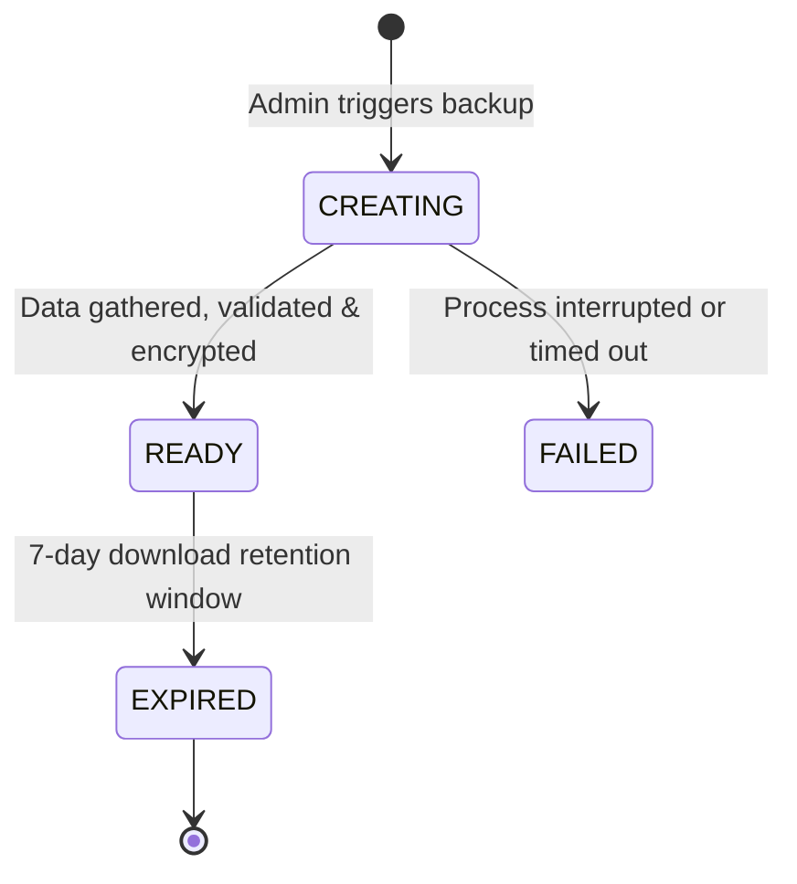
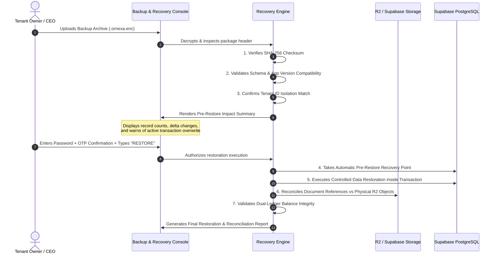

# ORNEXA — BACKUP, DISASTER RECOVERY & RESTORATION MASTER
**Authoritative Specification for Tenant Data Export, Storage Integrity & Recovery**
*Version: 3.0.0 (Approved Source of Truth)*
*Last Updated: August 2026*

---

## 1. Multi-Layered Disaster Recovery Strategy

Ornexa does not rely on a single user download mechanism for enterprise business continuity. Recovery is structured across **5 complementary resilience layers**:

```
┌─────────────────────────────────────────────────────────────────────────────┐
│                    ORNEXA 5-LAYER RECOVERY ARCHITECTURE                     │
├───────────────────┬─────────────────────────────────────────────────────────┤
│ Layer 1: Supabase │ Automated point-in-time PostgreSQL continuous backups & │
│ Platform Snapshots│ WAL archiving (Physical cloud disaster recovery)        │
├───────────────────┼─────────────────────────────────────────────────────────┤
│ Layer 2: Schema & │ Version-controlled Supabase migration history in Git    │
│ Migration History │ (Guarantees reproducible schema states)                 │
├───────────────────┼─────────────────────────────────────────────────────────┤
│ Layer 3: Storage  │ Cloudflare R2 / S3 cross-region object versioning for   │
│ & Media Redundancy│ logos, CAD models, invoice PDFs, and QC photos          │
├───────────────────┼─────────────────────────────────────────────────────────┤
│ Layer 4: Tenant   │ Self-service encrypted business data export package     │
│ Export Package    │ (Tenant-owned standalone JSON/CSV encrypted archive)    │
├───────────────────┼─────────────────────────────────────────────────────────┤
│ Layer 5: Staged   │ Automated monthly restore rehearsals in isolated test   │
│ Restore Rehearsals│ environments with dual-ledger reconciliation reports    │
└───────────────────┴─────────────────────────────────────────────────────────┘
```

---

## 2. Tenant-Accessible Backup Export

Authorized Tenant Administrators and CEOs can generate and download complete, tenant-scoped backup packages (`/control/backup-recovery`):

### 2.1 Package Contents
1. **Core Business Masters:** Party 360 directory, Stock Categories, Metal & Purity Masters, Branches, Users & Roles.
2. **Transactional Records:** Sales Orders, Job Cards, Worker Returns, Outside Work Orders, Tax Invoices, Expense Vouchers.
3. **Double-Entry Ledgers:** Fine Metal Ledger (mg) and Cash Ledger (paise) with full historical entries.
4. **Configuration & Rules:** Active formula presets, Custom Fields schemas, Custom Category definitions, Document Templates, Print Profiles, Terms & Conditions hierarchy.
5. **Document & Media Metadata:** Document tokens, file paths, checksum hashes, and upload dates (Raw binary files are securely backed up in Layer 3).
6. **Audit Logs:** System activity references and creation signatures.
7. *Strict Exclusion:* Platform secrets, database credentials, and any data belonging to other tenants are strictly excluded.

### 2.2 Backup Generation Lifecycle & Attributes


- **Recorded Metadata:**
  - `backup_id:` Unique cryptographic UUID.
  - `tenant_id:` Target firm identifier.
  - `created_by:` Admin user identity.
  - `created_at:` Timestamp.
  - `schema_version:` Compatible database schema version.
  - `app_version:` Active Ornexa platform release version.
  - `file_size_bytes:` Compressed archive size.
  - `checksum_sha256:` SHA-256 integrity hash.
  - `status:` `CREATING`, `READY`, `FAILED`, `EXPIRED`.

---

## 3. Controlled Restoration Engine

To prevent catastrophic accidental overwrites, **restoration is a strictly controlled, multi-phase verification workflow**:



---

## 4. Supported Restoration Modes

1. **Full Tenant Restore:** Complete restoration of business masters, transactional records, custom fields, and ledgers from an approved full backup archive.
2. **Configuration-Only Restore:** Restores settings, formula rules, print profiles, document templates, and custom category masters without altering transactional history or account balances.
3. **Selective Recovery (Planned):** Scoped restoration of specific modules (e.g. Design Catalogue or Ready Stock) into an isolated staging branch.

---

## 5. Storage & Document Reconciliation Standard

A restored database pointing to missing media files is considered a failed restore. The recovery engine executes an automated **Document Reconciliation Verification**:
- Verifies every `generated_documents` record matches a verified object in `invoices-pdf`.
- Verifies every stock photo path matches a valid object in `stock-images`.
- Verifies company logo paths match `firm-logos`.
- Flags missing objects in the final restoration report.

---

## 6. Security & Authorization Policy

- **Permitted Roles:** Only `super_owner`, `owner / ceo`, or authorized `saas_admin` with tenant consent can trigger restoration.
- **Strict Verification:** Requires recent authentication (< 10 minutes), multi-factor token verification, explicit confirmation phrase, and creates an indelible `platform_audit_logs` record.

---

## 7. Definition of Done (DoD) for Backup & Recovery

Backup functionality is **NOT complete merely because a file downloads**. Completion requires verifying:
1. Export package creation and successful SHA-256 checksum verification.
2. Complete restore into an isolated test tenant environment.
3. 100% data reconciliation across masters, transactions, fine gold balances (mg), cash ledgers (paise), and storage attachments.
4. Clean generation of the post-restore verification report.
