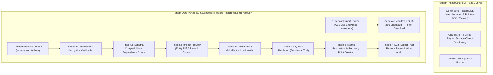

# ORNEXA — TENANT DATA PORTABILITY & RESTORE RECOVERY MASTER
**Authoritative Architectural Specification for Encrypted Tenant Archives, Multi-Phase Controlled Restoration, and Disaster Recovery**
*Version: 3.1.0 (Approved Source of Truth)*
*Last Updated: August 2026*

---

## 1. Data Portability & Disaster Recovery Philosophy

### 1.1 The Core Operating Principle
> **"ORNEXA IS ONLINE-AUTHORITATIVE ON SUPABASE. TENANTS HAVE FULL DATA PORTABILITY THROUGH ENCRYPTED BACKUP PACKAGES, WHILE RESTORATION FOLLOWS A CONTROLLED MULTI-STAGE RECONCILIATION ENGINE."**
>
> We strictly distinguish between **Platform-Level Infrastructure Disaster Recovery** (managed by Supabase automated WAL archiving and point-in-time recovery) and **Tenant-Level Data Portability & Restoration** (self-service encrypted exports and safe imports).



---

## 2. The `.ornexa.enc` Tenant Export Archive

When an authorized administrator requests a backup in `/control/backup-recovery`, the engine packages:

### 2.1 Archive Manifest Schema (`manifest.json`)
```json
{
  "ornexa_archive_version": "3.1.0",
  "schema_version": "20260814_01",
  "tenant_id": "tenant_maa_tara_jewellers_001",
  "firm_name": "Maa Tara Jewellers",
  "created_at": "2026-08-14T22:00:00.000Z",
  "created_by_user_id": "usr_owner_001",
  "encryption_algorithm": "AES-GCM-256",
  "sha256_checksum": "e3b0c44298fc1c149afbf4c8996fb92427ae41e4649b934ca495991b7852b855",
  "included_modules": [
    "parties", "masters", "inventory_tags", "rate_book", 
    "job_cards", "ledgers", "custom_fields", "templates", "audit_logs"
  ],
  "record_counts": {
    "parties": 1420,
    "inventory_tags": 3840,
    "vouchers": 12850,
    "job_cards": 420
  }
}
```

### 2.2 Security & Encryption
- Data is encrypted client-side or in sandboxed Edge Function using tenant-specific KMS keys.
- Signed, expiring single-use download links prevent unauthorized file sniffing.

---

## 3. The 7-Phase Controlled Restoration Engine

A tenant administrator can never blindly overwrite a production database. The restore engine enforces strict safety gates:

1. **Phase 1 (Integrity & Checksum Verification):** Verifies SHA-256 checksum and decrypts payload in memory. Rejects corrupted or tampered packages immediately.
2. **Phase 2 (Schema Compatibility Check):** Validates that the archive schema version is compatible with the active database migrations.
3. **Phase 3 (Impact Preview & Diff Analysis):** Displays a detailed modal showing: *Incoming Parties: 1,420*, *Existing Parties: 1,418*, *Incoming Tags: 3,840*, *Active Gold Balance Variance: 0.000g*.
4. **Phase 4 (Security & Multi-Factor Authorization):** Requires CEO / Platform Owner role authentication and OTP confirmation.
5. **Phase 5 (Dry-Run Simulation):** Runs the full database insert transaction inside a temporary PostgreSQL transaction block (`ROLLBACK`), verifying foreign key constraints without persisting changes.
6. **Phase 6 (Atomic Restoration & Recovery Point):** Takes a pre-restore database snapshot, commits the archive data, and creates an emergency rollback point.
7. **Phase 7 (Post-Restore Dual-Ledger Reconciliation):** Automatically runs trial balance and gold custody reconciliation checks to guarantee that $\sum \text{Debits} = \sum \text{Credits}$ and $\sum \text{Gold Assets} = \sum \text{Gold Liabilities}$.
