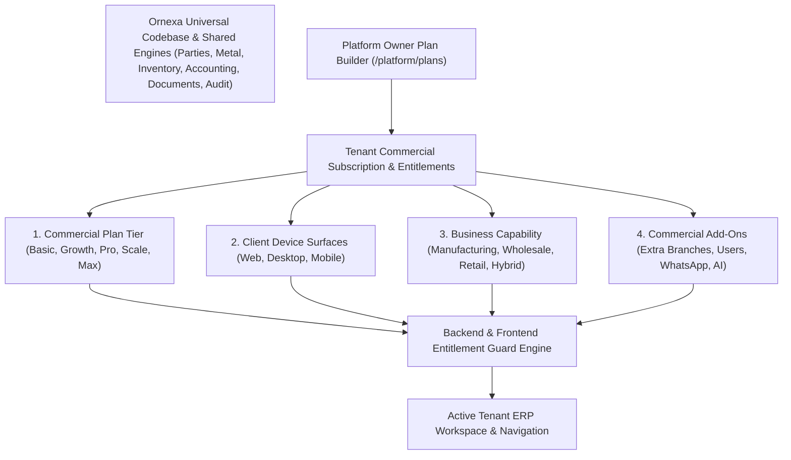

# ORNEXA — BUSINESS PRODUCT, LICENSING & ENTITLEMENT MASTER
**Authoritative Architectural Specification for Commercial Products, Plan Tiers (Basic, Growth, Pro, Scale, Max), Device Entitlements, and Licensing Infrastructure**
*Version: 3.2.0 (Approved Source of Truth)*
*Last Updated: August 2026*

---

## 1. Commercial Architecture: Platform Capability vs Customer License

### 1.1 The Core Operating Principle
> **"ONE PLATFORM. MULTIPLE LICENSABLE JEWELLERY BUSINESS CAPABILITIES. ONE AUTHORITATIVE DATA SOURCE. NO PRODUCT FORKS."**
>
> Ornexa technically supports **Manufacturing**, **Wholesale**, and **Retail** operations from a single unified codebase, PostgreSQL schema, double-entry accounting engine, and gold custody architecture.
>
> **HOWEVER, A TENANT OPERATES ONLY THE BUSINESS CAPABILITIES AND DEVICE SURFACES INCLUDED IN ITS PURCHASED LICENSE.**
>
> Business Mode and Device Access are **NOT** unrestricted, free dropdown toggles in regular tenant settings. A tenant purchasing an *Ornexa Basic + Manufacturing* plan receives exactly the licensed manufacturing workspace on their chosen client surface (Web or Desktop), without unpurchased Wholesale/Retail or Mobile client access.



---

## 2. The 5 Approved Commercial Plan Tiers

| Plan Tier | Allowed Device Surface Choices | Included Branches | User Quota Mode | Core Feature Scope | Intelligence & Customization Scope |
|---|---|:---:|---|---|---|
| **ORNEXA BASIC** | **Choose 1:** `Web` **OR** `Desktop`<br>*(Mobile strictly excluded)* | **1 Branch** | Configurable Seat Cap | Core double-entry accounting, gold/fine gold traceability, basic stock, standard receipts & invoices, compliance | ❌ No Portals<br>❌ No CEO Portal<br>❌ No AI / Automation |
| **ORNEXA GROWTH** | **Choose 1:** `Web` **OR** `Desktop` **OR** `Mobile` | **1 Branch** | Configurable Seat Cap | Basic tier + multi-category inventory, data imports, expanded configuration, standard documents | 1 Standard Portal<br>❌ No CEO Portal<br>❌ No Cloud AI |
| **ORNEXA PROFESSIONAL**| **Choose 2:** `Web + Desktop` \| `Web + Mobile` \| `Desktop + Mobile` | **1 Branch** | Configurable Seat Cap | Growth tier + advanced manufacturing, Party 360, worker/outside gold books, QC/Hallmark/Refinery, 10 document templates, print profiles, standard automation | 2 Standard Portals<br>✅ CEO Portal<br>*(Cloud AI / WABA metered)* |
| **ORNEXA SCALE** | **Choose 2:** `Web + Desktop` \| `Web + Mobile` \| `Desktop + Mobile` | **1 Branch** | Configurable Seat Cap | Professional tier + Universal Custom Transactions, Full Formulas, Workflow Designer, Report Builder, Config Rollback, Advanced Audit | Advanced Portals<br>✅ CEO Portal<br>✅ Local/Context AI included |
| **ORNEXA MAX** | **All 3 Included:**<br>`Web + Desktop + Mobile` | **1 Branch** *(Add-ons available)* | **Uncapped / Fair-Use** | Complete Hybrid Suite (Manufacturing + Wholesale + Retail), Universal Custom Transactions/Fields/Masters/Formulas/Workflows/Documents/Reports/Portals | All Standard Portals<br>✅ Full CEO Portal<br>✅ Context AI + Framework |

---

## 3. Primary Business Products & Commercial Add-Ons

Platform Owners sell standardized primary business licenses and expansion add-ons:

| Primary License | Included Core Capabilities | Target Jewellery Business |
|---|---|---|
| **ORNEXA MANUFACTURING** | Job Cards, CAD/Designs, Karigar Bench Custody, Metal Issue/Receive, Melting & Assaying, Outside Work (Mina/Polish), QC, BIS Hallmarking (HUID), Scrap Recovery, Manufacturing Reports | In-house jewellery factories, karigar workshops, casting & handmade manufacturing units |
| **ORNEXA WHOLESALE** | B2B Dealer Accounts, Wholesale Price Lists, Customer-Specific Rates, Bulk Order Booking, Stock Allocation/Picking, Dispatch Challans, Courier Tracking, Dealer B2B Portal, Wholesale Invoices | B2B bullion & jewellery wholesale distributors, stockists, trading houses |
| **ORNEXA RETAIL** | Showroom Ready Stock, Butterfly Barcode Tags, Counter Estimates, POS Sales Invoices, Old Gold Exchange/Buyback, Customer Repair Orders, WhatsApp Invoices, Customer CRM | Single/multi-branch retail jewellery showrooms, boutique counters |
| **ORNEXA HYBRID / ENTERPRISE** | **Manufacturing + Wholesale + Retail** simultaneously with inter-branch stock transfers and unified gold accounting | Large vertically integrated jewellery enterprises (Factory + Warehouse + Retail Showroom Network) |

---

## 4. Branch Limits & User Seat Architecture

### 4.1 1 Base Branch in Every Plan
- Every standard base plan (*Basic*, *Growth*, *Professional*, *Scale*, *Max*) includes **1 primary physical branch** by default (`branch.base_limit = 1`).
- Operating multiple branches (e.g. Workshop in Kolkata + Showroom in Mumbai) requires purchasing **Additional Branch Licenses** (`ADDON_BRANCH_EXTRA`).

### 4.2 Configurable User Limits & Max Fair-Use
- Plans *Basic*, *Growth*, *Professional*, and *Scale* utilize configurable seat caps stored in the plan definition (`quota.users`).
- Plan **Ornexa Max** operates on an **uncapped, fair-use model** with no artificial seat restrictions, protected by automated platform abuse monitors.

---

## 5. Assisted Setup & Later Expansion Lifecycles

1. **Assisted Setup Wizard (New Customer):** Guides the customer through 12 logical stages based on their purchased plan tier, primary business product, and device selection. Reference: [`ONBOARDING_MASTER.md`](./ONBOARDING_MASTER.md).
2. **Later Expansion Wizard (Adding Capabilities):** When an existing firm purchases an additional capability (e.g. adding Wholesale to an active Manufacturing firm), the expansion wizard seamlessly reuses all existing **Parties**, **Gold Safes**, **Stock Trays**, and **Double-Entry Ledgers** without database migrations or code branching.

---

## 6. Terminology Customization vs Commercial Capability

```
┌─────────────────────────────────────────────────────────────────────────────┐
│                    TERMINOLOGY VS CAPABILITY MATRIX                         │
├──────────────────────────────────────┬──────────────────────────────────────┤
│ 🟢 FREE CUSTOMIZATION (Included)     │ 🔴 COMMERCIAL ADD-ON (Requires Plan) │
├──────────────────────────────────────┼──────────────────────────────────────┤
│ • Changing 'Karigar' ↔ 'Worker'     │ • Unlocking Wholesale Dispatch Hub   │
│ • Changing 'Bhav' ↔ 'Metal Rate'     │ • Unlocking Retail POS Counter       │
│ • Changing 'Hisab' ↔ 'Settlement'    │ • Unlocking Karigar Melting & Stages │
│ • Changing 'Khata' ↔ 'Ledger'        │ • Unlocking Dealer B2B Portal        │
│ • Selecting Indian Trade / Standard  │ • Adding 2nd Physical Branch License │
│ • Customizing Field Aliases          │ • Adding Mobile App to Basic Plan    │
└──────────────────────────────────────┴──────────────────────────────────────┘
```

---

## 7. Backend-Aware License Enforcement & Security

- **Server-Side Verification:** Route guards, RPC stored procedures, and Edge Functions validate entitlement tokens in JWT claims. Tampering with client-side localStorage cannot unlock paid features.
- **Dignified Upgrade UX:** Displays clean, role-aware informational notifications when unauthorized modules are searched, avoiding broken screens or aggressive marketing to bench workers.
- **Historical Data Preservation:** When a subscription or add-on expires, **zero data is deleted**. Past transactions transition to read-only archive status.
