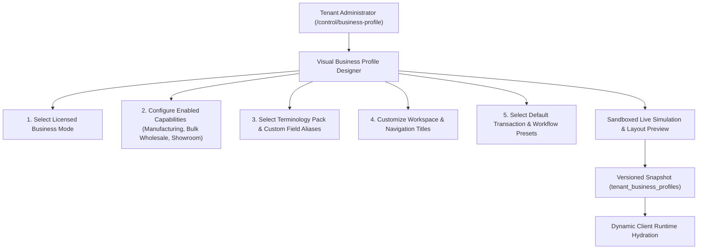
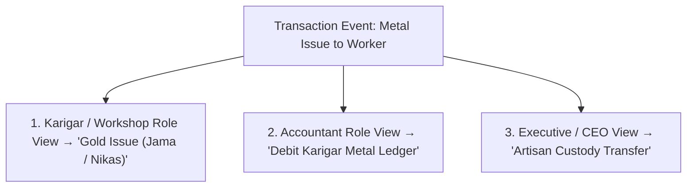

# ORNEXA — BUSINESS PROFILE & ADAPTIVE ENGINE MASTER
**Authoritative Architectural Specification for the Business Profile Designer, Workspace Adaptation, and Role-Scoped Terminology**
*Version: 3.1.0 (Approved Source of Truth)*
*Last Updated: August 2026*

---

## 1. Business Profile Architecture

### 1.1 The Core Operating Principle
> **"A BUSINESS PROFILE IS A DECLARATIVE METADATA BUNDLE THAT ADAPTS THE ENTIRE ERP TO THE FIRM'S BUSINESS MODEL WITHIN LICENSED ENTITLEMENT BOUNDARIES."**
>
> In Ornexa, a **Business Profile** operates strictly within the tenant's purchased product license and active entitlements. It unifies:
> 1. Licensed Primary Business Mode (*Manufacturer*, *Wholesaler*, *Retailer*, *Hybrid*)
> 2. Workspace Navigation & Labeling
> 3. Active Terminology Pack & Custom Overrides
> 4. Default Workflow & Transaction Templates
> 5. Configured Report Families & Executive Dashboards
> 6. Portal Presentation Wording
>
> *Rule: A tenant administrator cannot use the Business Profile Designer to freely switch between unpurchased business modes. Expanding from Manufacturing to Wholesale requires a commercial license add-on.*

---

## 2. Dynamic Workspace Customization & Renaming

Tenants can customize top-level navigation labels to match internal team nomenclature:

| Business Mode Preset | Canonical Workspace Key | Default Rendered Title | Allowed Tenant Custom Labels |
|---|---|---|---|
| **Manufacturer** | `workspace_work` | `Production` | `Workshop`, `Factory Floor`, `Manufacturing`, `Job Center` |
| **Wholesaler** | `workspace_work` | `Orders & Dispatch` | `B2B Orders`, `Dealer Sales`, `Order Booking & Dispatch` |
| **Retailer** | `workspace_work` | `Sales & Billing` | `Showroom Counter`, `Billing & Estimates`, `Retail POS` |
| **Hybrid** | `workspace_work` | `Work & Operations` | `Operations Hub`, `Manufacturing & Orders` |
| **All Modes** | `workspace_stock` | `Stock & Vault` | `Inventory`, `Vault & Trays`, `Metal & Tag Stock` |
| **All Modes** | `workspace_parties`| `Parties 360` | `Customers & Dealers`, `Jewellers & Karigars`, `Clients & Vendors` |
| **All Modes** | `workspace_accounts`| `Accounts & Books` | `Ledgers & Cash`, `Financials`, `Khata & Cashbook` |
| **All Modes** | `workspace_insights`| `Insights & Reports`| `Reports & Analytics`, `Business Intelligence`, `GST & Audits` |

---

## 3. Role-Scoped Terminology Adaptations

While tenant-wide terminology ensures general consistency, Ornexa supports subtle, role-specific vocabulary enhancements where operational clarity demands it:

- **Workshop Floor Staff:** Sees familiar trade terms (*"Issue"*, *"Receive"*, *"Ghat / Wastage"*, *"Tapas"*).
- **Accounts Department:** Sees standard bookkeeping language (*"Debit"*, *"Credit"*, *"WIP Asset Account"*, *"Taxable Value"*).
- **Executive / CEO:** Sees strategic indicators (*"Unhedged Metal Exposure"*, *"Artisan Yield"*, *"Gross Margin"*).

---

## 4. Business Profile Lifecycle & Safe Rollback

1. **Draft Staging:** Any modifications to business profiles are staged in `status = DRAFT`.
2. **Side-by-Side Simulation:** The administrator can toggle an interactive preview iframe showing how invoices, menus, and reports look under the new profile.
3. **Atomic Publication:** Publishing updates the active `profile_version_id` and triggers a background cache refresh for all tenant sessions via Supabase Realtime.
4. **Instant One-Click Rollback:** If an updated profile causes confusion, the administrator can restore any previous published version in under 2 seconds.
