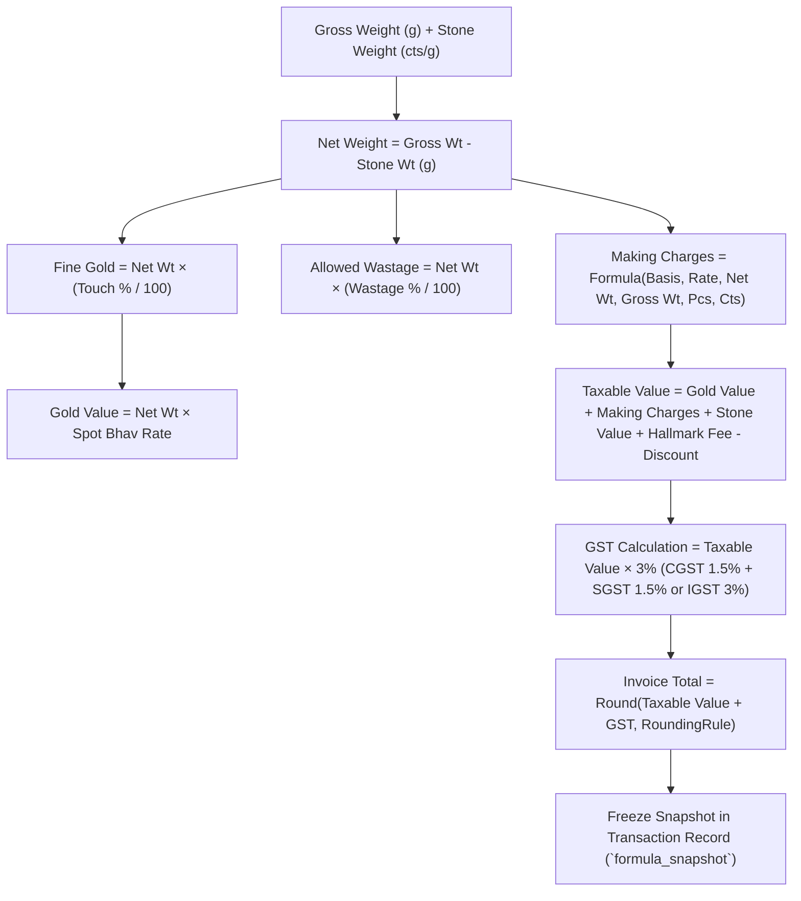

# ORNEXA — CALCULATION, MAKING & RULE ENGINE MASTER
**Authoritative Architectural Specification for Deterministic Jewellery Formulas, Making Charge Basis, Labour Rules, Wastage Allowances, and GST Valuation Pipelines**
*Version: 4.0.0 (Approved Source of Truth)*
*Last Updated: August 2026*

---

## 1. Calculation Engine Philosophy

### 1.1 The Core Operating Principle
> **"EVERY FINANCIAL AND METAL CALCULATION IS 100% DETERMINISTIC, CONFIGURABLE BY TRADE RULES, AND IMMUTABLY SNAPSHOTTED UPON TRANSACTION POSTING."**
>
> In the jewellery industry, calculating fine gold, making charges, artisan labour, and GST involves complex domain formulas that vary across product lines and trading relationships.
>
> The Calculation Engine at **Customization → Calculations** (`/control/customization/calculations`) allows businesses to configure formulas while protecting statutory compliance invariants.

---

## 2. Supported Making Charge Calculation Bases

| Making Charge Basis Code | Formula Expression | Applicable Jewellery Product Lines |
|---|---|---|
| `GROSS_WEIGHT_RATE` | $\text{Making} = \text{Gross Weight (g)} \times \text{Rate per Gram (₹/g)}$ | Heavy plain casting bangles, solid chains |
| `NET_WEIGHT_RATE` | $\text{Making} = \text{Net Weight (g)} \times \text{Rate per Gram (₹/g)}$ | Studded gold jewellery where customer pays making only on gold |
| `PER_PIECE_FIXED` | $\text{Making} = \text{Fixed Tariff Amount per Piece (₹)}$ | Standard lightweight rings, nose pins, ear studs |
| `PERCENTAGE_OF_GOLD` | $\text{Making} = \text{Gold Metal Value (₹)} \times (\text{Making \%} / 100)$ | High-karat handmade bridal jewellery, temple jewellery |
| `CARAT_BASED_SETTING`| $\text{Making} = \text{Diamond Carats} \times \text{Rate/Ct} + \text{Gold Net Wt} \times \text{Gold Rate/g}$ | Micro-pave diamond solitaires, prong-set jewellery |

---

## 3. Wastage (Ghat) & Loss Rules

- **Allowed Wastage Allowances:** Standard percentage (e.g. `2.5%` for casting, `4.0%` for handmade filigree).
- **Chain Wastage Exclusions:** Automatic deduction rules excluding machine-soldered chains from manual bench loss claims.
- **Scrap Assaying Tolerance:** Maximum permitted assay variance (`0.10%`) between bench scrap and refining recovery.

---

## 4. 7-Tier Precedence Hierarchy

Formulas resolve deterministically from most specific to global fallback:
$$\text{Item Master} \to \text{Karigar / Worker} \to \text{Party / Customer} \to \text{Module} \to \text{Branch} \to \text{Tenant} \to \text{Platform Default}$$

---

## 5. Domain Boundary: Metal Engine vs Customization Workspace

- **Metal / Fine Gold Core:** The underlying mathematical conversions ($\text{Gross} \times \text{Touch} / 100$) are core non-customizable physical invariants in the Gold/Metal domain.
- **Customization Workspace:** Exposes the commercial configuration rules (Which making basis applies, what % margin is allowed, which tier wins).
