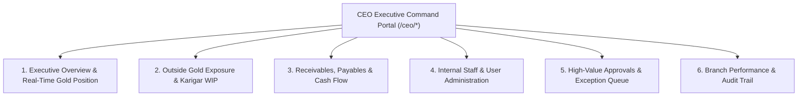

# ORNEXA — CEO EXECUTIVE PORTAL MASTER SPECIFICATION
**Authoritative Specification for Executive Command Centre & User Governance**
*Version: 3.0.0 (Approved Source of Truth)*
*Last Updated: August 2026*

---

## 1. Portal Identity & Executive Purpose

The **CEO Executive Portal** (`/ceo/*`) is a dedicated, isolated executive command workspace tailored specifically for business owners, managing directors, and chief executives. It is not an entry-heavy operational screen; it is an executive oversight cockpit designed for immediate decision-making, financial risk monitoring, gold exposure tracking, and staff governance.



---

## 2. Executive Overview & Risk Metrics

The CEO overview renders aggregated, high-speed read models optimized for fast executive assessment:

1. **Total Gold Position:**
   - **Vault Pure Gold (24K):** Fine metal held in central raw bullion vaults.
   - **Working Ready Stock:** Total fine gold value sitting in showroom display trays.
   - **Karigar WIP Custody:** Fine gold currently with internal bench artisans.
   - **Outside Contractor Exposure:** Fine gold currently outside under Section 143 job work.
   - **Customer Gold Liability:** Advance metal deposited by customers awaiting order delivery.
2. **Financial Liquidity:**
   - **Total Receivables:** Broken down by `Current`, `Due in 7 Days`, `Overdue > 30 Days`.
   - **Total Payables:** Bullion dealer settlements and component vendor bills.
   - **Today's Net Cash Flow:** Inflow vs Outflow across all active branches.
3. **Operational Exceptions & Bottlenecks:**
   - Jobs overdue past promised delivery date.
   - Outside job work lots approaching 270/300 day GST Section 143 return deadlines.
   - QC rejection spikes in specific workshops or item categories.

---

## 3. CEO User Administration Console

The CEO Portal contains the authoritative console for managing internal staff, role permissions, and branch assignments:

```
┌─────────────────────────────────────────────────────────────────────────────┐
│                       CEO USER ADMINISTRATION HUB                           │
├─────────────────────────────────────────────────────────────────────────────┤
│  [➕ Invite New Internal User]     [🛡️ Manage Roles]     [📍 Branch Scope]   │
├─────────────────────────────────────────────────────────────────────────────┤
│  Tabs: [Active Staff (24)]  [Pending Invitations (3)]  [Suspended Users (2)]│
├─────────────────────────────────────────────────────────────────────────────┤
│  Staff Member   │ Assigned Role │ Branch Scope     │ Last Login │ Status   │
├─────────────────┼───────────────┼──────────────────┼────────────┼──────────┤
│  Aritra Manna   │ Branch Manager│ Main Workshop HQ │ 10 min ago │ ACTIVE   │
│  Rahul Das      │ Workshop Lead │ Main Workshop HQ │ 1 hour ago │ ACTIVE   │
│  Priya Sharma   │ Billing / POS │ Retail Branch 1  │ 2 days ago │ ACTIVE   │
│  Arpan Manna    │ Production    │ Multi-Branch All │ Pending    │ INVITED  │
└─────────────────────────────────────────────────────────────────────────────┘
```

### 3.1 Permitted Administrative Actions
- **Invite Staff:** Issue secure single-use email invitation with pre-assigned role and branch scope.
- **Resend / Revoke Invite:** Resend expired onboarding links or revoke pending invitations immediately.
- **Role Re-assignment:** Promote, reassign, or customize permissions for existing employees.
- **Branch Scope Assignment:** Restrict staff to a specific physical location or grant enterprise multi-branch visibility.
- **Suspend / Reactivate:** Temporarily block account access during leave or security reviews without deleting historical transaction audit signatures.
- **Reset Credentials:** Trigger an administrative password reset with automatic session termination across all devices.

---

## 4. Multi-Level High-Value Approvals

The CEO Portal acts as the final gatekeeper for sensitive transactions exceeding operational thresholds:
- Expense vouchers exceeding branch manager approval limits (e.g. > ₹25,000).
- Metal wastage (Ghat) allowances exceeding tolerance percentages on high-value diamond jobs.
- Exceptional discounts exceeding standard pricing rules on B2B invoices.
- Credit limit overrides for wholesale customers.
- Historical transaction reversal authorizations.

---

## 5. Security & Audit Logging

Every interaction within the CEO User Administration Console and Approval Queue writes an immutable, timestamped record to `platform_audit_logs` including: Admin User ID, Action Type, Target User/Transaction, IP Address, and Pre/Post State Snapshot.
