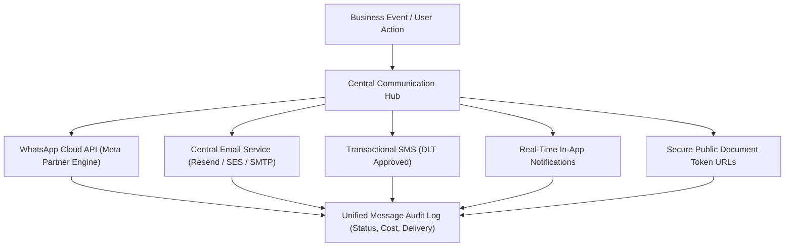
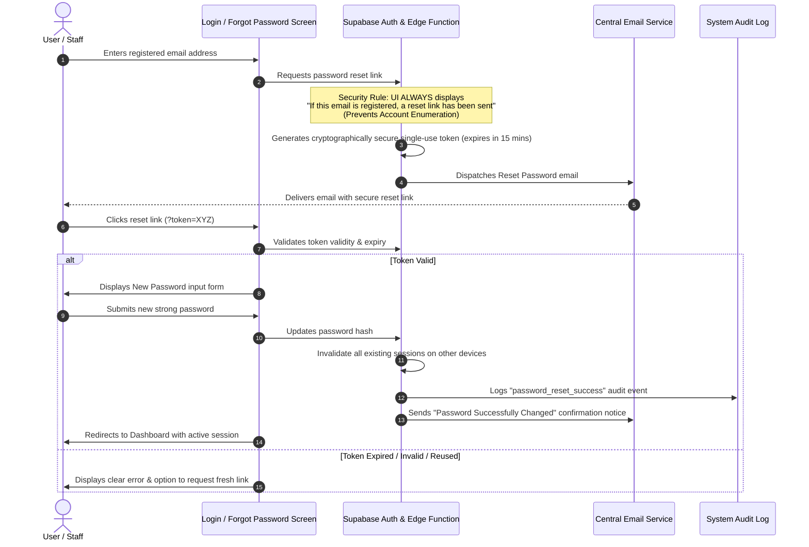

# ORNEXA — COMMUNICATION & EMAIL MASTER SPECIFICATION
**Authoritative Specification for Multi-Channel Messaging & Central Email Service**
*Version: 3.0.0 (Approved Source of Truth)*
*Last Updated: August 2026*

---

## 1. Unified Communication Architecture

Ornexa provides a centralized **Communication Hub** (`/communication/*`) routing transactional messages across five distinct delivery channels:

---

## 2. Central Email Service Architecture

To maintain high deliverability and security, **emails are never dispatched directly from the client browser**. All outgoing emails pass through a server-side transactional queue backed by a clean provider abstraction.

### 2.1 Provider Abstraction Layer
- **Supported Providers:** Resend (Default), Amazon SES, SendGrid, Postmark, and Standard Enterprise SMTP.
- **Provider Switching:** Configurable per tenant or globally via Platform Owner without changing application code.

### 2.2 Standard Transactional Email Catalog
1. **User Invitation / Staff Onboarding:** Secure single-use registration link with pre-assigned role.
2. **Password Reset:** Cryptographically secure time-limited token link.
3. **Email Verification:** Account confirmation token.
4. **Tax Invoice & Receipt Delivery:** High-fidelity HTML summary with attached PDF and secure preview link.
5. **Customer Account Statement:** Monthly dual-ledger statement export.
6. **Support Ticket Updates:** Notifications when firm staff reply to a support thread.
7. **Subscription & Renewal Notices:** 7-day, 3-day, and expiration notices for SaaS billing.
8. **Security Alerts:** Login from new device, password change confirmation, 2FA alerts.

### 2.3 Outbox Queue & Status Tracking
Every email creates an entry in `email_outbox`:
- `Status Lifecycle:` `queued` → `sending` → `sent` → `delivered` (or `failed` → `retry`).
- `Tracking Attributes:` `tenant_id`, `recipient_email`, `subject`, `template_name`, `entity_type` (e.g. `invoice`), `entity_id`, `error_message`, `retry_count` (max 3 retries with exponential backoff).

---

## 3. End-to-End Secure Password Reset Workflow

Ornexa implements an enterprise-grade password reset protocol designed to protect user privacy and prevent email enumeration attacks:

---

## 4. In-App Notification Center

- Real-time bell icon in the top navigation bar powered by Supabase Realtime channels.
- Categorized feeds: `All`, `Orders`, `Workshop`, `Financial`, `Approvals`, `Security`.
- Sound and toast alert toggles configurable per user.
