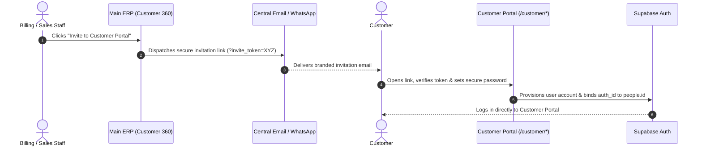
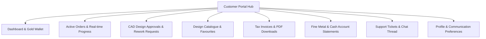

# ORNEXA — CUSTOMER PORTAL MASTER SPECIFICATION
**Authoritative Specification for Customer Self-Service & Design Approvals**
*Version: 3.1.0 (Approved Source of Truth)*
*Last Updated: August 2026*

---

## 1. Portal Identity & Core Objective

The **Customer Portal** (`/customer-portal` or `/customer/*`) provides wholesale buyers and retail clients with a secure, transparent, mobile-optimized (390px viewport-first) self-service workspace to track orders, approve custom CAD designs, inspect invoices, manage gold wallets, and communicate with the firm.

---

## 2. Onboarding & Invitation Flow

Customers are onboarded via secure invitations generated directly from **Customer 360** in the main ERP:

### 2.1 Authentication & Login Methods
- **Password Authentication:** Primary login using Registered Email / Phone + Password.
- **Optional OTP Login:** Tenants can enable OTP via SMS/WhatsApp as an optional secondary login method.
- **Self-Service Recovery:** "Forgot Password" link with secure expiring email token.

---

## 3. Strict Security & Information Isolation Boundary

> **CRITICAL SECURITY INVARIANT:**
> A portal identity belongs to one authorized tenant context and one or more explicitly linked Party relationships. No portal request may escape that authorization boundary.
>
> **Implementation chain:** Authenticated User → `portal_identities` → `portal_party_links` → scoped RPCs (`get_customer_portal`, `get_karigar_portal`, `get_supplier_portal`) → RLS.
>
> Browser-supplied `tenant_id`, `party_id`, `customer_id`, `karigar_id`, or document IDs are never trusted. Direct URL/ID tampering must fail safely via server-side scope checks.

> **CRITICAL SECURITY RULE:**
> Under no circumstances shall any query, RPC, or view in the Customer Portal expose internal manufacturing economics.

### Strictly Prohibited from Customer View:
- Internal manufacturing costs, gross margins, or profit percentages.
- Bullion purchase rates or supplier invoice costs.
- Karigar identity, labour wage rates, or artisan settlement amounts.
- Internal workshop stage notes, internal rework discussions, or confidential QC notes.
- Data or transactions belonging to other customers.
- Company-wide business metrics or firm analytics.

---

## 4. Mobile-First Navigation & Feature Set

### 4.1 Dashboard & Wallet Overview
- **Gold Wallet Card:** Total fine gold held on deposit (mg and grams).
- **Outstanding Money Balance:** Current debit balance in ₹ with payment terms breakdown.
- **Active Orders Count:** Jobs currently on bench or in finishing.
- **Quick Actions:** Browse Catalogue, Submit Support Query, View Latest Invoices.

### 4.2 CAD Design Approval Workflow
- **Pending Approvals Queue:** Custom orders requiring customer confirmation before manufacturing begins.
- **Inspection Card:** High-resolution CAD 3D renders, target gross weight, purity specification (e.g. 22K 916), estimated charges.
- **Actions:**
  - `✅ Approve Design` → Transitions order to `Approved / Ready for Production` and alerts workshop.
  - `🔄 Request Modifications` → Opens structured feedback form with text notes and optional reference image upload; routes order back to CAD designer.

### 4.3 Design Catalogue Browsing & Favourites
- **Visual Grid:** Filter by Category (Rings, Necklaces, Bangles), Metal Purity (22K, 18K), and Target Weight ranges (e.g., < 5g, 5–15g).
- **Enquiry Builder:** Customers can tap `Add to Custom Enquiry` to request a formal quotation or order.

### 4.4 Invoices, Receipts & PDF Downloads
- **Invoice Card:** Invoice No, Date, Total Amount, Amount Paid, Balance Due, Due Date badge (`Current` / `Overdue`).
- **Download PDF:** One-tap download of officially signed GST Tax Invoice PDF.
- **WhatsApp Share:** Receive invoice copy directly on WhatsApp.

### 4.5 Dual-Balance Account Statement (Ledger)
- Detailed 90-day statement showing date, voucher type, metal credit/debit, cash credit/debit, and running balances.
- Export to PDF / CSV for customer accounting records.

### 4.6 Support Desk & Messaging Thread
- Submit new ticket (Order Query, Payment Question, Repair Request).
- Chronological message thread with firm support staff including timestamped replies and photo attachments.
