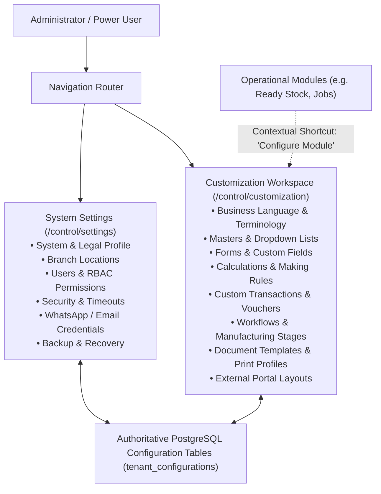
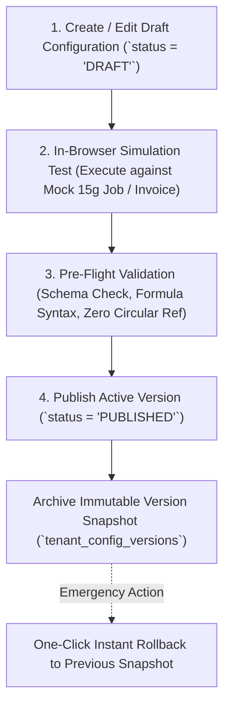

# ORNEXA — UNIVERSAL CUSTOMIZATION WORKSPACE MASTER
**Authoritative Architectural Specification for the First-Class Customization Workspace, Business Adaptability, Draft-Publish Lifecycles, and Staged Configuration Engine**
*Version: 4.0.0 (Approved Source of Truth)*
*Last Updated: August 2026*

---

## 1. Architectural Separation: Customization vs Settings

### 1.1 The Core Operating Principle
> **"SETTINGS CONFIGURES THE SYSTEM; CUSTOMIZATION ADAPTS THE JEWELLERY BUSINESS."**
>
> We strictly separate **System Infrastructure** from **Business Adaptability**:
> - **Settings (`/control/settings`):** System, branches, staff users, security, inactivity timeouts, communication credentials, backup, integrations, and licensing.
> - **Customization (`/control/customization`):** Dedicated top-level workspace containing everything that defines how the jewellery business operates (Terminology, Dropdowns, Custom Fields, Making Rules, Workflows, Document Templates, Print Profiles, and Portals).



---

## 2. The 11 Customization Categories

```
┌─────────────────────────────────────────────────────────────────────────────┐
│                      CUSTOMIZATION WORKSPACE CATEGORIES                     │
├───────────────────────┬─────────────────────────────────────────────────────┤
│ 1. Business Language  │ Terminology packs (Karigar/Worker), Field aliases   │
│ 2. Masters & Lists    │ Custom dropdowns, categories, reasons, worker types │
│ 3. Forms & Fields     │ Dynamic custom fields, field ordering, requirements │
│ 4. Calculations       │ Making charge rules, labour formulas, wastage loss  │
│ 5. Transactions       │ Custom voucher types, multi-ledger posting rules    │
│ 6. Workflows          │ Manufacturing stages, outside Mina/Polish, QC flow  │
│ 7. Documents          │ 10 Template families, T&C clauses, header blocks    │
│ 8. Printing           │ Print profiles, thermal POS 80mm/58mm, label tags   │
│ 9. Portals            │ Customer, Karigar, Supplier layout & field controls │
│ 10. Reports           │ Custom report definitions, column layouts, filters  │
│ 11. Advanced          │ Configuration versions, draft simulations, rollback │
└───────────────────────┴─────────────────────────────────────────────────────┘
```

---

## 3. Draft → Test → Publish Configuration Lifecycle

Critical business configurations (such as labour calculation formulas, document templates, or production stages) never become active immediately while an administrator is editing them. They follow a safe 4-stage lifecycle:



---

## 4. Fine-Grained Customization Permissions (RBAC)

To prevent accidental modification of business logic:
- `customization.view`: Browse configuration settings and previews.
- `customization.edit`: Create and modify draft configuration versions.
- `customization.publish`: Authorized to publish configurations to live production.
- `customization.formulas`: High-risk authority required to modify financial/metal calculation rules.
- `customization.rollback`: Emergency authority to restore historical snapshots.

---

## 5. Global Unified Search (`Ctrl/Cmd+/`)

The global search bar seamlessly queries both **Settings** and **Customization**:
- Query: `"invoice terms"` $\to$ Jumps to **Customization → Documents → Terms & Conditions**
- Query: `"session timeout"` $\to$ Jumps to **Settings → Security → Timeouts**
- Query: `"chain wastage"` $\to$ Jumps to **Customization → Calculations → Wastage Rules**
- Query: `"karigar stage"` $\to$ Jumps to **Customization → Workflows → Manufacturing Stages**
- Query: `"whatsapp credentials"` $\to$ Jumps to **Settings → Communication → WhatsApp**
