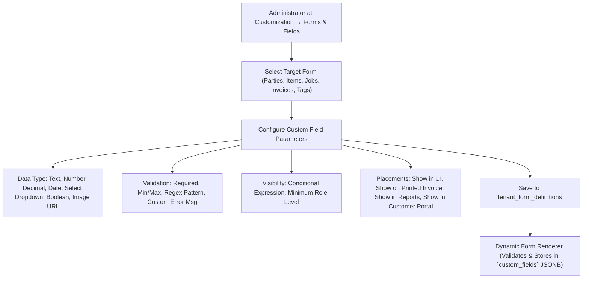

# ORNEXA — CUSTOM FIELDS & DYNAMIC FORMS MASTER
**Authoritative Architectural Specification for Dynamic Form Designer, Custom Attributes, JSONB Storage, and Multi-Surface Field Visibility**
*Version: 4.0.0 (Approved Source of Truth)*
*Last Updated: August 2026*

---

## 1. Dynamic Forms Philosophy

### 1.1 The Core Operating Principle
> **"EVERY CORE ENTITY IN ORNEXA SUPPORTS EXTENSIBLE CUSTOM FIELDS WITHOUT DATABASE SCHEMA MIGRATIONS."**
>
> Jewellery businesses track unique trade attributes (e.g. *Special Sieve Size, Caste/Community Group, Custom Hallmarking Mark, Customer Ring Size, Specific Wastage Tag*).
>
> The Dynamic Form Designer at **Customization → Forms & Fields** (`/control/customization/forms`) allows administrators to safely extend standard forms without code changes.



---

## 2. Supported Form Entities

| Target Entity Form | Typical Custom Field Examples | Storage Location |
|---|---|---|
| **Party 360 (Customers/Dealers)** | Customer Ring Size, Spouse Birthday, Referral Agent, Credit Guarantee Contact | `parties.custom_fields` (JSONB) |
| **Item Masters & Products** | Design Code Alias, Brand Collection, Minimum Selling Touch %, Custom Category | `item_masters.custom_fields` (JSONB) |
| **Manufacturing Job Cards** | Urgent Flight Delivery Date, Specific Polisher Notes, Casting Lot Ref | `job_cards.custom_fields` (JSONB) |
| **Vouchers & Invoices** | Delivery Vehicle No, Transporter E-Way Bill Note, Special Discount Authority | `universal_transactions.custom_fields` (JSONB) |
| **Inventory Tags** | Special RFID Chip Identifier, Diamond Certification Number, Vault Tray Slot | `tag_registry.custom_fields` (JSONB) |

---

## 3. Database Schema Contract

```sql
CREATE TABLE public.tenant_form_definitions (
    id UUID PRIMARY KEY DEFAULT gen_random_uuid(),
    tenant_id UUID NOT NULL REFERENCES public.tenants(id) ON DELETE CASCADE,
    entity_type TEXT NOT NULL, -- 'PARTY', 'ITEM', 'JOB_CARD', 'TRANSACTION', 'TAG'
    field_key TEXT NOT NULL, -- e.g. 'ring_size', 'referral_agent'
    field_label TEXT NOT NULL,
    field_type TEXT NOT NULL, -- 'TEXT', 'NUMBER', 'DECIMAL', 'DATE', 'SELECT', 'BOOLEAN'
    options JSONB, -- For SELECT dropdown options ['A', 'B', 'C']
    is_required BOOLEAN NOT NULL DEFAULT false,
    validation_regex TEXT,
    default_value JSONB,
    display_order INTEGER NOT NULL DEFAULT 0,
    show_on_print BOOLEAN NOT NULL DEFAULT false,
    show_on_portal BOOLEAN NOT NULL DEFAULT false,
    show_in_reports BOOLEAN NOT NULL DEFAULT true,
    min_role_level TEXT NOT NULL DEFAULT 'VIEWER',
    is_active BOOLEAN NOT NULL DEFAULT true,
    created_at TIMESTAMPTZ NOT NULL DEFAULT clock_timestamp(),
    CONSTRAINT tenant_entity_field_unique UNIQUE (tenant_id, entity_type, field_key)
);
```
