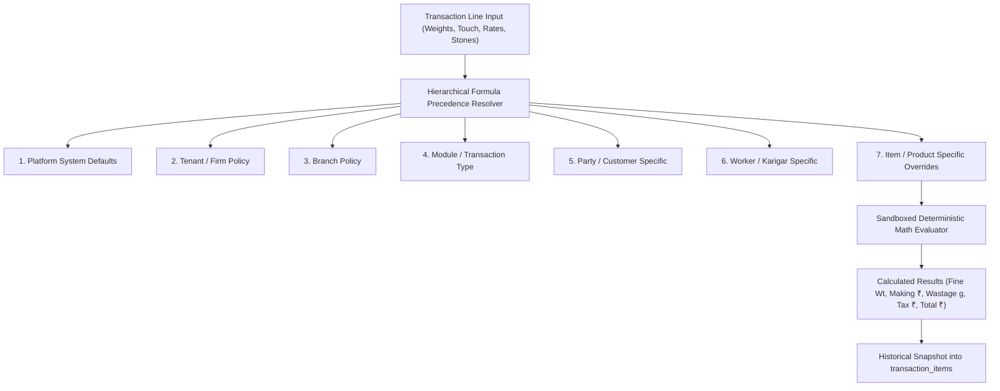

# ORNEXA — DETERMINISTIC CUSTOM FORMULA ENGINE MASTER
**Authoritative Architectural Specification for Mathematical Calculations, Formula Precedence, and Historical Immutability**
*Version: 3.1.0 (Approved Source of Truth)*
*Last Updated: August 2026*

---

## 1. Custom Formula Engine Philosophy

### 1.1 The Core Operating Principle
> **"EVERY FINANCIAL AND METAL CALCULATION IS EXECUTED BY A DETERMINISTIC, VERSIONED FORMULA ENGINE. POSTED TRANSACTIONS PERMANENTLY SNAPSHOT THE FORMULA VERSION USED."**
>
> In the jewellery trade, calculations for fine gold conversions, making charges, alloy additions, stone deductions, and artisan wastage tolerances vary by regional custom and tenant policy. Ornexa enables safe, declarative formula customization without compromising historical audit accuracy.

---

## 2. Governed Jewellery Calculation Domains

The Formula Engine powers all core mathematical operations across the ERP:

| Calculation Domain | Input Variables | Mathematical Expression / Logic |
|---|---|---|
| **Fine Gold Weight** | `gross_wt`, `less_wt`, `touch_pct`, `wastage_pct` | $\text{Net} = \text{Gross} - \text{Less}$; $\quad \text{Fine} = \text{Net} \times \left( \frac{\text{Touch} + \text{Wastage}}{100} \right)$ |
| **Labour / Making Charges** | `gross_wt`, `net_wt`, `making_rate`, `labour_basis`, `metal_val` | Per Gram Gross ($\text{Gross} \times \text{Rate}$), Per Gram Net ($\text{Net} \times \text{Rate}$), Fixed Piece ($\text{Rate}$), % of Metal ($\text{Val} \times \% $) |
| **Artisan Scrap Loss & Tolerance**| `issued_fine`, `received_fine`, `scrap_fine`, `allowed_loss_pct` | $\text{Actual Loss} = \text{Issued} - (\text{Received} + \text{Scrap})$; $\quad \text{Excess Loss} = \max(0, \text{Actual Loss} - \text{Allowed})$ |
| **Stone & Diamond Value** | `carat_wt`, `piece_count`, `rate_per_carat`, `rate_per_piece` | $\text{Value} = (\text{Carats} \times \text{Rate/Ct}) + (\text{Pcs} \times \text{Rate/Pc})$ |
| **GST & Statutory Tax** | `taxable_value`, `gst_rate_pct`, `is_inter_state` | If Inter-State: $\text{IGST} = \text{Val} \times 3\%$; Else: $\text{CGST} = \text{Val} \times 1.5\%, \text{SGST} = \text{Val} \times 1.5\%$ |
| **Alloy & Purity Addition** | `pure_gold_wt`, `target_touch_pct` | $\text{Required Alloy Wt} = \left( \text{Pure Wt} \times \frac{99.90}{\text{Target Touch}} \right) - \text{Pure Wt}$ |

---

## 3. Strict 7-Tier Formula Precedence Hierarchy

When computing a value, the formula engine resolves overrides deterministically:

1. **Platform Default:** Baseline standard Indian jewellery math (e.g. 3% GST, net weight fine conversion).
2. **Tenant Policy:** Firm-wide policies (e.g. standard 2.5% wholesale making charge).
3. **Branch Policy:** Branch-specific overheads or regional tax treatments.
4. **Module / Transaction Type:** Specific overrides (e.g. Job Work vs Retail Invoice).
5. **Party / Customer Specific:** Negotiated trade terms (e.g. VIP client 1.5% wastage allowance).
6. **Worker / Karigar Specific:** Contracted artisan labour rate card (e.g. Master Goldsmith ₹120/g vs Bench Worker ₹85/g).
7. **Item Specific:** Unique product complexity surcharge (e.g. Intricate Bridal Necklace minimum making ₹450/g).

---

## 4. Sandboxing & Historical Immutability

1. **No Arbitrary Code Execution:** Formulas are parsed into Abstract Syntax Trees (AST) using a sandboxed math engine (`mathjs` / custom parser) that permits only approved arithmetic functions (`+`, `-`, `*`, `/`, `round`, `min`, `max`, `if`).
2. **Zero Historical Mutation:** When an invoice or karigar settlement is posted, the computed values and the formula version ID (`formula_version_id`) are snapshot into the record. Updating a formula rule today has zero impact on past transactions.
