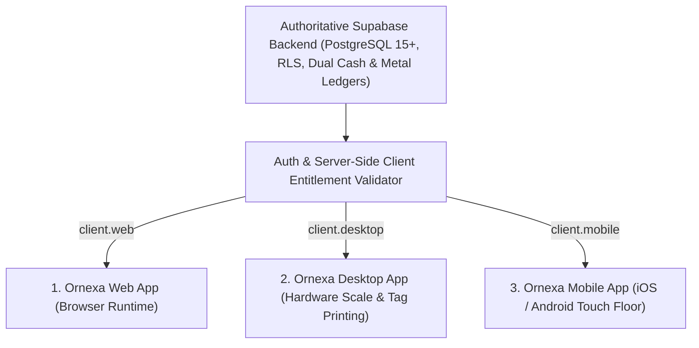
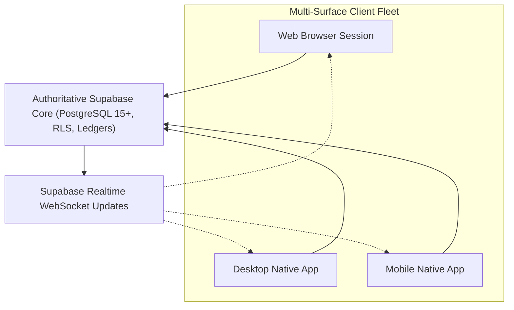

# ORNEXA — DEVICE ACCESS & CLIENT ENTITLEMENT MASTER
**Authoritative Architectural Specification for Multi-Surface Client Entitlements: Web, Desktop, and Mobile Apps**
*Version: 3.2.0 (Approved Source of Truth)*
*Last Updated: August 2026*

---

## 1. Multi-Surface Client Architecture

### 1.1 The Core Operating Principle
> **"DEVICE ACCESS IS A LICENSABLE ENTITLEMENT, NOT AN UNRESTRICTED UNIVERSAL RIGHT."**
>
> Ornexa provides three first-class client application surfaces:
> 1. **Web Application (`client.web`):** High-speed browser client for office workstations and distributed teams.
> 2. **Desktop Application (`client.desktop`):** Keyboard-first, hardware-accelerated desktop client for Windows/macOS with direct digital scale (serial/USB) and butterfly tag printer integration.
> 3. **Mobile Application (`client.mobile`):** Native touch-first iOS & Android client with progressive disclosure, camera barcode scanning, and mobile workshop approvals.
>
> Access to these surfaces is strictly governed by the tenant's purchased commercial tier and active **client entitlement tokens**.



---

## 2. Client Entitlement Rules Across Commercial Plans

The five commercial tiers grant client surface access according to strict rules:

| Commercial Plan Tier | Allowed Device Choices | Included Client Platform Combinations | Mobile Access Included? | Server Entitlements Assigned |
|---|:---:|---|:---:|---|
| **ORNEXA BASIC** | **Choose 1** | `Web` **OR** `Desktop` | ❌ Strictly Excluded | `client.web` OR `client.desktop` |
| **ORNEXA GROWTH** | **Choose 1** | `Web` **OR** `Desktop` **OR** `Mobile` | ✅ If Selected (1 choice only) | `client.web` OR `client.desktop` OR `client.mobile` |
| **ORNEXA PROFESSIONAL**| **Choose 2** | `Web + Desktop`<br>`Web + Mobile`<br>`Desktop + Mobile` | ✅ If Selected (Choice of 2) | Any 2 of (`client.web`, `client.desktop`, `client.mobile`) |
| **ORNEXA SCALE** | **Choose 2** | `Web + Desktop`<br>`Web + Mobile`<br>`Desktop + Mobile` | ✅ If Selected (Choice of 2) | Any 2 of (`client.web`, `client.desktop`, `client.mobile`) |
| **ORNEXA MAX** | **All 3 Included** | `Web + Desktop + Mobile` (Unrestricted) | ✅ Always Included | `client.web`, `client.desktop`, `client.mobile` |

---

## 3. Server-Side Enforcement (Zero Client-Side Bypasses)

```
╔══════════════════════════════════════════════════════════════════════════════╗
║                   SERVER-SIDE CLIENT ENTITLEMENT ENFORCEMENT                 ║
╠══════════════════════════════════════════════════════════════════════════════╣
║ Client entitlement is validated at the AUTHENTICATION & RPC GATEWAY LAYER:   ║
║                                                                              ║
║  1. When a client authenticates, the payload identifies `client_type`.      ║
║  2. The server cross-references `tenant_entitlements` for that client token.  ║
║  3. If a tenant with only `client.desktop` attempts to authenticate via the  ║
║     Mobile app or Web browser, the server returns HTTP 403 Forbidden with     ║
║     a structured entitlement payload:                                        ║
║     `{"error": "CLIENT_NOT_ENTITLED", "required": "client.mobile"}`          ║
║  4. Client-side localStorage, cookies, or devtools tampering CANNOT unlock   ║
║     unlicensed client surfaces.                                              ║
╚══════════════════════════════════════════════════════════════════════════════╝
```

---

## 4. Device Selection & Upgrade Lifecycles

### 4.1 Onboarding Device Selection
During firm onboarding or deal creation in Platform Owner, the administrator selects the included surfaces based on the plan's quota:
- *Example (Professional Plan):* Administrator selects `[✓] Desktop App` and `[✓] Mobile App`. The system provisions `client.desktop` and `client.mobile`.

### 4.2 Seamless Add-On & Device Upgrades
If a **Basic** tenant with `Desktop` later requires `Web Access`:
1. The tenant requests the **Web Client Add-On** via `/ceo/billing` or through Platform Owner.
2. The entitlement `client.web` is appended to the tenant's subscription.
3. The Web application becomes immediately accessible without data migration or downtime.

### 4.3 Configurable Device Swap Policy
Platform Owners can configure tenant swap policies in `commercial_plans`:
- `PERMANENT_CHOICE`: Device selection is locked for the subscription term.
- `FREE_SWAP_ALLOWED`: Tenant can swap client surfaces $N$ times per billing year (e.g. swap Web for Mobile).
- `PAID_SWAP`: Administrative fee charged per platform change.
- `UPGRADE_ONLY`: Requires moving to a plan with higher device allowances.

---

## 5. Unified Single Source of Truth Across All Clients



- **Zero Data Forks:** All clients read and write to the same Supabase database. A job card approved on the Desktop app in the factory workshop updates instantly on the owner's Mobile phone and the accountant's Web browser.
- **Zero Local Offline Databases:** The system explicitly deprecates local SQLite / FoxPro / offline-first sync. Supabase online-only is the authoritative truth.

---

## 6. App Download & Access Centre (`My Ornexa Apps`)

In the CEO / Tenant Administration console (`/control/apps`), administrators and authorized users see the status of their client apps:

```
┌─────────────────────────────────────────────────────────────────────────────┐
│                             MY ORNEXA APPS                                  │
├─────────────────────────────────────────────────────────────────────────────┤
│ 🌐 Ornexa Web Application                                                   │
│    Status: [ INCLUDED IN YOUR PLAN ]                                        │
│    Action: [ Launch Web Workspace → ]                                       │
│                                                                             │
│ 🖥️ Ornexa Desktop App (Windows & macOS)                                     │
│    Status: [ INCLUDED IN YOUR PLAN ]                                        │
│    Action: [ Download Installer v3.2.0 (x64 / ARM64) ]                      │
│                                                                             │
│ 📱 Ornexa Mobile App (iOS & Android)                                        │
│    Status: [ NOT INCLUDED IN BASIC PLAN ]                                   │
│    Action: [ View Upgrade Options ]  [ Request Mobile Add-On ]              │
└─────────────────────────────────────────────────────────────────────────────┘
```

---

## 7. Client-Specific Session Governance & Security

The platform logs and monitors active client sessions in `user_active_sessions`:
- **Captured Metadata:** `user_id`, `client_type` (`WEB` / `DESKTOP` / `MOBILE`), `device_model`, `os_version`, `ip_address`, `last_active_at`, `app_version`.
- **Remote Revocation:** The CEO / Security Administrator can view all live sessions and click **Revoke Session** to instantly log out lost or compromised devices.
