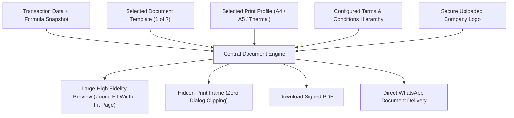

# ORNEXA — DOCUMENT & PRINTING ENGINE MASTER
**Authoritative Specification for Document Rendering, Print Profiles & Templates**
*Version: 3.0.0 (Approved Source of Truth)*
*Last Updated: August 2026*

---

## 1. Central Document & Printing Engine

Ornexa provides a dedicated, enterprise-grade **Document & Printing Engine** designed for high-precision jewellery documents. The engine completely replaces fragile browser modal printing with an isolated, high-fidelity rendering pipeline.



### 1.1 Preview Capabilities
- **Large Readable Surface:** Full-screen or dedicated wide drawer (never cramped into a tiny modal).
- **Controls:** `Zoom In (+)`, `Zoom Out (-)`, `Fit to Width`, `Fit to Page`, `100% Actual Size`.
- **Multi-Page Navigation:** Page X of Y with thumbnail navigation.
- **Actions:** Print, Download PDF, Send via WhatsApp, Send via Email, Copy Secure Share Link.

---

## 2. Configurable Print Profiles

Print Profiles allow users to target different physical printers without breaking document layouts:

| Print Profile | Target Media | Dimensions | Use Cases | Key Profile Attributes |
|---|---|---|---|---|
| **A4 Standard** | Standard Laser / Inkjet | 210 × 297 mm | Tax Invoices, Quotations, Audit Ledgers | Full details, bank info, terms, dual signature. |
| **A4 Compact** | Laser / Inkjet | 210 × 297 mm | High-density multi-item manufacturing bills | Compact line height, reduced margins, multi-item table. |
| **A5 Portrait / Landscape** | Pre-printed / Half A4 | 148 × 210 mm | Job Work Challans, Delivery Notes, Estimates | Streamlined columns, focused party and metal summary. |
| **Thermal Receipt** | POS Thermal Roll | 80mm / 58mm | Cash Receipts, Token Slips, Advance Vouchers | Monochrome optimized, bold totals, QR payment code. |
| **Jewellery Tag / Label** | Thermal Transfer | 50×25mm / 40×20mm | Butterfly Tags, Barcode / RFID item stickers | Ultra-dense barcode, gross wt, net wt, HUID, price. |
| **Job Card Voucher** | Workshop Cardstock | A5 / A4 Slip | Karigar Bench Job Ticket, Melting Ticket | Large item sketch, metal issued, stages, deadline. |
| **Gold Issue / Receive Slip**| Impact / Thermal | 100 × 150 mm | Vault handoff voucher | Dual sign-off (Vault Manager & Karigar). |
| **Ledger Statement** | Laser Continuous | A4 Portrait | Party / Karigar 90-day transaction history | Dense financial & metal credit/debit columns. |

---

## 3. The 10 Professional Document Template Families
*(For in-depth specifications on block design, custom template import/export, and schema validation, see [`DOCUMENT_TEMPLATE_ENGINE.md`](./DOCUMENT_TEMPLATE_ENGINE.md). For physical printer calibration, see [`PRINT_PROFILE_MASTER.md`](./PRINT_PROFILE_MASTER.md).)*

Ornexa ships with 10 distinct, business-ready base document layouts selectable per document type and fully customizable without code:

1. **Classic Business:** Elegant bordered header, traditional double-ruled tables, prominent gold weight summary boxes, formal stamp & signature blocks.
2. **Modern Professional:** Clean asymmetric layout, subtle background fills, clear typographical hierarchy, distinct tax and banking blocks.
3. **Compact Ledger:** High information density, reduced padding, optimized for invoices with 10+ line items on a single A4 page.
4. **Premium Jewellery:** Luxury styling, refined serif typography, prominent brand logo, elegant gemstone & diamond breakdown.
5. **Minimal Clean:** Borderless, generous whitespace, contemporary sans-serif typography, compact summary footer.
6. **Traditional Indian Business:** Standard Indian trade layout matching traditional red-book / computer invoice familiarity.
7. **Dense Accounting:** Auditor-focused, detailed debit/credit/tax schedules, comprehensive ledger notes.
8. **Elegant Corporate:** Executive B2B layout with separated buyer/seller/ship-to panels and corporate compliance styling.
9. **Workshop / Manufacturing:** Job card & workshop ticket layout, metal purity custody, stage sign-offs, barcode tracker.
10. **Customer-Friendly Digital:** Optimized for mobile viewing, PDF share, payment QR, clear milestone status.

### 3.1 Customization Controls per Template
- **Color Palette:** Primary Brand Color, Secondary Text Color, Accent Highlight.
- **Typography:** Configurable font pairings (e.g. Inter, Playfair Display, Roboto Mono).
- **Header & Footer Styles:** Left-aligned, Centered, or Split Banner.
- **Table Styling:** Striped rows, bordered grid, or clean underlines.
- **QR / Barcode Position:** Top-right, bottom invoice corner, or header.

---

## 4. Logo Management & Branding Standard

- **Upload Standard:** Authorized users upload their actual company/branch logo in PNG, JPG, or SVG format directly to the secure `firm-logos` bucket.
- **Strict Rule:** Never invent fake logos or use AI to generate arbitrary customer logos.
- **Multi-Document Reuse:** The uploaded logo automatically scales across Invoices, Job Cards, Quotations, Receipts, Customer Portal, and Email headers.

---

## 5. Conditional Document Fields

> **"If a field has no valid value, it must never appear as an ugly blank or misleading placeholder on the final document."**

### 5.1 Clean Rendering Rules
- If Customer GSTIN is not recorded: **Do NOT print `GSTIN: Not Recorded`**. Simply omit the GSTIN row entirely.
- Applies to: Buyer/Seller Email, Alternate Phone, Shipping Address (if identical to billing), Due Date (if immediate cash), Discount Line (if zero), Bank Details (if cash transaction).

### 5.2 Mandatory Compliance Guard
- If a field is **legally mandatory** for that transaction type (e.g., GSTIN on B2B invoices > ₹50,000, Place of Supply, HSN 7113, or 6-char HUID on hallmarked gold), the engine **blocks document generation** and prompts the user to provide the missing data rather than silently omitting it.

---

## 6. Buyer / Seller State & Tax Display

All B2B documents must explicitly render:
- **Seller Details:** Registered Firm Name, Branch Address, State Name, 2-Digit State Code, GSTIN, PAN.
- **Buyer Details:** Customer/Party Name, Billing Address, Shipping Address, State Name, 2-Digit State Code, GSTIN, Contact No.
- **Place of Supply:** Explicitly printed (e.g. `Place of Supply: 19 - West Bengal`).
- **GST Breakdown Table:** Taxable Amount, CGST Rate & Amount, SGST Rate & Amount, IGST Rate & Amount, Total Tax in Words.

---

## 7. Due Date & Payment Terms Presentation

- Invoices clearly display: **Invoice Date**, **Payment Terms** (e.g., *15 Days Trade Credit*), and **Due Date** (e.g., *29-Aug-2026*).
- Overdue notices or payment reminder slips prominently highlight the overdue duration.

---

## 8. Document-Generated-From Context & Audit Metadata

Every generated document captures internal audit metadata:
- `Generated By:` User ID & Full Name.
- `Role:` Active ERP Role at generation time.
- `Tenant & Branch:` Exact firm and branch location.
- `Source Transaction ID:` Immutable reference to the database transaction.
- `Template & Profile Version:` Exact layout configuration used.
- *Rule: This metadata is stored in the system audit log and printed only as a tiny micro-audit string at the bottom footer (or omitted from customer-facing print unless requested).*

---

## 9. Configurable Terms & Conditions Hierarchy

Terms & Conditions resolve hierarchically so firms can set global policies while allowing branch or document-specific overrides:

```
Platform Default Terms
         │
         ▼
Tenant / Firm Level Terms (e.g. Standard Return & Weight Tolerance Policy)
         │
         ▼
Branch Level Terms (e.g. Local Delivery & Jurisdiction Clause)
         │
         ▼
Document Type Terms (e.g. Specific Job Card Terms vs Invoice Terms vs Gold Issue Terms)
         │
         ▼
Specific Selected Template Overrides
```

- **Historical Immutability:** When an invoice or job card is generated, the active terms text is snapshot into the document record so future policy changes never alter past documents.
