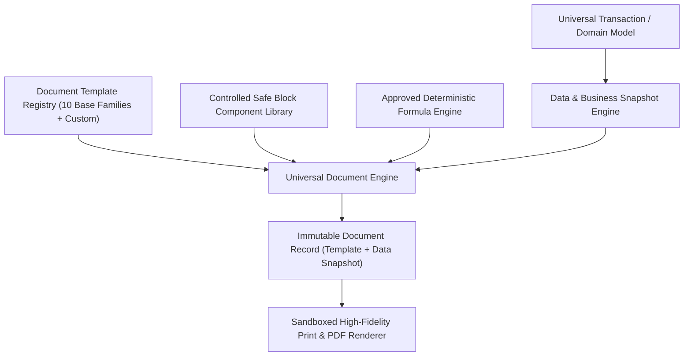

# ORNEXA — UNIVERSAL DOCUMENT TEMPLATE ENGINE MASTER
**Authoritative Architectural Specification for High-Precision Document Generation, Visual Template Designer, and Controlled Block Architecture**
*Version: 3.1.0 (Approved Source of Truth)*
*Last Updated: August 2026*

---

## 1. Universal Document Engine Scope

### 1.1 The Core Operating Principle
> **"EVERY GENERATED AND PRINTABLE DOCUMENT IN ORNEXA USES THE SAME CENTRAL CONFIGURABLE DOCUMENT ENGINE."**
>
> Customization is not reserved for tax invoices alone. Every operational, manufacturing, accounting, and portal document in the system is driven by the **Universal Document Template Engine**.



### 1.2 Universal Document Catalog
The Document Engine powers all of the following document types across the platform:
1. **Sales & Commercial:** Tax Invoice, Retail Bill, Quotation, Estimate / Proforma, Delivery Challan, Customer Sales Return.
2. **Payments & Cash Flow:** Cash Receipt Slip, Bank Payment Voucher, Journal Voucher, Customer Advance Receipt, Customer Refund Voucher.
3. **Purchases & Vendor Bills:** Bullion Purchase Invoice, Gemstone Purchase Voucher, Consignment Receive Note, Supplier Debit Note.
4. **Workshop & Manufacturing:** Job Card Ticket, Melting Ticket, Casting Slip, Alloy Issue Voucher, Metal Loss Slip, Karigar Return Voucher.
5. **Vault & Metal Custody:** Daily Gold Issue Voucher, Daily Gold Receive Voucher, Fine Metal Transfer Note, Inter-Vault Handover Slip.
6. **Subcontractor & Outwork:** Outside Work Voucher (Stone Setting, Enameling/Mina, Laser Soldering, High-Gloss Polish), Mina Book Document, Polish Book Document.
7. **Compliance & Quality Assurance:** Quality Control Inspection Certificate, Hallmark (HUID) Handover Slip, Refinery Assay Summary, Branch Transfer Challan.
8. **Financial Reports & Statements:** Customer Account Statement, Karigar Metal & Cash Hisab Statement, Supplier Ledger, Stock Balance Sheet.
9. **Personnel & Operations:** Daily Attendance Sheet, Karigar Wage Settlement Slip, Vault Daily Balance Sheet.
10. **Portal & Custom Documents:** Customer Portal CAD Approval Certificates, Custom User-Defined Transaction Documents.

---

## 2. The 10 Professional Document Template Families

Ornexa ships with **10 distinct, production-ready base template families**. Each family is structurally tailored for distinct operational contexts:

```mermaid
graph TD
    T1["1. Classic Business (Traditional bordered, double-rule header, gold summary boxes)"]
    T2["2. Modern Professional (Clean asymmetric, structured tax & banking panels)"]
    T3["3. Compact Ledger (High density, single-page 10+ line items optimization)"]
    T4["4. Premium Jewellery (Luxury styling, refined serif typography, gemstone breakdown)"]
    T5["5. Minimal Clean (Borderless, generous whitespace, contemporary sans-serif)"]
    T6["6. Traditional Indian Business (Standard Indian trade layout, vernacular-friendly)"]
    T7["7. Dense Accounting (Auditor-focused, detailed debit/credit & tax schedules)"]
    T8["8. Elegant Corporate (Executive B2B layout, separate buyer/seller/ship-to panels)"]
    T9["9. Workshop / Manufacturing (Job card layout, metal purity custody, stage sign-offs, barcode)"]
    T10["10. Customer-Friendly Digital (Optimized for mobile viewing, PDF share, payment QR)"]
```



### 2.1 Deep Structural Differences
Each template family differs structurally in:
- **Header Composition:** Split-banner, centered ornate emblem, or compact side-by-side identity.
- **Information Density:** Ultra-compact (30+ items per page) vs spacious luxury presentation.
- **Table Structure:** Grid-bordered, alternating banded rows, or minimalist bottom-border lines.
- **Typography & Numeral Formatting:** Tabular figures, classical serif headers, or clean geometric sans.
- **Summary & Calculations Presentation:** Prominent gold weight summary blocks, tax schedule grids, or net payable focus.
- **Signature & Stamp Architecture:** Dual sign-offs (Vault + Artisan), single authorized signatory, or multi-department sign-off grids.
- **Terms & Legal Notes Layout:** Compact footer notes, two-column legal disclaimer, or expandable back-page attachment.

---

## 3. Template Theme Customization Controls

Administrators can customize visual styling while maintaining print contrast and compliance readability:
- **Color Palette Tokens:** Primary Brand Color, Secondary Text Tone, Border Shade, Background Table Fills, Highlight Accent.
- **Typography Presets:** Font Pairings (Inter, Roboto, Playfair Display, Noto Sans Devanagari) with strict line-height tracking.
- **Header & Footer Customization:** Logo dimensions (small, medium, full-width banner), logo alignment (left, center, right), dynamic header metadata.
- **Table Styling:** Header background shade, grid border weight (0.5pt, 1pt), row padding, font size scaling.
- **Signature Styling:** Text label, digital signature image integration, official rubber stamp placement box.
- **QR & Barcode Placement:** Top header, invoice footer, right-aligned summary block, or dedicated barcode sticker area.

---

## 4. Controlled Component Block System

To eliminate security vulnerabilities, **arbitrary executable HTML and JavaScript are strictly prohibited**. Users compose templates using a certified library of sandboxed components:

| Controlled Block Component | Content & Capabilities | Configuration Options |
|---|---|---|
| `<HeaderBlock>` | Company Name, Logo, Branch Address, GSTIN, PAN, Phone, Email | Alignment, Logo size, Contact layout |
| `<PartyBlock>` | Customer / Supplier Name, Billing & Shipping Address, GSTIN, State | Show/Hide shipping, Label aliases |
| `<LineItemTable>` | Serial, Item Code, Description, HSN, Gross Wt, Net Wt, Purity, Rate, Total | Column selection, ordering, widths |
| `<WeightSummaryBlock>` | Pure Gold Issued, Gross Wt Received, Scrap Wt, Allowed Wastage, Net Loss | Purity conversion mode, Gram precision |
| `<TaxBreakdownBlock>` | Taxable Value, CGST, SGST, IGST, Total Tax in Words | Detailed table vs single-line tax |
| `<TotalsBlock>` | Subtotal, Discount, Making Charges, Other Charges, Round Off, Grand Total | Alignment, Emphasis styling, Currency symbol |
| `<PaymentInfoBlock>` | Bank Name, Account No, IFSC Code, Branch, UPI ID | Show/Hide bank details, UPI QR toggle |
| `<QRCodeBlock>` | Dynamic UPI Payment QR, E-Invoice QR, or Document Verification URL | Size, Error correction level, Caption |
| `<BarcodeBlock>` | Code 128 / QR / DataMatrix barcode for transaction tracking or HUID | Height, Human-readable text toggle |
| `<TermsBlock>` | Hierarchical Terms & Conditions, Return Policy, Interest Clause | Font size, Multi-column layout |
| `<SignatureBlock>` | Authorized Signatory label, Customer Signature, Vault Sign-off | Single / Dual signature, Stamp box |
| `<CustomFieldBlock>` | Dynamic custom attribute value (Text, Date, Number, Tag) | Custom label, Alignment, Prefix/Suffix |
| `<PageFooterBlock>` | Page X of Y, Generation Timestamp, Micro-Audit Hash | Visibility, Micro-print size |

---

## 5. Visual Template Designer & Field Customization

Authorised users can visually edit document structures with guaranteed layout safety:

### 5.1 Safe Layout Operations
- **Add / Remove Rows & Sections:** Insert or remove controlled component blocks.
- **Reorder & Align:** Drag-and-drop block positioning, left/center/right text alignment.
- **Field Visibility & Rename:** Show or hide optional fields; rename standard labels (e.g. rename *Making Charges* to *Crafting Fee*).
- **Calculated & Formula Fields:** Insert approved mathematical expressions from the deterministic formula engine (e.g. `[Gross Weight] - [Stone Weight]`).

### 5.2 Conditional Display Logic
Templates evaluate clean display conditions during generation:
```
IF (Customer.GSTIN IS EMPTY)  → HIDE "Customer GSTIN" Row (Never print "Not Recorded")
IF (Transaction.Discount == 0) → HIDE "Discount" Row
IF (Item.StoneWeight > 0)      → SHOW "Stone Details & Breakdown" Table
IF (Transaction.IsTaxable)     → SHOW "GST Breakdown Schedule"
IF (Document.RequiresApproval) → SHOW "Secondary Supervisor Signature Block"
```

---

## 6. Document Versioning & Historical Immutability

> **"Changing a template today must NEVER silently alter an invoice printed six months ago."**

When a transaction document is posted or finalized, the Document Engine stores an **immutable document snapshot**:
1. `template_id` & `template_version`
2. `theme_tokens_snapshot`
3. `terms_and_conditions_snapshot`
4. `field_configuration_snapshot`
5. `business_data_snapshot` (Immutable transaction figures)
6. `micro_audit_hash` (Cryptographic verification hash)

Re-printing a historical document always renders using the exact snapshot active at the time of document generation.

---

## 7. Custom Document Types & Universal Transaction Engine Integration

When an administrator defines a new transaction type in the **Universal Transaction Engine** (e.g. *Refinery Gold Assaying Challan*):
1. **Define Transaction Schema:** Configure transaction fields, metal purity inputs, and ledger accounts.
2. **Create Custom Document Definition:** Bind the transaction to the Document Engine.
3. **Select Base Template Family:** Choose one of the 10 base template families.
4. **Customize Blocks & Terminology:** Tailor labels, QR codes, and custom fields.
5. **Configure Numbering Series:** Set prefix, padding, and financial year resets.
6. **Deploy Instantly:** Document becomes available for preview, PDF export, thermal print, and WhatsApp sharing with zero code deployment.

---

## 8. Template Import & Export (`.ornexa-template`)

Templates can be shared across branches or backed up via portable packages:
- **Format:** Standardized `.ornexa-template` JSON package containing:
  - `template_schema_version`
  - `target_document_type`
  - `block_layout_tree`
  - `theme_style_tokens`
  - `conditional_rules_manifest`
- **Security Validation:** Imported templates undergo strict schema validation and sanitization. Cross-tenant proprietary template leaks are blocked.
