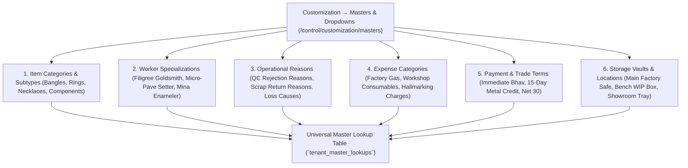

# ORNEXA — DROPDOWN & MASTER LIST ENGINE MASTER
**Authoritative Architectural Specification for Centralized Custom Lists, Dropdown Management, Categories, Reasons, and Master Lookups**
*Version: 4.0.0 (Approved Source of Truth)*
*Last Updated: August 2026*

---

## 1. Centralized Master List Philosophy

### 1.1 The Core Operating Principle
> **"EDITABLE DROPDOWNS AND CATEGORY MASTERS ARE CONSOLIDATED UNDER CUSTOMIZATION, NEVER SCATTERED ACROSS UNRELATED SETTINGS PAGES."**
>
> In jewellery operations, categorization and lookup values (e.g. *Expense Categories, Worker Specializations, Scrap Return Reasons, Delivery Challan Terms*) are constantly refined.
>
> The Master & Dropdown Engine at **Customization → Masters & Dropdowns** (`/control/customization/masters`) provides a single, organized interface for managing all system lookup lists.



---

## 2. Database Schema Contract

```sql
CREATE TABLE public.tenant_master_lookups (
    id UUID PRIMARY KEY DEFAULT gen_random_uuid(),
    tenant_id UUID NOT NULL REFERENCES public.tenants(id) ON DELETE CASCADE,
    category_key TEXT NOT NULL, -- 'WORKER_TYPE', 'REJECTION_REASON', 'EXPENSE_CATEGORY', 'PAYMENT_TERMS'
    code TEXT NOT NULL, -- 'MINA_WORKER', 'POROSITY_DEFECT', 'WORKSHOP_GAS'
    label TEXT NOT NULL, -- 'Mina Enameling Specialist', 'Casting Porosity Defect'
    display_order INTEGER NOT NULL DEFAULT 0,
    is_system_default BOOLEAN NOT NULL DEFAULT false,
    is_active BOOLEAN NOT NULL DEFAULT true,
    metadata JSONB DEFAULT '{}'::jsonb, -- e.g. color badge, default rate
    created_at TIMESTAMPTZ NOT NULL DEFAULT clock_timestamp(),
    CONSTRAINT tenant_lookup_unique UNIQUE (tenant_id, category_key, code)
);
```

- **Module-Local Shortcuts:** Clicking *"Manage Categories"* inside the Ready Stock inventory view opens a drawer connected to `tenant_master_lookups WHERE category_key = 'ITEM_CATEGORY'`, ensuring a single authoritative source of truth.
