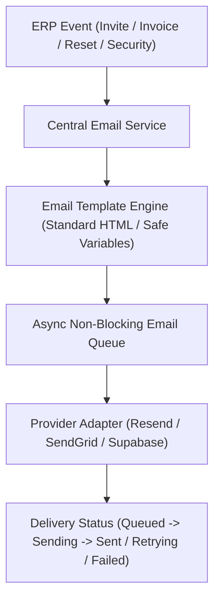

# ORNEXA — CENTRALIZED EMAIL SERVICE MASTER
**Specification for Central Email Service, Template Engine, Queueing & Provider Abstraction**
*Version: 4.0.0*

---

## 1. Operating Architecture

## 2. Invariants

- **Non-Blocking Execution:** Email dispatch never blocks or delays database commits or user transactions.
- **Delivery Accuracy:** "Sent" indicates SMTP dispatch; "Delivered" is shown only when provider webhook confirms delivery.
- **Configurable Templates:** Supports tenant branding, logos, localized text, and secure action URLs.
