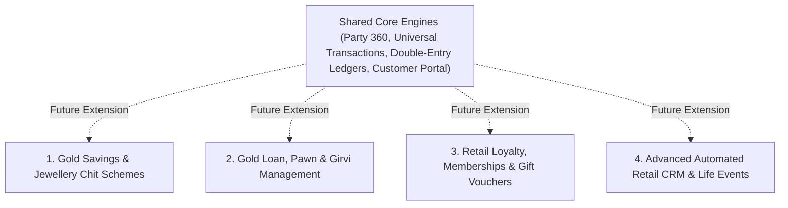

# ORNEXA — FUTURE EXTENSIBILITY & ROADMAP SPECIFICATION
**Authoritative Specification for Deferred Retail Financial Products and Extensibility Architectural Hooks**
*Version: 3.2.0 (Approved Source of Truth)*
*Last Updated: August 2026*

---

## 1. Scope Freezing & Extensibility Principle

### 1.1 The Core Operating Principle
> **"RETAIL FINANCIAL PRODUCTS ARE FROZEN FOR FUTURE EXTENSIBILITY. THEY ARE NOT BEING IMPLEMENTED IN CURRENT RELEASE GATES."**
>
> To maintain laser focus on core jewellery manufacturing, gold accountability, wholesale distribution, and counter billing, complex retail financial schemes are **deliberately deferred**.
>
> **CRITICAL IMPLEMENTATION MANDATE:**
> 1. **DO NOT IMPLEMENT THESE FEATURES NOW.**
> 2. **DO NOT EXPOSE EMPTY MENU ITEMS OR DEAD CARDS FOR THEM.**
> 3. **DO NOT BUILD PLACEHOLDER OR BROKEN SCREENS.**
> 4. Ensure current architectural engines (*Party 360, Universal Transaction Engine, Formula Engine, Workflow Engine, Document Engine, Double-Entry Accounting, Customer Portal, Plan/Entitlement Engine*) remain structurally capable of supporting them in future updates without architectural rewrites.

---

## 2. Deferred Retail Capabilities Catalogue



### 2.1 Gold Savings Scheme / Monthly Jewellery Scheme Management
- **Description:** Traditional Indian jewellery monthly gold accumulation schemes (e.g. 11+1 month bonus schemes, weight-accruing gold piggy bank).
- **Future Capabilities:**
  - Monthly Gold Deposit Schemes (Fixed Cash or Spot-Metal Grams)
  - Scheme Instalment schedules & automated UPI Auto-Debit / eNACH hooks
  - Maturity date tracking & firm bonus / benefit rule evaluation
  - Customer Scheme Passbook / Statement in Customer Portal
  - Scheme Redemption against jewellery purchase invoices
  - Automated WhatsApp payment reminders & receipt vouchers
- **Architectural Hook:** Will utilize `party_accounts` (Customer sub-ledger), `universal_transactions` (`SCHEME_DEPOSIT`), and `formula_engine` (Bonus rules).

### 2.2 Gold Loan / Pawn / Girvi Management (Collateralized Lending)
- **Description:** Pledging gold jewellery as collateral against short-term personal or commercial loans, subject to statutory RBI and local state money-lending regulations.
- **Future Capabilities:**
  - Loan against physical gold appraisal and gross/net valuation
  - Compound / simple interest rules, penalty slabs, and notice periods
  - Vault packet seal tracking, barcode lot custody, and periodic audit
  - Loan principal repayment, interest servicing, and full release settlement
  - Statutory default notice generation, auction schedules, and settlement ledgers
- **Architectural Hook:** Will utilize `tag_registry` (Packet tracking), `accounting_ledger` (Loan asset / Interest income), and `document_template_engine` (Pledge pawn ticket).

### 2.3 Retail Loyalty, Tiered Memberships & Gift Vouchers
- **Description:** Consumer loyalty points, VIP tier progression (Silver, Gold, Platinum, Solitaire), and digital gift cards.
- **Future Capabilities:**
  - Points earning on making charges or gross invoice value
  - Points redemption against making charge discounts
  - Digital Gift Voucher generation with unique redemption PIN
  - VIP Member event invitations and priority booking
- **Architectural Hook:** Will utilize `party_360_profiles` and `custom_formula_engine`.

---

## 3. Release Readiness Boundary

```
╔══════════════════════════════════════════════════════════════════════════════╗
║                   RELEASE READINESS BOUNDARY GUARANTEE                       ║
╠══════════════════════════════════════════════════════════════════════════════╣
║ The features listed in this document are STRICTLY EXCLUDED from current      ║
║ production release readiness gates and automated test suites.                ║
║                                                                              ║
║ Any code introducing dummy navigation routes or incomplete UI screens for     ║
║ Gold Schemes, Girvi Pawn Loans, or Loyalty Points will FAIL Definition-of-   ║
║ Done (DoD) review.                                                           ║
╚══════════════════════════════════════════════════════════════════════════════╝
```
