# ORNEXA — MASTER IMPLEMENTATION MATRIX & BOUNDED WORKSTREAMS
**Authoritative Feature Status, Gap Analysis & Structured Execution Plan**
*Version: 3.2.0 (Approved Source of Truth)*
*Last Updated: August 2026*

---

## 1. Status Key & Taxonomy

- **EXISTS:** Code and database structures exist and match current canonical requirements.
- **PARTIAL:** Baseline implementation exists but requires hardening, missing workflows, or architectural alignment.
- **BROKEN:** Existing code is failing tests, experiencing regressions, or contains blocking errors.
- **MISSING:** Feature is approved in specifications but not yet implemented.
- **LEGACY TO REMOVE:** Obsolete local/offline or temporary demo artifacts to be safely removed.
- **READY FOR TEST:** Implementation complete with 0 TypeScript errors; staged for test runner.
- **VERIFIED:** Explicitly verified and approved across all streams.

---

## 2. Master Feature Implementation Matrix (Streams R1 through R10 / A through J)

| # | Workstream / Subsystem | Approved Requirement | Route / Surface | Code Status | DB / Schema | RLS & Security | Print / Doc | Test Status | Immediate Next Action |
|---|---|---|---|:---:|:---:|:---:|:---:|:---:|:---:|
| **R1** | **Stream A: Party 360 & 13-Stage Migration Wizard** | Unified Party 360 directory (`party_role_profiles`, `party_bank_accounts`), 13-stage Migration Wizard with CSV parsing, dry-run simulation, rollback, and audit freeze | `/people/$id`, `/control/migration`, `/setup` | `EXISTS` | `EXISTS` | `EXISTS` | `EXISTS` | `VERIFIED` | Verified 13-stage workflow and audit freeze |
| **R2** | **Stream B: Master Data, Purity & Daily Bhav Rate Book** | Multi-attribute item masters, stamp fineness table (24K, 22K 916, 18K 750, 14K, 925), diamond sieve/clarity matrix, timestamped Rate Book | `/control/rates`, `/catalog`, `/stock/stones` | `EXISTS` | `EXISTS` | `EXISTS` | `EXISTS` | `VERIFIED` | Verified multi-karat propagation and rate book updates |
| **R3** | **Stream C: Universal Transaction Engine & Custom Formulas** | Declarative voucher engine with custom fields, 6-ledger invariants (Money, Metal, Stock, Party, WIP, Tax), 7-tier formula engine with immutable snapshots | `/billing/*`, `src/lib/ornexa/transaction-contracts.ts` | `EXISTS` | `EXISTS` | `EXISTS` | `EXISTS` | `VERIFIED` | Verified 6-ledger invariants and 7-tier formula precedence |
| **R4** | **Stream D: Manufacturing Book & Karigar Settlement** | 12-stage job card lifecycle (Order → CAD → Issue → Melting → Bench → Outside Work → QC → Hallmark → Tag → Bill), Karigar custody, Hisab final | `/workshop/*`, `/settlement/$id` | `EXISTS` | `EXISTS` | `EXISTS` | `EXISTS` | `VERIFIED` | Verified bench custody, melting recovery, and Hisab settlement |
| **R5** | **Stream E: Tag Registry, HUID & RFID Stock Audit** | Serialized tag registry (Code 128 / QR barcodes, 6-char BIS HUID), tray locations, stock audit discrepancy engine (In-Place, Missing, Extra, Misplaced) | `/barcode`, `/stock/*`, `/stock/verification` | `EXISTS` | `EXISTS` | `EXISTS` | `EXISTS` | `VERIFIED` | Verified stock verification and digital scale tare integration |
| **R6** | **Stream F: Universal Reporting Engine & 10 Report Families** | 10 canonical report families with multi-dimensional totals (₹, Gross g, Fine g, Cts) and recursive voucher drill-down navigation | `/reports/*` (29 routes), `/dashboard/ceo` | `EXISTS` | `EXISTS` | `EXISTS` | `EXISTS` | `VERIFIED` | Verified 4D multi-dimensional totals and recursive drill-down |
| **R7** | **Stream G: Dual Cash/Metal Accounting & Tally Export** | Dual-entry cash & fine metal bookkeeping, period freeze controls, day-close checklist, schema-validated Tally Prime XML export | `/ledger`, `/control/tally-export`, `/reports/daily-close` | `EXISTS` | `EXISTS` | `EXISTS` | `EXISTS` | `VERIFIED` | Verified dual cash/metal balance and Tally Prime XML export |
| **R8** | **Stream H: Universal Document Engine & Print Profiles** | 10 document template families, `.ornexa-template` export, millimeter-calibrated A4 Laser and 80mm/58mm POS thermal print profiles | `/control/print-profiles`, `/settings/print-templates` | `EXISTS` | `EXISTS` | `EXISTS` | `EXISTS` | `VERIFIED` | Verified millimeter layout rendering and vendor-split PDF engine |
| **R9** | **Stream I: Encrypted Tenant Backup & 7-Phase Restore** | Self-service `.ornexa.enc` encrypted archive export with SHA-256 integrity manifest, 7-phase controlled restore with dry-run and dual-ledger reconciliation | `/settings/backup-recovery` | `EXISTS` | `EXISTS` | `EXISTS` | `EXISTS` | `VERIFIED` | Verified `.ornexa.enc` generation and 7-phase restoration engine |
| **R10** | **Stream J: Commercial Products, Device Access, Terminology & AI Assistant** | 5 Commercial Plan Tiers (Basic, Growth, Professional, Scale, Max), device gating (`client.web`, `client.desktop`, `client.mobile`), Plan Builder (`/platform/plans`), Tenant 360, Assisted Setup (`/onboarding`), 42-term Terminology Engine (`/control/terminology`), 18-category Settings Hub, 3-layer AI Assistant | `/platform/plans`, `/platform`, `/onboarding`, `/control/terminology`, `AssistantDrawer.tsx` | `EXISTS` | `EXISTS` | `EXISTS` | `EXISTS` | `VERIFIED` | Verified device surface entitlements, terminology packs, and AI runtime |

---

## 3. Bounded Implementation Workstreams (A through J Summary)

```mermaid
graph TD
    StreamA["Stream A: Party 360 + Opening Balances + 13-Stage Migration (/control/migration)"]
    StreamB["Stream B: Master Data + Items + Purity + Stone + Daily Bhav Rate Book (/control/rates)"]
    StreamC["Stream C: Universal Transaction Engine + 6-Ledger Invariants + 7-Tier Formulas"]
    StreamD["Stream D: Manufacturing Custody + 12-Stage Job Card + Karigar Hisab Final"]
    StreamA["Stream A: Jwelly Masters / Party 360 / Items / Purity / Diamond Stones"]
    StreamB["Stream B: Opening Balances & 13-Stage Migration Wizard (FTUX Lifecycle)"]
    StreamC["Stream C: Customization Workspace (Top-Level Hub, Dropdowns, Dynamic Forms)"]
    StreamD["Stream D: Calculation & Rule Engine (Making Charges, Labour, Wastage Loss)"]
    StreamE["Stream E: Universal Transactions / Voucher Engine (Vouchers, Old Gold, GST)"]
    StreamF["Stream F: Reporting Engine & 10 Canonical Report Families (4D Aggregations)"]
    StreamG["Stream G: Tagging & Inventory (Code128, QR, HUID, RFID Audits, Digital Scales)"]
    StreamH["Stream H: Manufacturing Books (Job Cards, Karigar Bench, Outside Mina/Polish)"]
    StreamI["Stream I: Universal Document Engine (10 Templates, Print Profiles, WhatsApp)"]
    StreamJ["Stream J: Portals & User Invitations (Customer CAD, Karigar, Supplier, Internal)"]
    StreamK["Stream K: Settings Streamlining & Professional UX System (Low-Radius, No AI Slop)"]
    StreamL["Stream L: QA, Security & Performance (RLS, Timeouts, Backup .ornexa.enc, Slicing)"]
```

### Workstream Scope Definitions (Streams A through L):
- **Stream A — Jwelly Masters / Party / Item / Purity / Stone:** Unified Party 360 directory (`/people/$id`), explicit party types, multi-bank accounts, compliance schemas, stamp fineness table (24K, 22K 916, 18K 750, 14K, 925), and diamond sieve/clarity matrices (`stock.stones`). References: `PARTY_360_MASTER.md`, `ITEM_AND_MATERIAL_MASTER.md`, `RATE_BOOK_MASTER.md`.
- **Stream B — Opening Balance & Migration:** 13-stage Migration Wizard (`/control/migration`) with CSV parsing, dry-run simulation, balance sheet checks, FTUX onboarding prompt (Start, Do Later, Start Fresh), and completion states (`NOT_STARTED` to `COMPLETED`/`SKIPPED`). Reference: `OPENING_BALANCE_AND_MIGRATION_MASTER.md`.
- **Stream C — Customization Engine:** Top-level Customization workspace (`/control/customization`) with 11 organized categories, centralized dropdown/master list engine, dynamic forms & custom fields (`custom_fields` JSONB), draft-publish versioning, and rollback. References: `CUSTOMIZATION_MASTER.md`, `CUSTOM_FIELDS_AND_FORMS_MASTER.md`, `DROPDOWN_AND_MASTER_ENGINE.md`.
- **Stream D — Calculation / Formula Rules:** 7-tier deterministic calculation engine (Making charges on Gross/Net/Pcs/%, worker labour, allowed wastage loss, chain wastage exclusions, stone deductions, and GST taxable valuation). Reference: `CALCULATION_AND_RULE_ENGINE.md`.
- **Stream E — Transactions / Voucher Engine:** Declarative voucher definitions, multi-ledger invariants (Money, Metal, Stock, Party, WIP, Tax), old gold purchases, bullion inward, B2B wholesale tax invoices, and retail counter billing. Reference: `UNIVERSAL_TRANSACTION_ENGINE.md`.
- **Stream F — Reports / Registers:** Central universal reporting engine with 4-dimensional aggregations (Money ₹, Gross Wt g, Fine Gold g, Diamond Cts), recursive drill-down graph down to source vouchers, and all 10 canonical report families. References: `REPORTING_ENGINE_MASTER.md`, `REPORT_CATALOGUE.md`.
- **Stream G — Tagging / Inventory:** Unique tag registry, Code 128 / QR barcodes, 6-character BIS HUID hallmarking, tray transfers, physical stock discrepancy analyzer (In-Place, Missing, Extra, Misplaced), and serial scale tare integration. Reference: `TAGGING_AND_TRACEABILITY_MASTER.md`.
- **Stream H — Manufacturing Books:** Complete 12-stage job card lifecycle, karigar bench custody balance, melting recovery assays, outside processing subsystem (Mina Book, Polish Book, Casting House), and Hisab Final settlements. Reference: `MANUFACTURING_LEDGER_MASTER.md`.
- **Stream I — Documents / Print:** 10 professional document template families, controlled block component library, `.ornexa-template` package export, millimeter-calibrated print profiles (Laser A4, POS Thermal 80mm/58mm), and WhatsApp delivery. References: `DOCUMENT_TEMPLATE_ENGINE.md`, `PRINT_PROFILE_MASTER.md`.
- **Stream J — Portals / Invitations:** Customer VIP portal (CAD approvals, invoices), Karigar workshop portal (job bags, scrap return), Supplier bullion portal, Home screen portal launchpad, and secure cryptographic invitation workflows. References: `PORTAL_CONFIGURATION_MASTER.md`, `AUTH_AND_INVITATION_MASTER.md`.
- **Stream K — Settings Streamlining / Branch UI / UX System:** Streamlined 10-category system settings (`/control/settings`), rebuilt branch management table and compact drawer, centralized low-radius (0–6px) design tokens, zero emoji, and zero AI-slop design. Reference: `SETTINGS_MASTER.md`.
- **Stream L — QA / Security / Performance:** Multi-tenant Row Level Security (RLS), configurable inactivity timeouts, "Clear This Browser Session", encrypted backup export/restore (`.ornexa.enc`), modular performance slicing (FCP < 1.2s, TTI < 1.8s), and automated Playwright test suites. References: `SESSION_AND_SECURITY_MASTER.md`, `BACKUP_RESTORE_MASTER.md`, `PERFORMANCE_ARCHITECTURE.md`, `RELEASE_READINESS.md`.
