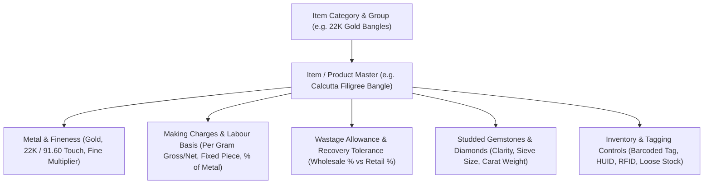

# ORNEXA — ITEM, MATERIAL & JEWELLERY ATTRIBUTES MASTER
**Authoritative Architectural Specification for Jewellery Product Masters, Purity Matrices, Gemstones, and Dynamic Item Attributes**
*Version: 3.1.0 (Approved Source of Truth)*
*Last Updated: August 2026*

---

## 1. Modern Jewellery Product Hierarchy

### 1.1 The Core Operating Principle
> **"JEWELLERY ITEMS ARE MULTI-DIMENSIONAL PHYSICAL OBJECTS COMBINING PRECIOUS METALS, GEMSTONES, ARTISAN LABOUR, AND UNIQUE TRACEABILITY SEALS."**
>
> Unlike generic retail ERPs with simple SKU codes, Ornexa's **Item & Material Master** captures fine purity conversions, labour rate cards, wastage tolerances, diamond sieve matrices, and statutory hallmarking (HUID) parameters.

---

## 2. Comprehensive Item Master Schema

Each item in `item_masters` encompasses:

### 2.1 Core Product Identity
- `item_name`: Official product name (e.g. *Antique Temple Choker Necklace*).
- `item_code`: Alphanumeric search alias / SKU.
- `item_group_id`: Parent group (e.g. *Gold Ornaments*, *Diamond Studded*, *Silver Utensils*, *Bullion Bars*).
- `category_id`: Sub-category (e.g. *Rings*, *Earrings*, *Chains*, *Bangles*, *Mangalsutras*, *Coins*).
- `design_code` & `collection_name`: Design catalog mapping (e.g. *Bridal Heritage 2026*).

### 2.2 Metal & Purity Configurations
- `metal_type`: `Gold`, `Silver`, `Platinum`, `Palladium`, `Alloy / Brass`.
- `purity_stamp_id`: Foreign key to Stamp/Purity Master (e.g. `22K (916)`, `18K (750)`, `14K (585)`, `999 (Fine)`).
- `default_touch`: Standard purity percentage (e.g. `91.60%`).
- `fine_calculation_mode`:
  - `Touch Only`: $\text{Fine} = \text{Net Wt} \times \frac{\text{Touch}}{100}$
  - `Touch + Wastage`: $\text{Fine} = \text{Net Wt} \times \frac{\text{Touch} + \text{Wastage}}{100}$

### 2.3 Labour, Making & Wastage Engine
- `labour_basis`:
  - `1`: Per Gram on Gross Weight
  - `2`: Per Gram on Net Weight
  - `3`: Fixed Amount per Piece
  - `4`: Percentage of Metal Value
- `default_making_rate`: Standard making charge (₹/g or ₹/pc).
- `min_making_charge`: Floor making threshold below which billings trigger manager override.
- `allowed_wastage_pct`: Benchmark artisan wastage allowance (e.g. `2.50%`).

### 2.4 Inventory, Tagging & Compliance Controls
- `stock_method`: `Tagged Only` (Unique barcode/HUID per piece), `Loose Stock Only` (Bulk grams/pieces), `Hybrid / Both`.
- `tag_weight_deduction`: Standard plastic tag & thread tare weight (e.g. `0.020g`) deducted during live weighing scale capture.
- `huid_applicable`: Boolean flag enforcing 6-character BIS hallmark code recording before sale.
- `hsn_code`: Statutory GST HSN code (e.g. `7113` for Jewellery, `7108` for Bullion).

---

## 3. Stamp & Purity Master

The **Stamp / Purity Master (`/masters/purity`)** centrally governs metal fineness standards:

| Stamp / Karat Name | Metal Type | Touch / Fineness % | Standard Karat | HUID Mandatory | Benchmark Use Cases |
|---|---|---|---|:---:|---|
| **24K Fine Gold** | Gold | 99.90% / 99.50% | 24K | No (Bullion) | Bullion Bars, Coins, Minted Biscuits |
| **22K Gold (916)** | Gold | 91.60% | 22K | Yes | Traditional Indian Jewellery, Chains, Bangles |
| **20K Gold (833)** | Gold | 83.33% | 20K | Yes | Regional Ornaments, Kolhapuri Jewellery |
| **18K Gold (750)** | Gold | 75.00% | 18K | Yes | Diamond Studded Jewellery, Modern Rings |
| **14K Gold (585)** | Gold | 58.50% | 14K | Yes | Lightweight Everyday Diamond Jewellery |
| **9K Gold (375)** | Gold | 37.50% | 9K | Optional | Budget Gemstone Jewellery, Export Lines |
| **Fine Silver (999)**| Silver | 99.90% | Pure Silver | No | Silver Coins, Pooja Bars |
| **Sterling Silver (925)**| Silver | 92.50% | 925 Sterling | Yes | Silver Jewellery, Utensils, Giftware |
| **Platinum (950)** | Platinum | 95.00% | Pt 950 | Yes | Platinum Wedding Bands, Solitaire Rings |

---

## 4. Diamond & Gemstone Master

For studded jewellery, the Gemstone Master supports multi-parameter stone matrices:

### 4.1 Governed Gemstone Dimensions
- **Diamond Clarity:** `FL`, `IF`, `VVS1`, `VVS2`, `VS1`, `VS2`, `SI1`, `SI2`, `I1`, `I2`, `I3`.
- **Diamond Color:** `D`, `E`, `F` (Colorless), `G`, `H`, `I`, `J` (Near Colorless), `K` through `Z` (Faint/Light Yellow), `Fancy Color`.
- **Diamond Cut / Polish / Symmetry:** `Excellent`, `Very Good`, `Good`, `Fair`, `Poor`.
- **Shape & Faceting:** `Round Brilliant`, `Princess`, `Emerald`, `Oval`, `Marquise`, `Pear`, `Cushion`, `Heart`, `Radiant`, `Baguette`.
- **Sieve / Size Brackets:** `+0000 to -00` (Star/Melle), `+00 to +2`, `+2 to +6.5`, `+6.5 to +11`, `+11 to +14` (Pointers/Solitaires).
- **Certification Laboratory:** `GIA`, `IGI`, `HRD`, `SGL`, `In-House Verified`.

---

## 5. Tenant-Defined Custom Item Attributes

Ornexa allows tenants to configure unlimited custom item attributes without database schema changes:
- Custom stone settings (Prong, Bezel, Channel, Pavé, Micro-pavé)
- Custom enamel colors & polish styles (High Gloss, Matte, Antique, Rhodium, Rose Gold Flash)
- Custom gender & sizing metrics (Ring Size India/US, Bangle Size 2.4/2.6/2.8, Chain Length Inches)
- Custom workshop notes & CAD source file links.
