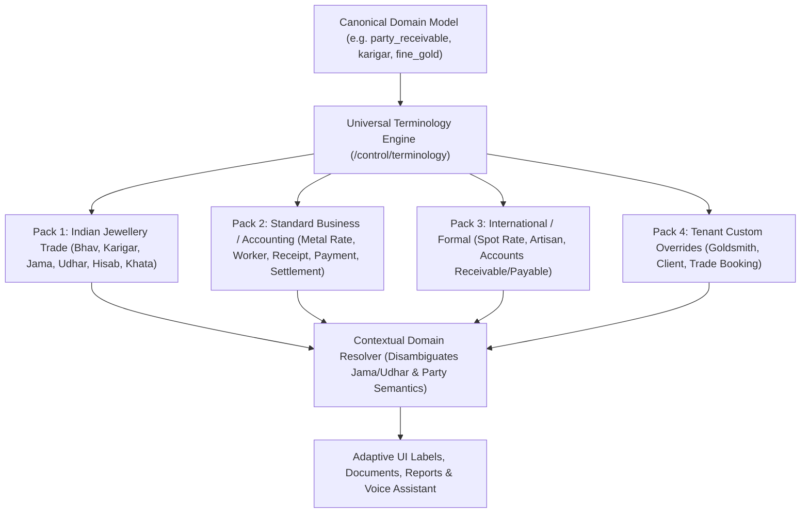
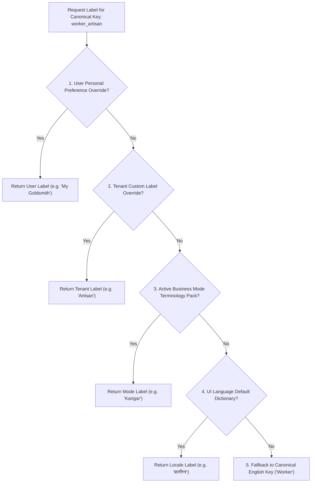

# ORNEXA — JEWELLERY INDUSTRY TERMINOLOGY MASTER
**Authoritative Architectural Specification for Canonical Keys, Terminology Packs, Trade Dictionaries, and Contextual Linguistic Mapping**
*Version: 3.1.0 (Approved Source of Truth)*
*Last Updated: August 2026*

---

## 1. Terminology Engine Philosophy

### 1.1 The Core Operating Principle
> **"WORDS ARE CONFIGURABLE; BUSINESS TRUTH IS NOT."**
>
> The underlying database, double-entry ledgers, RLS policies, and gold calculations rely on **immutable canonical domain keys**. The presentation layer dynamically translates these keys into familiar trade vocabulary based on the active **Terminology Pack**, **Business Mode**, and **Tenant Overrides**.



---

## 2. Separate Language vs Terminology

Ornexa maintains a strict architectural distinction between **UI Language** and **Business Terminology**:
- **Language Pack (`locale`):** Determines the base language syntax (English `en-IN`, Marathi `mr-IN`, Hindi `hi-IN`, Gujarati `gu-IN`, Bengali `bn-IN`).
- **Terminology Pack (`trade_pack`):** Determines domain-specific business vocabulary.
- *Example:* A user can operate in **English UI Language** while using the **Indian Jewellery Trade Terminology Pack** (*displaying "Karigar", "Bhav", "Hisab", "Jama"*). Another user in the same tenant can operate in **Marathi UI** with **Standard Accounting Terminology**.

### 2.1 Terminology Style is Customizable — Business Capability is NOT
```
╔══════════════════════════════════════════════════════════════════════════════╗
║                TERMINOLOGY VS COMMERCIAL CAPABILITY BOUNDARY                 ║
╠══════════════════════════════════════════════════════════════════════════════╣
║ Changing "Karigar" ↔ "Worker" or "Bhav" ↔ "Rate" is a cosmetic terminology   ║
║ personalization and is 100% FREE within any licensed business environment.   ║
║                                                                              ║
║ Changing an ERP from "Manufacturing Mode" to "Wholesale Mode" is a           ║
║ COMMERCIAL CAPABILITY / LICENSING CHANGE and requires an active entitlement  ║
║ token (e.g. business.wholesale).                                             ║
║                                                                              ║
║ Choosing a terminology preset does NOT unlock unpurchased business models.  ║
╚══════════════════════════════════════════════════════════════════════════════╝
```

---

## 3. Strict Contextual Warning: Jama / Udhar vs Debit / Credit

```
╔══════════════════════════════════════════════════════════════════════════════╗
║                   CRITICAL JAMA / UDHAR CONTEXTUAL RULE                      ║
╠══════════════════════════════════════════════════════════════════════════════╣
║ Under NO circumstances should the engine execute naive global string mapping: ║
║  ❌ JAMA ≠ GLOBAL "CREDIT"                                                    ║
║  ❌ UDHAR ≠ GLOBAL "DEBIT"                                                   ║
║                                                                              ║
║ IN JEWELLERY TRADE VERNACULAR:                                               ║
║  - Gold deposited by customer → "Customer Gold Jama" (Physical Inward)       ║
║  - Gold issued to Karigar → "Karigar Issue / Udhar" (Metal Outward / Debit)  ║
║  - Cash received from buyer → "Cash Jama" (Cash Inward / Accounting Debit)   ║
║  - Cash balance owed by buyer → "Udhar Khata" (Receivable Asset)             ║
║                                                                              ║
║ Canonical double-entry accounting mechanics remain strictly mathematical:     ║
║ Debits and Credits are invariant; "Jama" and "Udhar" are presentation badges.║
╚══════════════════════════════════════════════════════════════════════════════╝
```

---

## 4. Comprehensive Jewellery Industry Terminology Dictionary

The table below defines the canonical mapping for 42 foundational jewellery concepts:

| # | Canonical Key | Indian Trade Label | Standard Business Label | International Formal | Manufacturer Default | Wholesaler Default | Retail Default | Description & Contextual Domain Rules | Allowed Override |
|---|---|---|---|---|---|---|---|---|:---:|
| **1** | `metal_rate` | Bhav / Daily Bhav | Metal Rate / Spot Rate | Market Spot Rate | Daily Bhav | Metal Rate | Today's Gold Rate | Precious metal rate per gram for billing & valuation | Yes |
| **2** | `worker_artisan` | Karigar | Worker / Craftsman | Artisan / Goldsmith | Karigar | Manufacturer / Karigar| Bench Worker / Goldsmith | Craftsman performing jewellery fabrication/repair | Yes |
| **3** | `party_customer` | Party / Grahak | Customer / Client | Business Client | Jeweller / Client | Dealer / Jeweller | Customer / Buyer | Buyer of finished jewellery or manufacturing services | Yes |
| **4** | `party_supplier` | Mahajan / Supplier | Supplier / Vendor | Vendor / Bullion Dealer | Bullion Supplier | Manufacturer / Supplier| Wholesaler / Supplier | Seller of raw gold bullion, gems, or ready goods | Yes |
| **5** | `metal_receipt` | Jama (Metal) / Aamad | Metal Receipt / Inward | Metal Return / Inward | Metal Receive | Stock Inward | Old Gold Inward | Physical metal received from karigar or customer | Yes |
| **6** | `metal_issue` | Issue / Nikas | Metal Issue / Outward | Material Issue | Gold Issue | Stock Dispatch | Issue to Workshop | Physical metal issued to artisan or branch | Yes |
| **7** | `account_ledger` | Khata / Ledger | Account Ledger | Statement of Account | Party Khata | Dealer Ledger | Customer Statement | Financial and metal transaction statement | Yes |
| **8** | `settlement_final` | Hisab / Hisab Final | Account Settlement | Final Reconciliation | Karigar Hisab | Dealer Settlement | Account Settlement | Reconciling metal issued vs returned vs loss | Yes |
| **9** | `metal_purity_touch`| Touch / Tanch / Tapas | Purity Factor / Touch % | Fineness / Karat | Touch % | Purity (Touch) | Karat (Purity) | Gold fineness percentage (e.g. 91.60 for 22K) | Yes |
| **10**| `fine_metal_weight`| Fine / Pure Weight | Fine Metal Weight | Pure Metal Equivalent | Fine Gold (g) | Fine Metal (g) | Pure Gold (g) | Calculated pure 24K equivalent weight | Yes |
| **11**| `gross_weight` | Wajan / Gross Weight | Gross Weight | Total Mass | Gross Wt (g) | Gross Wt (g) | Gross Weight (g) | Total physical weight on digital scale | Yes |
| **12**| `net_weight` | Net Wajan | Net Weight | Net Precious Metal | Net Wt (g) | Net Wt (g) | Net Weight (g) | Physical metal weight after stone/wax deductions | Yes |
| **13**| `loss_wastage` | Ghat / Chhijat / Wastage| Wastage Allowance | Process Loss Tolerance | Ghat / Wastage | Wastage % | Wastage Allowance | Permitted metal loss during manufacturing stages | Yes |
| **14**| `making_charges` | Majuri / Making | Making Charges | Crafting / Labour Fee | Making Charges | Making Charges | Making / Labour | Artisan or retail labour charge for craftsmanship | Yes |
| **15**| `manufacturing_job` | Job / Job Card | Manufacturing Order | Production Work Order | Job Card | Custom Order | Repair / Custom Job | Unique workshop production bag or ticket | Yes |
| **16**| `inventory_goods` | Maal / Stock | Goods / Inventory | Stock Inventory | Factory Stock | Warehouse Stock | Showroom Ready Stock| Precious jewellery items held for sale or work | Yes |
| **17**| `item_tag` | Tag / Label | Item Tag / Barcode | Inventory Tag | Tag No | Barcode Tag | Price Tag / Barcode | Unique serialized butterfly barcode label on item | Yes |
| **18**| `ready_stock` | Ready Maal / Stock | Finished Goods | Available Inventory | Finished Vault | Available Stock | Counter Ready Stock | Finished inventory ready for immediate delivery | Yes |
| **19**| `work_in_progress` | WIP / Chalu Kaam | Work in Progress (WIP) | Production WIP | Workshop WIP | Assembly WIP | Workshop Orders | Metal and jobs currently on goldsmith benches | Yes |
| **20**| `memo_approval` | Jangad / Approval | Approval Memo | Consignment Approval | Jangad Outward | Approval Memo | Approval / Memo | Goods given to client or dealer on returnable trial | Yes |
| **21**| `delivery_challan` | Challan | Delivery Challan | Dispatch Note | Delivery Challan | Dispatch Challan | Delivery Slip | Non-tax delivery or inter-branch transfer slip | Yes |
| **22**| `rate_cut_settle` | Bhav Cut / Rate Cut | Rate Settlement | Price Fixing Contract | Bhav Cut | Rate Settlement | Gold Rate Fixing | Fixing gold purchase/sale price against open metal | Yes |
| **23**| `metal_deposit` | Gold Jama / Deposit | Customer Metal Advance | Client Metal Deposit | Customer Gold Deposit | Dealer Metal Advance| Customer Gold Advance| Physical gold held in advance for future orders | Yes |
| **24**| `gold_balance` | Gold Baki / Balance | Metal Outstanding | Net Metal Balance | Metal Custody Balance | Gold Balance | Gold Account | Net fine gold receivable from or payable to party | Yes |
| **25**| `financial_receivable`| Udhar Baki / Len-den | Outstanding Receivable | Accounts Receivable | Receivables | Dealer Outstanding | Customer Outstanding| Net monetary cash owed by customer or dealer | Yes |
| **26**| `cash_receipt` | Jama Slip / Receipt | Cash Receipt | Payment Receipt | Cash Receipt | Collection Receipt | Payment Receipt | Money received via cash, cheque, NEFT, or UPI | Yes |
| **27**| `cash_payment` | Bhugtan / Payment | Payment Voucher | Disbursal Voucher | Cash Payment | Supplier Payment | Expense / Payout | Money paid out to supplier, karigar, or expense | Yes |
| **28**| `sales_invoice` | Pukka Bill / Tax Bill | Tax Invoice | Commercial Invoice | Tax Invoice | Wholesale Invoice | Tax Invoice / Bill | Legal GST tax invoice for jewellery delivery | Yes |
| **29**| `estimate_slip` | Kaccha Bill / Estimate| Quotation / Estimate | Proforma Quotation | Estimate | Proforma Estimate | Counter Estimate | Non-posted estimate slip for customer quotation | Yes |
| **30**| `old_gold_purchase`| Old Gold / Khadda | Old Gold Purchase | Scrap Buyback | Scrap Purchase | Metal Inward | Old Gold Exchange | Customer or dealer scrap gold bought for melting | Yes |
| **31**| `refinery_melting` | Ghalai / Refinery | Refining & Assaying | Smelting & Assaying | Melting & Assay | Melting Lot | Refinery Batch | Melting scrap gold into standard pure bullion bars | Yes |
| **32**| `hallmark_huid` | Hallmark / HUID | BIS Hallmarking (HUID) | Official Assay Hallmark | Hallmark (HUID) | Hallmark HUID | BIS Hallmark Seal | Mandatory 6-character laser engraved assay seal | Yes |
| **33**| `enameling_mina` | Mina Kaam / Meenakari | Enameling / Meena | Enamel Crafting | Mina Work | Mina Processing | Enamel Work | Colored vitreous enamel art on jewellery surface | Yes |
| **34**| `polishing_finish` | Chhulai / Polish | Polishing & Cleaning | Surface Finishing | High-Gloss Polish | Final Polish | Showroom Polish | High-luster magnetic & ultrasonic surface finish | Yes |
| **35**| `studded_gemstone` | Nagina / Stone | Colored Gemstone | Mounted Gemstone | Stones / Nag | Gemstones | Stones (Ruby/Emerald)| Non-diamond precious and semi-precious stones | Yes |
| **36**| `cut_diamond` | Heera / Diamond | Cut & Polished Diamond | Natural/Lab Diamond | Diamonds / Heera | Loose Diamonds | Certified Diamonds | Natural or lab-grown faceted diamonds | Yes |
| **37**| `repair_order` | Marammat / Repair | Repair Order | Service & Restoration | Workshop Repair | Reconditioning | Customer Repair | Fixing broken jewellery or resizing rings | Yes |
| **38**| `outside_contractor`| Outside Karigar | Process Subcontractor | External Specialist | Subcontractor | Outside Vendor | Workshop Specialist | Specialized outside vendor (Mina, Micro-setting) | Yes |
| **39**| `salesperson_agent` | Salesman / Dalal | Sales Executive / Agent| Sales Representative | Trade Broker | Field Sales Agent | Showroom Executive | Staff or broker driving sales and bookings | Yes |
| **40**| `inter_branch_move` | Branch Transfer | Inter-Branch Transfer | Facility Transfer | Factory to Showroom | Warehouse Transfer | Showroom Transfer | Stock transfer between registered firm locations | Yes |
| **41**| `tray_box_location`| Dabba / Tray / Box | Showcase Tray / Safe | Storage Box / Slot | Vault Tray | Warehouse Box | Display Tray / Counter| Physical container holding finished inventory tags | Yes |
| **42**| `pawn_loan_pledge` | Girvi / Rahan (Legacy) | Gold Loan Pledge | Collateral Pledge | *Excluded (Retail)* | *Excluded (Retail)* | Gold Loan (Optional) | Pledged jewellery against short-term loan | Yes |

---

## 5. Terminology Fallback Resolution Pipeline

When rendering any label in the UI, document, or report, the runtime resolves strings in a strict 5-step fallback cascade:



---

## 6. Global Search & Voice Assistant Synonym Awareness

The Universal Search (`Ctrl/Cmd+K`) and Ornexa Voice Assistant automatically expand search terms across all terminology variants:
- Searching for `"Bhav"` matches transactions and menus containing `"Gold Rate"`, `"Daily Rate"`, or `"Spot Rate"`.
- Searching for `"Goldsmith"` or `"Artisan"` retrieves records stored under the canonical entity `karigar`.
- Voice commands in Hindi (*"Raju Karigar ka hisab dikhao"*) correctly resolve to the canonical `get_party_settlement_statement(party_type='KARIGAR', party_name='Raju')`.
