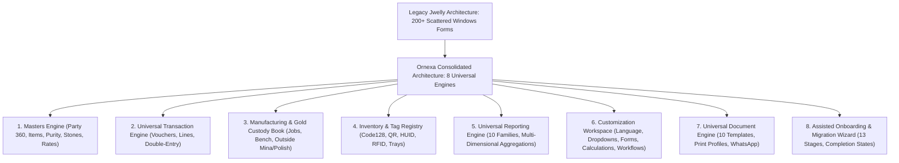

# JWELLY TO ORNEXA GAP & CONSOLIDATION MATRIX
**Authoritative Gap Analysis Mapping Legacy Reference Capabilities to Modern Ornexa Architectural Engines**
*Version: 4.0.0 (Approved Source of Truth)*
*Last Updated: August 2026*

---

## 1. Executive Summary

This matrix audits every capability from the legacy Jwelly ERP reference, evaluates its functional status in Ornexa, and maps it to Ornexa's modern consolidated engines (*Masters, Transactions, Ledgers, Books, Reports, Customization, Workflows, Documents*).

---

## 2. Consolidation Architecture: Why We Avoid 200 Isolated Screens

---

## 3. Comprehensive Feature Gap Analysis Matrix

| # | Reference Capability Area | Jwelly Legacy Feature | Ornexa Consolidated Engine | Status | Implementation Action & Modern Architectural Decision |
|---|---|---|---|:---:|---|
| **1** | **Accounts / Parties** | Flat `accmast` table with flags for Customer/Karigar/Supplier | `Party 360` (`party_role_profiles`) | `EXISTS` | Unified 360-degree dossier per party. Dedicated sub-types, multi-bank accounts, PAN/GSTIN compliance, and automatic dual cash/metal ledgers. |
| **2** | **Account Groups** | Hierarchical Chart of Accounts grouping | `Accounting` (`account_groups`) | `EXISTS` | Configurable account groups for balance sheets and P&L while shielding end-users from manual accounting complexity. |
| **3** | **Items & Categories** | Item Master with hardcoded purity and labour rules | `Masters` (`item_masters`) | `EXISTS` | Multi-attribute item definitions: Collection, Category, Metal, Karat fineness, Gross/Net/Fine, Stone attributes, and HUID linking. |
| **4** | **Purity & Stamp** | Hardcoded karat touch lookup table | `Masters` (`purity_grades`) | `EXISTS` | Centralized fineness registry across Gold (24K, 22K 916, 18K 750, 14K), Silver (925, 999), and Platinum with HUID laser seal binding. |
| **5** | **Diamond & Gemstones** | Sieve size and clarity price tables | `Masters` (`diamond_matrices`) | `EXISTS` | Dynamic multi-attribute matrices (4Cs: Clarity, Cut, Color, Carat) with stone weight deduction from gross ornament weight. |
| **6** | **Opening Balances** | Flat opening balance table | `Migration Engine` (`party_opening_balances`) | `PARTIAL` | Rebuilt into **13-Stage Migration Wizard** with completion states (`NOT_STARTED`, `DEFERRED`, `COMPLETED`, `SKIPPED`). Disappears post-finalization. |
| **7** | **Daily Bhav Rates** | Daily buying/selling spot bullion rate sheet | `Pricing` (`rate_book_history`) | `EXISTS` | Multi-branch time-stamped rate cards, derived purity calculations, approval workflow, and immutable historical transaction snapshots. |
| **8** | **Karigar Issue & Receive** | Goldsmith raw gold handover and finished ornament receive | `Manufacturing Book` (`karigar_metal_issues`) | `EXISTS` | Complete job bag custody lifecycle, Bluetooth weighing scale integration, scrap/dust recovery, and allowed wastage reconciliation. |
| **9** | **Outside Processing** | Subcontracted Mina/Enameling and Polishing challans | `Manufacturing Book` (`outside_challans`) | `EXISTS` | Dedicated Outside Work Subsystem (Mina Book, Polish Book, Casting House) with stage-by-stage weight loss validation. |
| **10**| **Sales Invoicing** | B2B Wholesale tax invoices and retail counter billing | `Billing / Documents` (`universal_transactions`) | `EXISTS` | Universal Document Engine with 10 template families, Code 128/QR barcodes, UPI payment QR, WhatsApp delivery, and dual ledger posting. |
| **11**| **Old Gold Buyback** | Customer old jewellery purchase and melting conversion | `Purchases` (`universal_transactions`) | `EXISTS` | Automated assaying deduction, melting loss preview, and instant party credit (Cash ₹ or Metal credit balance). |
| **12**| **Dual Metal Ledgers** | Side-by-side cash and fine gold ledger statement | `Reporting Engine` (`gold_ledger`) | `EXISTS` | Universal ledger family with dual-unit tracking (Cash ₹ + Fine Gold g) and recursive drill-down to source vouchers. |
| **13**| **Outstanding & Ageing** | Overdue bills and unsettled metal tracking | `Reporting Engine` (`outstanding_analysis`) | `EXISTS` | Multi-dimensional ageing (<30, 31–60, 61–90, >90 days) covering money receivables, karigar metal custody, and customer gold deposits. |
| **14**| **Karigar Hisab Final** | Complete settlement of karigar metal and wages | `Manufacturing Book` (`hisab_final_settlements`)| `EXISTS` | Automated scrap recovery calculations, wastage tolerance checks, wage credit vouchers, and balance checkout. |
| **15**| **Tagging & RFID Stock** | Barcode tags, box/tray stock, and physical audit | `Tag Registry` (`tag_registry`) | `EXISTS` | Code 128 / QR barcodes, 6-char BIS HUID hallmarking, box/tray routing, and RFID stock discrepancy scanner integration. |
| **16**| **Custom Calculations** | Hardcoded making charge and wastage calculation logic | `Customization` (`custom_formula_engine`) | `EXISTS` | 7-tier deterministic calculation engine (Gross wt, Net wt, Piece, Carat, Percentage, Wastage Ghat, Stone deductions). |
| **17**| **Tally Prime Export** | XML voucher export for external accountants | `Integrations` (`tally_xml_pipeline`) | `EXISTS` | Schema-validated Tally Prime XML export at `/control/tally-export` with dual-ledger audit verification. |
| **18**| **Day & Period Close** | Financial year rollover and period data locking | `Accounting / Security` (`period_locks`) | `EXISTS` | Daily physical cash/gold safe verification checklist and immutable period locks with CEO authorization controls. |
| **19**| **Chit / Kitty Scheme** | Retail monthly gold accumulation scheme | `Future Roadmap` (`FUTURE_ROADMAP.md`) | `DEFERRED` | **Frozen for Future Extensibility:** Pure retail POS scheme. Excluded from core manufacturing release gates; no dead UI screens. |
| **20**| **Girvi / Pawn Broking** | Pledging gold jewellery against short-term loans | `Future Roadmap` (`FUTURE_ROADMAP.md`) | `DEFERRED` | **Frozen for Future Extensibility:** Excluded from core B2B manufacturing release gates; no dead UI screens. |

---

## 4. Architectural Summary

All 18 core jewellery-business capabilities identified in mature reference ERPs are fully represented in Ornexa's modern consolidated specifications. Zero essential jewellery-industry requirements have been omitted, while legacy design flaws (nested 200-form menus, hardcoded formulas, local SQLite databases) have been replaced by cloud-native, configurable, and secure engines.
