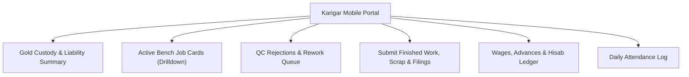

# ORNEXA — KARIGAR PORTAL MASTER SPECIFICATION
**Authoritative Specification for Workshop Artisans & Bench Jewellers**
*Version: 3.1.0 (Approved Source of Truth)*
*Last Updated: August 2026*

---

## 1. Portal Identity & Core Objective

The **Karigar Portal** (`/karigar-portal` or `/karigar/*`) provides workshop artisans, setters, polishers, and bench goldsmiths with an ultra-simple, mobile-first (390px viewport primary) interface designed for quick touch interactions in physical workshop environments.

---

## 2. Onboarding & Invitation Flow

Artisans are invited directly from **Karigar 360** in the main ERP:
1. **Invite from ERP:** Workshop supervisor or CEO clicks `[Invite to Karigar Portal]`.
2. **Invitation Link:** Dispatched via Email or WhatsApp.
3. **Password Setup:** Karigar opens link on mobile browser and creates a secure password.
4. **Party Binding:** Auth account maps to `portal_identities` + `portal_party_links` (strict tenant + party scope). Phone-only global matching is prohibited.

> **Security invariant:** A portal identity belongs to one authorized tenant context and one or more explicitly linked Party relationships. No portal request may escape that authorization boundary.

---

## 3. Core Functional Modules

### 3.1 Gold Custody & Liability Overview
- **Gold Held Right Now:** Real-time fine gold currently in the artisan's physical custody (in grams and mg).
- **Monthly Movements:** Total gold issued vs total gold returned this calendar month.
- **Liability Status Indicator:**
  - `Green (Within Limit):` Custody is well within the approved workshop credit limit.
  - `Amber (Near Limit):` Custody is within 10% of maximum allowed bench limit.
  - `Red (Limit Exceeded):` Requires immediate return or supervisor sign-off before fresh metal issuance.

### 3.2 Active Bench Jobs List & Drill-down
- **Job Cards List:** Job No, Article Design, Target Gross Weight, Due Date badge, Priority flag.
- **Job Card Drill-down:**
  - Full technical specs (Purity, Target Net Weight, Stone setting requirements).
  - Material Issued breakdown (Base gold ingot, findings, solder, stones).
  - Wastage (Ghat) allowed percentage.

### 3.3 QC Rejections & Rework Panel
- **QC Rejected Jobs:** Highlights articles returned by Quality Control with explicit inspector notes (e.g. *Prong loose on center stone*, *Surface porosity near hallmark area*).
- **Rework Acknowledgment:** One-tap `Acknowledge & Start Rework` button updates the job card state to `rework_started` and notifies the workshop supervisor.

### 3.4 Finished Work & Scrap Submission Form
- Allows the karigar to record physical handback of completed pieces:
  - **Finished Gross Weight (g)**
  - **Scrap / Ghat Weight (g)**
  - **Bench Filings / Dust Weight (g)**
  - **Notes / Remarks**
- Submission creates an unconfirmed `worker_return` record awaiting vault supervisor verification.

### 3.5 Wages, Advances & Hisab Ledger
- **Accrued Labour:** Itemized breakdown of completed jobs and calculated making charges.
- **Advances & Deductions:** Record of cash advances, tool deductions, or metal loss debits.
- **Net Outstanding Wages:** Clear summary of unpaid wages ready for weekly/monthly settlement.

### 3.6 Daily Attendance & Clock-in
- Logs daily bench attendance (`Present`, `Half Day`, `Absent`, `Overtime Hours`).

---

## 4. Strict Security & Data Scoping

- **RLS Policy:** Karigar accounts can only access records where `job_cards.karigar_id = auth.uid()` or `worker_returns.worker_id = auth.uid()`.
- **Zero Firm Exposure:** Karigars cannot view customer selling prices, invoice totals, firm-wide gold holdings, or other artisans' wage rates.
