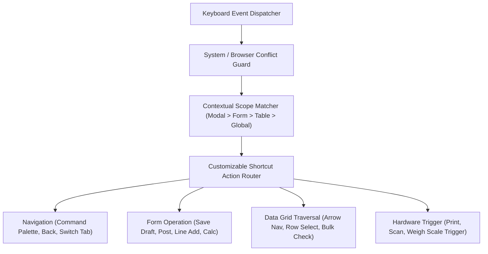
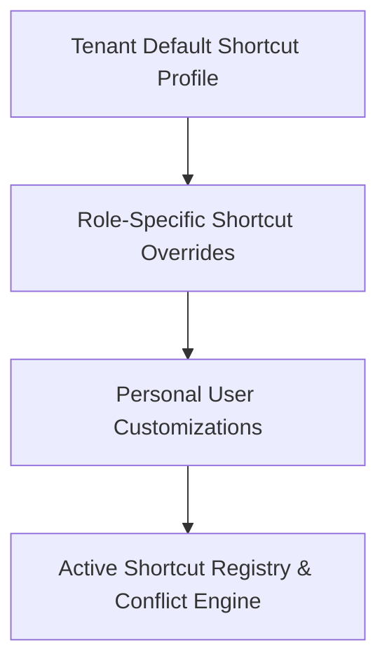
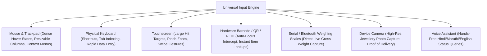

# ORNEXA — KEYBOARD OPERATION & INPUT METHOD MASTER
**Authoritative Architectural Specification for High-Speed Keyboard Navigation, Configurable Shortcuts, and Multi-Input Awareness**
*Version: 3.1.0 (Approved Source of Truth)*
*Last Updated: August 2026*

---

## 1. Full Keyboard Operation Philosophy

### 1.1 The Core Operating Principle
> **"A CAPABLE OPERATOR MUST BE ABLE TO PERFORM ALL MAJOR ERP WORKFLOWS EFFICIENTLY WITHOUT CONSTANTLY REACHING FOR THE MOUSE."**
>
> In high-volume jewellery manufacturing and wholesale environments, mouse dependency creates severe data entry bottlenecks. Ornexa is engineered with a **Keyboard-First Interaction Engine** across all desktop workflows.

---

## 2. Standard Global Default Shortcuts

Ornexa ships with an intuitive, standardized baseline shortcut set that operates consistently across the platform:

| Shortcut (Windows / macOS) | Action Scope | Operation Description |
|---|---|---|
| `Tab` / `Shift + Tab` | Global / Form | Advance to next / previous interactive field in logical tab order |
| `Enter` | Form / Modal / List | Confirm selection, submit focused row, or auto-add new line-item |
| `Escape` | Global | Close active modal, dismiss dropdown/drawer, cancel inline edit |
| `↑` / `↓` / `←` / `→` | Table / Select | Navigate through table rows, search results, or select dropdown options |
| `Ctrl + K` / `Cmd + K` | Global | Open Global Command Palette & Instant Search |
| `Ctrl + S` / `Cmd + S` | Transaction / Form | Save Draft or Update current record |
| `Ctrl + P` / `Cmd + P` | Document / Record | Open Document Print Preview modal / Direct Print |
| `Alt + ←` / `Option + ←` | Navigation | Navigate back to previous view / workspace |
| `Ctrl + N` / `Cmd + N` | Workspace | Trigger Quick-New transaction for current active module |
| `Ctrl + /` / `Cmd + /` | Global | Open Keyboard Shortcuts Cheat Sheet modal |

*Safety Rule: Ornexa strictly guards against overriding critical browser shortcuts (e.g. `Ctrl + T`, `Ctrl + W`, `Ctrl + R`, `Ctrl + Shift + I`).*

---

## 3. Configurable Keyboard Shortcuts System

Administrators and users can customize and extend shortcut mappings via **Settings → Keyboard & Shortcuts (`/control/shortcuts`)**.

### 3.1 Customizable Action Registry
Users can map shortcuts to high-frequency actions:
- **Transaction Creation:** `New Invoice`, `New Job Card`, `New Customer`, `New Gold Issue Voucher`, `New Gold Receive Slip`, `New Purchase Order`, `New Expense Voucher`
- **Vault & Production Operations:** `Open Gold Stock`, `Open Bench Work`, `Open Melting Book`, `Open QC Queue`, `Quick Gold Transfer`
- **Global Tools:** `Open Command Palette`, `Open Voice Assistant`, `Open Recent Records`, `Switch Active Branch` (for multi-branch authorized staff), `Open Notification Centre`, `Open Cash/Bank Ledgers`

### 3.2 Conflict Detection & Management Engine
- **Live Conflict Detector:** When assigning a key combination, the system warns in real-time if the shortcut collides with an existing global, module, or browser shortcut.
- **Searchable Shortcut Library:** Quick search filter to find any command and its bound key sequence.
- **Reset to System Defaults:** Instant one-click rollback (`Restore All Defaults` or `Reset Current Module Defaults`).
- **Granular Toggles:** Ability to disable optional specialized shortcuts without affecting baseline navigation.

---

## 4. Power-User Mode Interaction Layer

The **Power-User Mode** is a dedicated ergonomic setting for high-speed counter billing and ledger posting operators:

1. **Auto-Advancing Grid Entry:** Pressing `Enter` on the last column (e.g. `Touch %` or `Making Charge`) automatically commits the current item, calculates gross/net/fine metal weights, and creates a fresh blank row with cursor autofocused on `Item Code / Barcode`.
2. **Sticky Rapid-Action Bar:** Permanent, non-scrolling bottom action deck with hotkey badges:
   `[ F2: New Row ] | [ F4: Calc GST ] | [ F8: Print Bill ] | [ F10: Post & Clear ]`
3. **Number-Pad Quick Entry:** Full support for standard numpad operators (`+`, `-`, `*`, `/`) for rapid quantity and weight adjustments directly inside table cells.

---

## 5. Multi-Input Method Awareness

Ornexa accommodates the diverse hardware ecosystem of modern jewellery establishments:

### 5.1 Hardware Integration Standards
- **Barcode / QR Scanner Hook:** Listens for rapid serial keystroke inputs (typical of USB/Bluetooth HID scanners) and routes scanned tag codes directly to the active item picker, regardless of current mouse focus.
- **Precision Weighing Scale API:** Integrates via Web Serial / Bluetooth to pull live karat/gram readings directly into gold issue/receive forms, eliminating human transcription error.
- **Touch-Keyboard Awareness:** On touch devices, forms automatically adjust viewport margins and dismiss sticky footers when the software keyboard opens.
