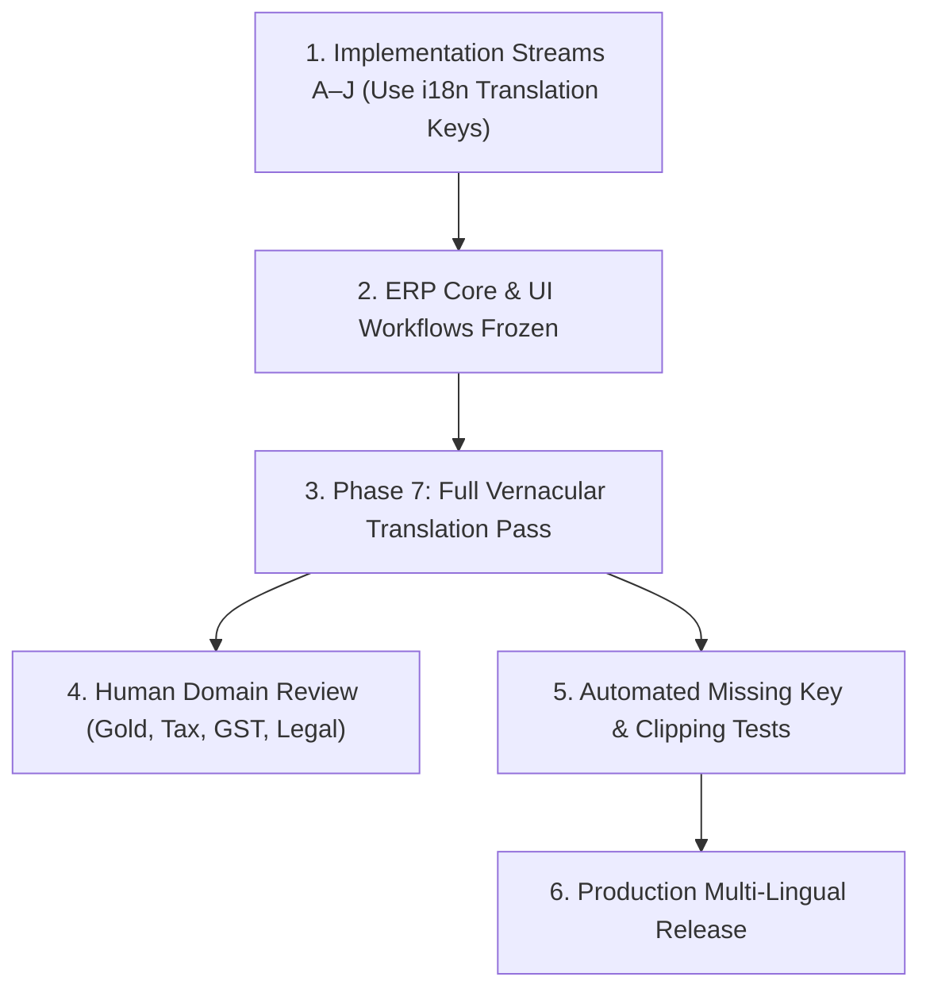

# ORNEXA — UNIVERSAL LOCALIZATION & MULTI-LANGUAGE MASTER
**Authoritative Architectural Specification for Codebase Localization Readiness, Phased Translation, Language vs Terminology Separation, and Quality Verification**
*Version: 3.3.0 (Approved Source of Truth)*
*Last Updated: August 2026*

---

## 1. Localization Philosophy: Build Ready Now, Translate Last

### 1.1 The Core Operating Principle
> **"BUILD FOR LOCALIZATION FROM DAY ONE. TRANSLATE ONLY AFTER PRODUCT LANGUAGE AND UI ARE FULLY STABLE."**
>
> To avoid wasted effort translating interfaces undergoing active feature changes, Ornexa enforces a strict phased approach:
> 1. **Codebase Localization-Ready NOW (Phase 1–5):** Zero hardcoded UI strings scattered in components. All labels, buttons, errors, empty states, and notifications MUST use translation keys (`t('auth.login')`, `t('nav.manufacturing')`).
> 2. **Full Translation Execution LAST (Phase 7):** Complete human-verified vernacular translations (Hindi, Marathi, Gujarati, Bengali) are executed once the entire ERP core, documents, settings, and workflows are frozen.



---

## 2. Orthogonal Separation: Language vs Terminology vs Document vs Communication

Ornexa treats Language, Terminology, Document Templates, and Communication Channels as four distinct, orthogonal layers:

```
┌─────────────────────────────────────────────────────────────────────────────┐
│                   FOUR-LAYER MULTI-LINGUAL ARCHITECTURE                     │
├─────────────────────────┬───────────────────────────────────────────────────┤
│ 1. User Interface Lang  │ English, Hindi (हिन्दी), Marathi (मराठी), Gujarati│
│ 2. Trade Terminology    │ Indian Trade (Karigar/Bhav) vs Standard (Worker)  │
│ 3. Document Print Lang  │ Can output Marathi tax invoices while UI is in EN │
│ 4. Party Preferred Lang │ Party 360 stores preferred WhatsApp/SMS language  │
└─────────────────────────┴───────────────────────────────────────────────────┘
```

- *Scenario A:* User Interface = **English**, Terminology = **Indian Jewellery Trade** (*Karigar, Bhav, Jama/Udhar*).
- *Scenario B:* User Interface = **Marathi**, Customer A preferred WhatsApp invoice language = **Hindi**, Customer B = **Marathi**.

---

## 3. Automated Translation Completeness Testing

Before any language pack is approved for release, automated CI/CD checks verify:
1. **Zero Missing Keys:** No fallback to English keys on non-English locales (`100% key parity`).
2. **Zero Hardcoded Strings:** Static AST lint analysis flags un-wrapped JSX strings in UI components.
3. **No Layout Clipping:** Verifies that longer vernacular phrases do not overflow or break table cell dimensions on mobile viewports (390px).

---

## 4. Human Domain Quality Review

Automated machine translation is **strictly prohibited from being used unreviewed** for statutory accounting, tax, or gold custody terms. All critical domain dictionaries must pass human expert verification:
- **Gold Terms:** Purity Touch, Fine Weight, Melting Loss / Ghat, Karigar Bench Custody, Hisab Settlement.
- **Accounting & Tax:** CGST, SGST, IGST, HSN Codes, Rounding, Dr/Cr vs Jama/Udhar.
- **Compliance:** Hallmarking BIS HUID, Delivery Challans, Tax Invoices, Weighing Scale Tare.
