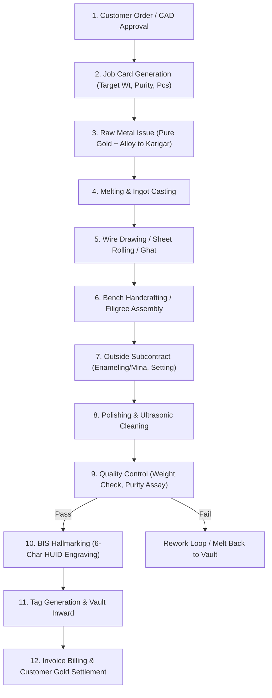
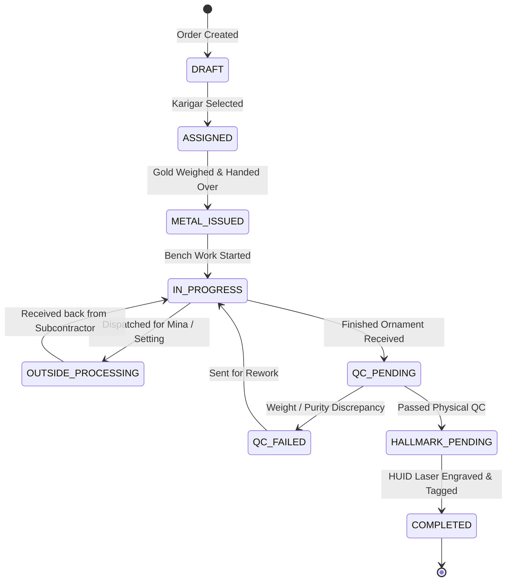

# ORNEXA — MANUFACTURING BOOK & GOLD TRACEABILITY MASTER
**Authoritative Architectural Specification for Job Cards, Stage Workflows, Karigar Metal Custody, and End-to-End Gram Accounting**
*Version: 3.1.0 (Approved Source of Truth)*
*Last Updated: August 2026*

---

## 1. Manufacturing Book as the Core Traceability Spine

### 1.1 The Core Operating Principle
> **"MANUFACTURING IN JEWELLERY IS NOT A GENERIC STOCK ADJUSTMENT. THE MANUFACTURING BOOK IS THE UNBROKEN CHAIN OF GOLD CUSTODY FROM RAW BULLION TO HALLMARKED PRODUCT."**
>
> Every milligram of metal must be fully explainable: who received it, what process was performed, what scrap was recovered, what wastage occurred, and where the finished ornament currently resides.

---

## 2. The 15 Core Gold Accountability Questions

The Manufacturing Ledger guarantees immediate, audit-backed answers to the following 15 critical questions:

| # | Operational Question | Underlying Database Evidence & Traceability Path |
|---|---|---|
| **1** | **Who currently has our gold?** | `karigar_gold_ledger` grouped by `worker_id` with active non-zero balance |
| **2** | **How much gross weight?** | Sum of physical metal issued minus confirmed scrap/returns (`current_gross_wt`) |
| **3** | **How much net weight?** | Gross weight minus wax, dust, thread, and unmounted stone tare weight |
| **4** | **How much fine gold?** | Exact pure gold equivalent: $\sum (\text{Net Weight} \times \text{Touch} \% / 100)$ |
| **5** | **What purity / touch?** | Line-by-line touch breakdown (e.g. 24K 99.9, 22K 91.6, 18K 75.0, 14K 58.5) |
| **6** | **Since when? (Ageing)** | Days elapsed since initial metal issue voucher timestamp |
| **7** | **For which specific jobs?** | Active foreign keys to `job_cards` in `IN_PROGRESS` or `OUTSIDE_WORK` state |
| **8** | **What was originally issued?** | Immutable records in `job_material_issues` (Grams, Touch, Fine) |
| **9** | **What was returned so far?** | Finished pieces, scrap metal, dust sweepings in `job_material_receipts` |
| **10**| **Expected vs Actual Output?** | Target finished gross weight vs actual scale weight at final receive |
| **11**| **Expected vs Actual Loss?** | Benchmark loss tolerance vs measured physical metal shrinkage |
| **12**| **Allowed Wastage %?** | Contracted artisan wastage threshold defined in Party 360 / Item Master |
| **13**| **Artisan Wage Due?** | Computed labour tariff based on approved piece rate or per-gram basis |
| **14**| **Pending & Delayed Jobs?** | Job cards where `current_timestamp > promised_delivery_date` |
| **15**| **Outside Work & Subcontracting?** | Metal currently stationed at Mina, Setting, Polish, Hallmark, or Refinery |

---

## 3. Detailed Manufacturing Stage Lifecycle

### 3.1 Scrap, Dust & Recovery Reconciliations
- **Daily Bench Sweepings:** Artisans submit unrecoverable fine filings and polishing dust.
- **Melting Recovery Assay:** Recovered scrap is remelted into standard bars; assay certificates record melting loss vs recovery fine gold.
- **Hisab Final Settlement:** Artisan fine balance is reconciled against authorized loss allowances. Any unexplained deficit is posted as a debit against their wage account.
