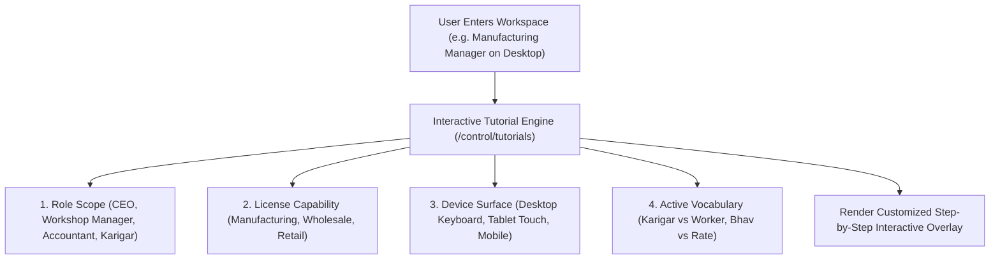
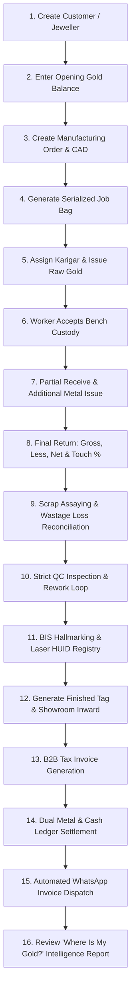

# ORNEXA — ONBOARDING, INTERACTIVE TUTORIAL & PRACTICE ENVIRONMENT MASTER
**Authoritative Architectural Specification for First-Time User Experience, Role-Aware Guided Tutorials, Manufacturing Master Tutorial, and Safe Demo Practice Mode**
*Version: 3.3.0 (Approved Source of Truth)*
*Last Updated: August 2026*

---

## 1. First-Time User Experience (FTUX) Philosophy

### 1.1 The Core Operating Principle
> **"A CUSTOMER SHOULD NOT NEED A WEEK OF IN-PERSON TRAINING SIMPLY TO OPERATE ORNEXA. AFTER INITIAL SETUP, THE PRODUCT ITSELF TEACHES THE CORRECT OPERATIONAL WORKFLOW."**
>
> When a tenant completes the initial firm provisioning, they are **never dropped onto a complex, empty dashboard** without guidance. Instead, Ornexa presents an inviting, non-blocking onboarding welcome modal:

```
┌─────────────────────────────────────────────────────────────────────────────┐
│                           WELCOME TO ORNEXA                                 │
├─────────────────────────────────────────────────────────────────────────────┤
│ Your jewellery enterprise workspace is ready. Would you like a 3-minute     │
│ interactive walkthrough of your core daily workflows?                      │
│                                                                             │
│  [ Start Guided Tutorial ]      [ Explore Myself ]      [ Remind Me Later ] │
└─────────────────────────────────────────────────────────────────────────────┘
```

- **Non-Blocking Rule:** Experienced operators or migrating jewellers can click `[ Explore Myself ]` to immediately access the workspace.
- **Replayability:** The tutorial can be reopened or restarted at any time from the top bar **Help & Learning (`?`)** menu.

---

## 2. Role-Aware & Business-Mode-Aware Tutorial Engine

Tutorials dynamically adapt to the user's **Commercial License**, **Assigned Role**, **Enabled Modules**, **Device Surface**, and **Active Terminology**:



| User Role | Licensed Business Mode | Key Guided Tutorial Milestones Taught |
|---|---|---|
| **CEO / Super Owner** | Any Mode | Executive KPI cards, *Where Is My Gold?*, Multi-branch summary, Unhedged exposure, User permissions, CEO Mobile App, Backups |
| **Manufacturing Manager**| Manufacturing | Jeweller Order $\to$ CAD $\to$ Job Card $\to$ Gold Issue $\to$ Bench Custody $\to$ Partial Receive $\to$ Scrap Recovery $\to$ QC $\to$ Hallmark |
| **Accountant** | Any Mode | Dual cash/metal ledger, Party 360 statements, Receipt vouchers, GST tax filing, Ageing schedule, Tally Prime XML export |
| **Workshop Karigar** | Manufacturing (Karigar Portal) | Mobile job view, Custody acceptance, Stage milestone updates, Partial metal return, Hisab Final settlement |
| **B2B Wholesale Manager** | Wholesale | Supplier Inward $\to$ Tag Verification $\to$ Dealer Order Booking $\to$ Stock Picking $\to$ Dispatch Challan $\to$ Wholesale Tax Bill |
| **Retail Counter Sales** | Retail | Tag scanning, Counter estimate generation, POS sales bill, Multi-payment mode, Old gold exchange |

---

## 3. The Manufacturing Master Tutorial (Complete End-to-End Walkthrough)

For jewellery manufacturers, Ornexa features an interactive 18-step master tutorial tracing a complete live order through the factory:



---

## 4. Safe Demo & Practice Company Sandbox

To allow new staff and workshop managers to learn without risking live production records:

```
┌─────────────────────────────────────────────────────────────────────────────┐
│ 🟢 PRACTICE MODE ACTIVE — DEMO JEWELLERY WORKSHOP                           │
├─────────────────────────────────────────────────────────────────────────────┤
│ You are operating in a safe sandbox with pre-loaded mock artisans, orders,  │
│ and gold lots. All transactions here are isolated from your live accounts.  │
│                                                                             │
│  [ Reset Demo Sandbox ]                    [ Exit to Live Company → ]       │
└─────────────────────────────────────────────────────────────────────────────┘
```

- **Strict Isolation Invariant:** Demo records (`is_demo = true`) are completely segregated from live production ledgers, GST reports, and statutory audits.
- **One-Click Sandbox Reset:** Users can reset sample data back to a clean state with a single click.

---

## 5. Contextual "How Does This Work?" & Visual Workflow Maps

1. **Contextual Help Badges (`?`):** Placed strategically near complex business concepts (*e.g. Touch % vs Fine Gold conversion, Wastage Ghat formulas, Print Profiles*).
2. **Visual "You Are Here" Workflow Maps:** For complex manufacturing job cards or wholesale dispatch orders, users can click **[ Show Workflow ]** to see the full lifecycle with the current stage highlighted.

---

## 6. User Progress Tracking & Tutorial Replays

- **User Progress Sync:** The system tracks tutorial progress in `user_tutorial_progress` (*Getting Started 100%, Manufacturing 70%, Accounting Not Started*).
- **Restart & Version Updates:** Users can restart any module tutorial anytime. When major new features are deployed, a non-intrusive *"What's New in v3.3"* banner offers a 60-second micro-tutorial.
