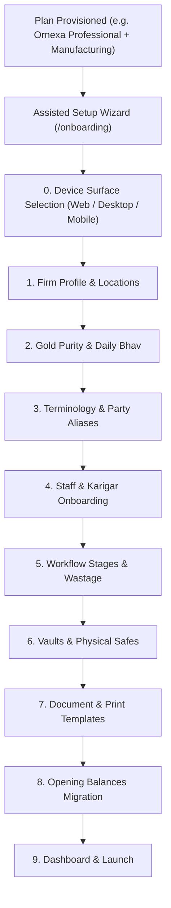

# ORNEXA — ASSISTED ONBOARDING & SETUP WIZARD MASTER
**Authoritative Architectural Specification for Assisted Tenant Provisioning, Plan-Specific Setup Wizards, Device Selection, and Expansion Workflows**
*Version: 3.2.0 (Approved Source of Truth)*
*Last Updated: August 2026*

---

## 1. Zero-Blank-Page Onboarding Philosophy

### 1.1 The Core Operating Principle
> **"TENANTS ARE NEVER DROPPED INTO AN EMPTY SYSTEM WITH DOZENS OF TECHNICAL SETTINGS SCREENS."**
>
> Following license provisioning, Ornexa automatically initiates a structured, guided **Assisted Setup Wizard** tailored strictly to the customer's purchased commercial plan (*Basic, Growth, Pro, Scale, Max*) and primary business product (*Manufacturing, Wholesale, Retail, Hybrid*).

---

## 2. Device Surface Selection During Onboarding

Before configuring business data, the wizard confirms the client surfaces included in the purchased plan:

| Purchased Plan Tier | Wizard Device Selection Prompt | Allowed Combinations | Stored Entitlement Tokens |
|---|---|---|---|
| **Ornexa Basic** | *"Choose your 1 included client platform:"* | `[ ] Web Browser` `[ ] Desktop App` *(Mobile is disabled)* | `client.web` **OR** `client.desktop` |
| **Ornexa Growth** | *"Choose your 1 included client platform:"* | `[ ] Web Browser` `[ ] Desktop App` `[ ] Mobile App` | `client.web` **OR** `client.desktop` **OR** `client.mobile` |
| **Ornexa Professional** | *"Select your 2 included client platforms:"* | Choose 2 of: `[✓] Web` \| `[✓] Desktop` \| `[✓] Mobile` | Any 2 of (`client.web`, `client.desktop`, `client.mobile`) |
| **Ornexa Scale** | *"Select your 2 included client platforms:"* | Choose 2 of: `[✓] Web` \| `[✓] Desktop` \| `[✓] Mobile` | Any 2 of (`client.web`, `client.desktop`, `client.mobile`) |
| **Ornexa Max** | *(All 3 surfaces automatically provisioned)* | All 3 Active: `Web + Desktop + Mobile` | `client.web`, `client.desktop`, `client.mobile` |

---

## 3. The 12-Stage Assisted Setup Wizard (Manufacturing Example)

When an **Ornexa Manufacturing** license is active, the wizard executes 12 logical stages:

1. **Client Device Confirmation:** Select and confirm permitted client surfaces.
2. **Firm & Registered Branches:** Firm Name, Legal Entity, Registered GSTIN, State, and Primary Workshop Location (1 Base Branch).
3. **Gold & Metal Parameters:** Active metals (Gold, Silver, Platinum), Karat Finenesses (24K, 22K 916, 18K 750), and Daily Bhav source.
4. **Party Classifications & Terminology:** Confirm terminology pack (*Indian Jewellery Trade* default) and configure initial party groups.
5. **Karigar & Worker Directory:** Bulk import or quick-add initial goldsmiths, polishers, setters, and contact numbers.
6. **Manufacturing Workflow Stages:** Activate production sequence: *Design $\to$ Melting $\to$ Bench $\to$ Mina $\to$ Polish $\to$ QC $\to$ Hallmark*.
7. **Wastage & Labour Formula Rules:** Define default Ghat/wastage % allowances by category and making charge basis (₹/g or %).
8. **Vaults & Safe Locations:** Register physical storage: Central Factory Safe, Bench WIP Safe, and Finished Goods Safe.
9. **Document Branding & Print Profiles:** Upload firm logo, select invoice & job card template family, and set thermal/laser printer margins.
10. **Opening Balances & Legacy Migration:** Launch the 13-stage Migration Wizard to import existing metal and cash balances.
11. **Reports & Dashboard Presets:** Preconfigure top dashboard cards (Bench Gold Custody, Active WIP, Promised Jobs).
12. **Executive Sign-Off & Launch:** Final review summary and one-click workspace activation.

---

## 4. Intelligent Assisted Recommendations

During initial question intake, Ornexa analyzes operational answers to offer non-intrusive commercial advice:
- *Scenario:* A tenant with an **Ornexa Basic + Manufacturing** plan checks *"We also need our workshop supervisors to scan job cards using mobile phones on the factory floor."*
- *System Response:* Displays an informative card:
  > *"Mobile app access is available in the Growth, Professional, Scale, and Max plans, or as a standalone Mobile Client Add-On. You can proceed with Desktop/Web now, or ask your account manager about mobile access."*
- *Rule:* The system **never automatically enables or charges** for unpurchased modes or client surfaces.

---

## 5. Later Expansion Wizard (Adding a New Mode or Client)

When an existing tenant purchases an additional business capability or client surface:
- **Zero Disruption:** Reuses all existing Parties, Bank Accounts, Metal Safes, and General Ledgers.
- **Dedicated Expansion Steps:** Select branch, assign dealer pricing, configure dispatch, or enable mobile app logins for authorized staff.
