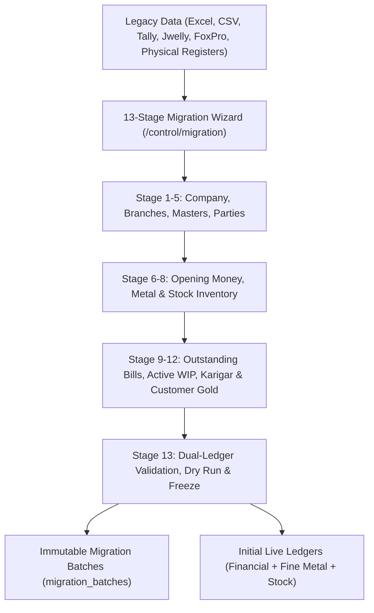
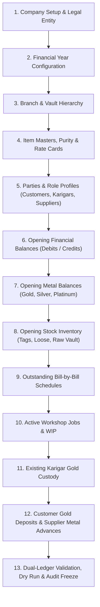

# ORNEXA — OPENING BALANCE & LEGACY MIGRATION MASTER SPECIFICATION
**Authoritative Architectural Specification for Multi-Dimensional Opening Balances, Historical Stock Ingestion, and the 13-Stage Migration Wizard**
*Version: 3.1.0 (Approved Source of Truth)*
*Last Updated: August 2026*

---

## 1. Opening Balance Philosophy (P0 Core Subsystem)

### 1.1 The Core Operating Principle
> **"A JEWELLERY BUSINESS STARTING ON ORNEXA HAS YEARS OF PRIOR TRANSACTIONS. WE NEVER REQUIRE THEM TO RE-ENTER HISTORICAL TRANSACTIONS TO BEGIN LIVE OPERATIONS."**
>
> Legacy onboarding requires a rigorous, multi-dimensional **Opening Balance & Migration Engine** capable of establishing opening financial positions, fine gold balances, physical stock tags, active workshop WIP, and supplier/customer deposits as of an exact **Migration Date**.



---

## 2. Multi-Dimensional Opening Balances (Beyond Mere Currency)

Jewellery business opening positions cannot be compressed into a single rupee figure. Ornexa models opening positions across typed, independent dimensions:

### 2.1 Party-Level Opening Dimensions
1. **Financial Balance (₹):**
   - Money Debit (Receivable from Customer)
   - Money Credit (Payable to Supplier / Karigar)
2. **Gold & Metal Balances (Grams):**
   - Gold Receivable / Payable (Pure Fine Gold in Grams)
   - Gross Weight & Touch % Breakdown (e.g. *50.000g @ 91.60 Touch = 45.800g Fine*)
   - Silver Gram Balance (Gross & Fine)
   - Platinum Gram Balance (Gross & Fine)
   - Other Metal Balances (Alloy, Copper, Brass)
3. **Gemstone & Diamond Opening Inventory:**
   - Total Diamond Carats & Piece Count
   - Total Colored Gemstone Carats / Grams
4. **Commercial Openings:**
   - Outstanding Unpaid Invoices (Bill-by-Bill Breakdown: Bill No, Date, Original Amount, Unpaid Balance)
   - Advance Cash Received / Paid (Unadjusted booking deposits)
   - Customer Gold Deposits (Physical metal held in trust for future custom orders)
   - Karigar Metal Custody (Physical gold currently resting at goldsmith benches)
   - Supplier Metal Advance (Fine gold delivered to bullion dealers pending bill)

---

## 3. Migration As-Of Date & Immutability

- Every migration batch requires an explicit **As-of Date** (e.g. `2026-04-01 00:00:00`).
- Transactions created with dates on or after the migration date are standard Ornexa operational transactions.
- Historical opening positions remain permanently tagged with `is_opening_balance = true` and `migration_batch_id`.
- Re-opening or altering an approved opening position is strictly restricted to CEO / Platform Admin roles through a controlled **Opening Adjustment Voucher**, preserving the full audit trail.

---

## 4. Comprehensive Opening Stock Categories

The migration engine ingests opening physical inventory into explicit operational locations:

| Opening Stock Category | Physical / System Location | Ingestion Schema & Attributes | Ledger & Stock Target |
|---|---|---|---|
| **Raw Pure Gold (24K)** | Main Treasury Vault | Gross Wt, Fineness (999.0 / 995.0), Bar Numbers | `vault_stock_ledger` (Pure Gold) |
| **Old Gold / Scrap Metal** | Old Gold Holding Vault | Gross Wt, Estimated Touch %, Calculated Fine Wt | `old_gold_stock_ledger` |
| **Alloy & Master Alloys** | Workshop Vault | Gross Wt, Alloy Type (Copper, Silver, Zinc) | `alloy_stock_ledger` |
| **Finished Jewellery (Tagged)** | Showroom Counters / Trays | Tag No, Category, Purity, Gross Wt, Net Wt, Stone Carats, Barcode | `inventory_items` + `tag_registry` |
| **Loose Jewellery (Untagged)** | Wholesale Stock Room | Category, Purity, Pcs, Total Gross Wt, Total Net Wt | `loose_stock_ledger` |
| **Active Job WIP** | Workshop Floors | Job Card No, Assigned Karigar, Metal Issued, Current Stage | `job_cards` + `workshop_wip_ledger` |
| **Gold with Karigar** | Outside Goldsmith Benches | Karigar ID, Gross Wt, Touch %, Fine Gold Balance | `karigar_gold_ledger` |
| **Gold at Outside Contractor**| Specialized Subcontractors | Vendor ID, Process (Mina, Setting, Polish), Gross Wt | `outside_work_ledger` |
| **Gold at Refinery** | Assaying / Refining House | Refinery ID, Melting Lot No, Gross Wt Dispatched | `refinery_custody_ledger` |
| **Gold at Hallmark Centre** | BIS Hallmarking Centre | Hallmark Vendor ID, Challan No, Piece Count, Gross Wt | `hallmark_custody_ledger` |
| **Approval / Memo Stock** | Out on Customer Approval | Customer ID, Approval Memo No, Tag Numbers, Gross Wt | `memo_approval_ledger` |
| **Branch Stock** | Multi-Branch Locations | Branch ID, Safe ID, Tagged & Loose Items | Branch Inventory Ledgers |

---

## 5. The 13-Stage Migration Wizard

Administrators execute onboarding through a structured, reversible 13-stage wizard:



### 5.1 Step-by-Step Capabilities
- **Template Download:** Pre-formatted CSV templates with sample data for each stage.
- **CSV Upload & In-Memory Parse:** High-speed streaming parser with instant schema validation.
- **Validation Preview & Error Reporting:** Highlights invalid GSTINs, negative weights, unrecognized party codes, or duplicate tag numbers in red before saving.
- **Dry-Run Simulation:** Calculates total opening assets vs liabilities, total fine gold balance, and total physical inventory without committing to database.
- **Reconciliation & Balance Sheet Check:** Verifies that Total Opening Assets = Total Opening Liabilities + Opening Capital Reserve.
- **Audit Freeze:** Generates a cryptographically signed migration batch record and transitions system to `LIVE` status.

---

## 6. End-to-End Migration & Operational Example

### 6.1 Customer Migration Scenario
On `01-Apr-2026`, Customer **Maa Durga Jewellers** is migrated with:
- **Cash Balance:** ₹85,000 Receivable (Debit)
- **Gold Deposit:** 42.350g (22K / 91.60 Touch = 38.793g Fine Gold)
- **Active Orders:** 2 Custom Wedding Necklaces pending production.

### 6.2 Subsequent Live Operations
1. **05-Apr-2026:** Customer deposits additional raw gold: `+10.000g @ 91.60 Touch` (Fine: `+9.160g`).
   - Gold Balance becomes: `52.350g Gross (47.953g Fine)`.
2. **12-Apr-2026:** Finished necklace delivered. Metal consumed in order: `18.500g Gross (16.946g Fine)`.
   - Remaining Customer Gold Balance: `33.850g Gross (31.007g Fine)`.
3. **12-Apr-2026:** Invoice making charges ₹12,000 billed.
   - Cash Receivable becomes: `₹85,000 + ₹12,000 = ₹97,000`.
4. **15-Apr-2026:** Customer pays ₹50,000 via UPI.
   - Cash Receivable becomes: `₹47,000`.

*Every gram of metal and rupee of cash is fully traceable from the initial migration snapshot through every subsequent transaction.*

---

## 7. Migration Lifecycle, Completion States & Onboarding UX Disappearance

### 7.1 First-Time Setup Prompt
During initial tenant onboarding, the user is presented with a non-intrusive choice:
```
┌─────────────────────────────────────────────────────────────────────────────┐
│                       MIGRATE EXISTING BUSINESS DATA                        │
├─────────────────────────────────────────────────────────────────────────────┤
│ Would you like to import opening cash, gold balances, stock, and karigar    │
│ records from your previous software or physical books?                      │
│                                                                             │
│  [ Start Migration Wizard ]       [ Do It Later ]       [ Start Fresh ]     │
└─────────────────────────────────────────────────────────────────────────────┘
```

### 7.2 The 7 Migration Completion States
Ornexa tracks migration lifecycle through explicit enum states in `tenant_migration_status`:

```
NOT_STARTED ──► IN_PROGRESS ──► VALIDATING ──► READY_TO_FINALIZE ──► COMPLETED
     │                                                                   ▲
     ├──► DEFERRED (Accessible later via /control/migration) ────────────┤
     │                                                                   │
     └──► SKIPPED (Tenant starts fresh with zero opening balances) ──────┘
```

1. `NOT_STARTED`: Initial uninitialized tenant state.
2. `DEFERRED`: User chose "Do It Later". Setup banner is minimized; wizard remains accessible at `/control/migration`.
3. `IN_PROGRESS`: Data is currently being ingested or reviewed across stages 1–12.
4. `VALIDATING`: Pre-flight dry-run and balance sheet checks are running.
5. `READY_TO_FINALIZE`: Dry run passed 100%; awaiting executive sign-off.
6. `COMPLETED`: Migration finalized, dual-ledgers initialized, and audit batch locked.
7. `SKIPPED`: User chose "Start Fresh". Opening positions default to zero.

### 7.3 Permanent UI Disappearance Post-Finalization
- Once migration reaches `COMPLETED` or `SKIPPED`, **the initial onboarding migration card permanently disappears from normal navigation**.
- Migration audit history remains viewable in read-only mode for statutory compliance.
- **Rerunning Protection:** Users are strictly blocked from repeatedly rerunning opening balance imports against live production ledgers. Future adjustments must use authorized Opening Adjustment Vouchers.

