# ORNEXA — FULL ERP A-TO-Z MASTER MAP
**Authoritative Encyclopedic Reference Map of Every Module, Feature, Ledger, Calculation, Report, Setting, Portal, and Architecture in Ornexa ERP**
*Version: 4.0.0 (Approved Source of Truth)*
*Last Updated: August 2026*

---

## Executive Overview: The Complete A-to-Z Operating Topology

```mermaid
graph TD
    subgraph A_to_F["Foundations & Materials (A–F)"]
        A["A: Accounts & Dual Ledgers"]
        B["B: Branches & Daily Bhav"]
        C["C: Customization & Making Rules"]
        D["D: Documents & Diamond 4Cs"]
        E["E: Entitlements & Expenses"]
        F["F: Fine Gold Traceability"]
    end

    subgraph G_to_L["Production & Operations (G–L)"]
        G["G: GST & BIS Hallmarking (HUID)"]
        H["H: Hisab Final & Hardware Scales"]
        I["I: Inventory & Tax Invoicing"]
        J["J: Job Cards (12 Stages)"]
        K["K: Karigar Bench Custody"]
        L["L: Localization & Melting Lots"]
    end

    subgraph M_to_R["Commercials & Intelligence (M–R)"]
        M["M: Migration Engine (13 Stages)"]
        N["N: Notifications & Numbering"]
        O["O: Outside Work & Old Gold"]
        P["P: Party 360 & External Portals"]
        Q["Q: Quality Control & Queries"]
        R["R: 10 Canonical Report Families"]
    end

    subgraph S_to_Z["Security & Systems (S–Z)"]
        S["S: Security RLS & Stock Audits"]
        T["T: Tag Registry & Terminology"]
        U["U: Universal Transactions"]
        V["V: Vault Safes & Verifications"]
        W["W: Workflows & WhatsApp Meta"]
        X["X: XML Tally & Exception Locks"]
        Y["Y: Year-End Close & Yields"]
        Z["Z: Zero-Loss Refining & Trust"]
    end

    A_to_F <--> G_to_L
    G_to_L <--> M_to_R
    M_to_R <--> S_to_Z
```

---

## The Complete A-to-Z Master Catalogue

### A — Accounts, Ledgers & Dual-Currency Accounting
- **Dual Cash (₹) & Metal (g) Ledgers:** Independent simultaneous balance tracking for currency and pure fine gold.
- **Chart of Accounts:** Configurable asset, liability, equity, revenue, and expense account hierarchy.
- **Day Book & Cash Book:** Real-time register of daily cash collections, bank deposits, and metal movements.
- **Bank Reconciliation:** Match bank statement transactions against issued receipts and payments.
- **Period Freeze Controls:** Hard calendar locks preventing backdated edits without CEO override PIN.
- **Tally XML Integration:** Native XML export pipeline mapped to Tally Prime accounting ledgers.

### B — Branches, Daily Bhav & Bullion Management
- **Multi-Branch Hierarchy:** Distinct state GSTINs, branch safes, physical counters, and scoped staff access.
- **Versioned Rate Book (Daily Bhav):** 24K, 22K (916), 18K (750), 14K, and Silver buy/sell spot rates with time stamps.
- **Branch Low-Radius UI:** Clean, high-density table and compact slide-in drawer (`0–6px` radius).
- **Bullion Inward & Outward:** Raw 24K bullion purchases, supplier metal advances, and spot rate booking.
- **Rate-Cut Contracts:** Fixing gold prices on delivery or deferred settlement dates.

### C — Customization, Calculations & Dynamic Fields
- **Top-Level Customization Workspace (`/control/customization`):** 11 organized business categories.
- **Calculation & Making Rule Engine:** 7-tier precedence formulas (Gross Wt, Net Wt, Per Piece, %, Carat).
- **Dynamic Form Designer:** Extensible attributes for Parties, Items, Jobs, and Invoices (`custom_fields` JSONB).
- **Centralized Dropdowns & Lists:** Lookup tables for categories, worker types, reasons, and statuses.
- **Wastage & Loss Allowances:** Configurable stage ghat % and chain wastage exclusion rules.
- **Draft $\to$ Test $\to$ Publish Versioning:** Safe test simulator on 15g mock orders with instant rollback.

### D — Documents, Diamond Matrices & CAD Studio
- **Universal Document Engine:** 10 built-in professional template families with millimeter print calibration.
- **Diamond & Gemstone Master:** 4Cs matrices (Clarity, Cut, Color, Carat) and sieve size pricing.
- **CAD Studio & 3D Render Workflow:** Customer design review, 3D asset uploads, and approval sign-offs.
- **Custom Template Import/Export:** Reusable `.ornexa-template` JSON packages.
- **Thermal POS Printing:** Compact 80mm and 58mm counter receipts with dynamic QR codes.

### E — Entitlements, Expenses & Exception Audits
- **5 Commercial Plan Tiers:** Basic, Growth, Professional, Scale, and Max.
- **Client Surface Gating:** Server-side enforcement of Web (`client.web`), Desktop (`client.desktop`), and Mobile (`client.mobile`).
- **1-Branch Base Standard:** 1 branch included by default; extra branches licensed via add-ons.
- **Workshop Expense Vouchers:** Factory gas, consumables, CAD designer fees, and overhead tracking.
- **Exception Intelligence:** Flagging negative gold positions, unauthorized discounts, or missing daily bhav.

### F — Fine Gold Traceability & Mathematical Invariants
- **"Where Is My Gold?" Matrix:** Real-time location tracking (Vault, Karigar Bench, Outside Vendor, Showroom).
- **Deterministic Touch Conversions:** $\text{Fine Gold (g)} = \text{Net Weight (g)} \times (\text{Touch \%} / 100)$.
- **Purity Standard Registry:** 24K (999), 22K (916), 18K (750), 14K (585), 925 Sterling Silver, Platinum (950).
- **Immutable Transaction Snapshots:** Freezing touch %, spot rates, and formulas at transaction commit.

### G — GST Compliance, Hallmarking & BIS HUID
- **Jewellery 3% GST Engine:** Automated calculation of CGST (1.5%) + SGST (1.5%) or IGST (3.0%).
- **Taxable Valuation Pipeline:** Metal Value + Making Charges + Stone Value + Hallmark Fee - Discounts.
- **BIS Hallmarking & HUID Registry:** 6-character alphanumeric laser hallmark tracking with vendor challans.
- **Statutory Returns Support:** Automated generation of GSTR-1 outward supply and GSTR-3B summary data.

### H — Hisab Final, Hardware Scales & Help Hub
- **Karigar Hisab Final Settlement:** Comprehensive reconciliation of metal custody, finished items, scrap, and wages.
- **Serial Weighing Scale Integration:** Direct RS-232 / USB scale reading with zero-tare calibration.
- **Training Centre & Help Hub (`/help`):** 12 structured video/SOP courses for rapid staff training.
- **Interactive Walkthroughs & FTUX:** 18-step guided Manufacturing Master Tutorial.
- **Practice Demo Sandbox:** Isolated environment (`is_demo = true`) for training without corrupting live books.

### I — Inventory, Invoicing & Item Masters
- **Multi-Attribute Item Masters:** Product category, design code, standard weight, minimum touch %, collection.
- **Stocking Modes:** Loose weight inventory, unique serialized tags, or hybrid stock.
- **B2B Wholesale Tax Invoicing:** Multi-item invoices with gold rate cuts, making charges, and credit terms.
- **Retail Counter Billing:** Instant barcode scan, payment mode splitting (Cash, UPI, Card, Old Gold).
- **Stock Transfers & Tray Movements:** Safe-to-safe and showroom tray reconciliation.

### J — Job Bags & 12-Stage Manufacturing Lifecycle
1. Customer Order & CAD Approval $\to$ 2. Job Card Generation $\to$ 3. Raw Gold Issue $\to$ 4. Melting & Casting $\to$ 5. Karigar Bench Assembly $\to$ 6. Outside Mina Enameling $\to$ 7. Diamond / Stone Setting $\to$ 8. Outside High Polish $\to$ 9. Strict QC Inspection $\to$ 10. BIS Hallmarking (HUID) $\to$ 11. Finished Tag Inward $\to$ 12. Invoicing & Hisab Settlement.

### K — Karigar Bench Custody & Workshop Operations
- **Artisan Bench Custody:** Real-time ledger of gold issued, finished weight returned, and active WIP.
- **Allowed Wastage vs Bench Loss:** Tracking actual worker loss against agreed trade thresholds.
- **Karigar Workshop Portal (`/karigar/*`):** Mobile-optimized view of assigned job bags and metal balances.
- **Worker Wage Tariffs:** Piece-rate, gram-rate, or monthly salary labour models.

### L — Localization, Loss Recovery & Melting Lots
- **Vernacular Localization:** Architecture prepared for Hindi, Marathi, Gujarati, and Bengali.
- **Number-to-Words Engine:** Regional currency formatting (Lakhs & Crores) across all printable documents.
- **Scrap & Melting Lots:** Tracking raw bench filings, dust recovery, and crucible melting assays.
- **Stage Loss Audit:** Identifying excessive loss stages (e.g. casting porosity vs polishing drag).

### M — Migration Wizard (13 Stages) & Multi-Bank Profiles
- **13-Stage Migration Wizard (`/control/migration`):** Ingest opening cash, metal, stock tags, WIP, and parties.
- **FTUX Onboarding Prompt:** Start Migration, Do It Later, or Start Fresh.
- **7 Migration States:** `NOT_STARTED`, `DEFERRED`, `IN_PROGRESS`, `VALIDATING`, `READY_TO_FINALIZE`, `COMPLETED`, `SKIPPED`.
- **Permanent UI Disappearance:** Migration card disappears post-completion; re-imports blocked on live data.
- **Party Multi-Bank Accounts:** IFSC, Account Number, Branch, and dynamic UPI QR generation.

### N — Notifications, Numbering & Meta Messaging
- **WhatsApp Meta Partner WABA:** Automated dispatch of PDF invoices, job cards, and payment receipts.
- **Email & SMS Reminders:** Payment due alerts, delivery ready notifications, and CAD approval links.
- **Custom Voucher Numbering:** Configurable prefix, suffix, date tokens, and branch sequence numbering.

### O — Outside Subcontracting & Old Gold Intake
- **Outside Work Books:** Dedicated tracking for Mina (Enameling), Polish, Setting, and Casting contractors.
- **Subcontractor Delivery Challans:** Gross weight dispatched, agreed processing rate, and expected return date.
- **Old Gold Buyback:** Melting appraisal, touch deduction, net cash payout or credit against new jewellery.

### P — Party 360, Portals & Performance Architecture
- **Unified Party 360 Directory (`/people/*`):** Customer, Dealer, Karigar, Supplier, and Refinery profiles.
- **Customer VIP Portal (`/customer/*`):** Online CAD approval, invoice history, payment ledger, and repair tracking.
- **Supplier Bullion Portal (`/supplier/*`):** Purchase order confirmations, metal delivery receipts, and billing.
- **CEO Executive Portal (`/ceo/*`):** Executive dashboards, cash flow forecasting, and metal exposure meters.
- **Performance Slicing:** Modular code splitting (FCP < 1.2s, TTI < 1.8s) and heavy library deferral.

### Q — Quality Control (QC) & Query Reports
- **Stage QC Inspection:** Mandatory checklists for casting porosity, structural solder, stone grip, and high polish.
- **Defect Rejection Routing:** Immediate return to previous stage or routing to melting scrap.
- **Universal Query Builder:** Dynamic filtering across all transaction lines, items, and parties.

### R — Reporting Engine (All 10 Canonical Families)
1. **Ledger Statements:** Dual-unit running ledgers (₹ and fine gold grams).
2. **Outstanding & Ageing:** 30/60/90+ day buckets for money and metal.
3. **Daily Books:** Cash Book, Gold Book, Silver Book, Day Book, Daily Sheet.
4. **Stock Status:** Tagged, loose, WIP, and multi-vault inventory.
5. **Registers:** Sales, Purchase, Issue, Receive, Job, and Transfer registers.
6. **Manufacturing Reports:** Worker custody, stage loss, outside work, and melting yields.
7. **Financial Statements:** Trial Balance, Trading Account, Profit & Loss, Balance Sheet.
8. **Compliance & Tax:** GSTR-1, GSTR-3B, TDS, and HUID traceability.
9. **Executive Dashboards:** Gross margin, top customers, gold exposure, and worker efficiency.
10. **Audit & Log Trails:** User activity, transaction edits, and system security events.

### S — Security, System Settings & Stock Audits
- **Multi-Tenant Row Level Security (RLS):** Authoritative database isolation at PostgreSQL layer.
- **Session Governance:** Configurable inactivity timeouts and "Clear This Browser Session".
- **Streamlined Settings (`/control/settings`):** 10 infrastructure categories (Firm, Branches, Users, Security, Backup).
- **Physical Stock Audit Engine:** Discrepancy analyzer (In-Place, Missing, Extra, Misplaced) with RFID / Barcode scanning.

### T — Tag Registry, Terminology & Training
- **Serialized Tag Management:** Unique Code 128 / QR barcodes with gross weight, net weight, touch, and stones.
- **42-Term Jewellery Dictionary:** Seamless switching between Trade terms (*Karigar, Bhav, Jama/Udhar*) and Standard terms.
- **Role-Based Guided Walkthroughs:** Contextual onboarding tailored to Sales, Goldsmiths, and Accountants.

### U — Universal Transactions & User Invitations
- **Declarative Transaction Contracts:** Single transaction engine powering Sales, Purchases, Issues, Receives, and Journals.
- **6-Ledger Invariants:** Atomic multi-ledger posting (Money, Metal, Stock, Party, WIP, Tax).
- **Cryptographic User Invitations:** Secure single-use token links for staff and external portal users.

### V — Vault Safes & Report Verifications
- **Multi-Vault Hierarchy:** Treasury Safe, Old Gold Vault, Workshop WIP Box, Showroom Counter Trays.
- **Report Verification Snapshots:** Executive audit freeze (`Verified By`, `Verified At`, `Verification Notes`).

### W — Workflows, Wastage & WhatsApp Meta
- **Custom Stage Workflows:** Define custom production routes for handmade filigree vs machine casting.
- **Allowed Scrap Tolerances:** Automatic flagging when workshop loss exceeds permitted limits.
- **WhatsApp Cloud API:** Direct business messaging without third-party aggregator dependencies.

### X — XML Tally Export & Exception Controls
- **Standard Tally Prime XML Schema:** Flawless double-entry ledger import without manual re-entry.
- **Negative Stock & Gold Prevention:** Strict validation blocking negative inventory balances.

### Y — Year-End Closing & Yield Analytics
- **Financial Year Rollover:** Automated calculation and carry-forward of closing cash and metal balances.
- **Melting Yield Analysis:** Bench scrap recovery % vs theoretical standard touch.

### Z — Zero-Loss Scrap & Zero-Trust Architecture
- **Refinery Assaying Recovery:** Full accountability from scrap handover to pure 24K bar return.
- **Zero-Trust Security:** Strict defense-in-depth from database RLS to UI role gating.
