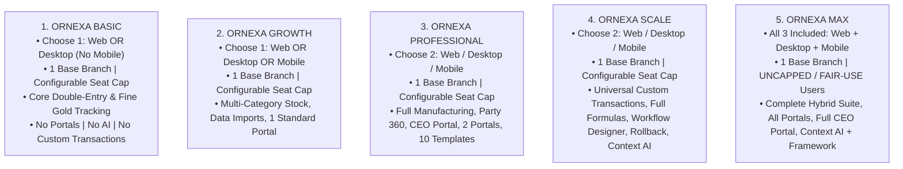

# ORNEXA — MASTER ARCHITECTURE & CAPABILITY MAP
**Authoritative Visual & Structural Navigation Map of the Entire Ornexa ERP System**
*Version: 4.0.0 (Approved Source of Truth)*
*Last Updated: August 2026*

---

## 1. Global System Topology & Universal Engine Map

```mermaid
graph TD
    subgraph DataLayer["Authoritative Cloud Backend (PostgreSQL 15+ & Supabase RLS)"]
        DualLedgers["Double-Entry Cash (₹) & Fine Gold (g) Ledgers"]
        StockVault["Tag Registry, Vault Safes & Workshop WIP"]
        PartyDB["Party 360 & Profiles (Customer, Dealer, Karigar, Supplier)"]
        ConfigDB["Customization & Versioned Config Rules (JSONB)"]
    end

    subgraph CoreEngines["The 8 Consolidated Functional Engines"]
        E1["1. Masters & Daily Bhav Engine"]
        E2["2. Universal Transaction Engine"]
        E3["3. Manufacturing & Gold Custody Book"]
        E4["4. Tag Registry & RFID Audit Engine"]
        E5["5. Universal Reporting Engine (10 Families)"]
        E6["6. Customization Workspace (11 Categories)"]
        E7["7. Universal Document Engine (10 Templates)"]
        E8["8. Assisted Onboarding & Migration Wizard"]
    end

    subgraph ClientSurfaces["Client Surfaces (Server-Side Entitlement Gated)"]
        WebClient["Web Browser App (`client.web`)"]
        DesktopClient["Desktop Native Client (`client.desktop`)"]
        MobileClient["Mobile Smartphone App (`client.mobile`)"]
    end

    subgraph Workspaces["Internal ERP & External Portal Workspaces"]
        MainERP["Main Manufacturing ERP (/*)"]
        CEOPortal["CEO Executive Portal (/ceo/*)"]
        CustomerPortal["Customer VIP Portal (/customer/*)"]
        KarigarPortal["Karigar Workshop Portal (/karigar/*)"]
        SupplierPortal["Supplier Bullion Portal (/supplier/*)"]
        PlatformOwner["Platform Owner Control Plane (/platform/*)"]
    end

    DataLayer <--> CoreEngines
    CoreEngines <--> ClientSurfaces
    ClientSurfaces <--> Workspaces
```



---

## 2. Top-Level Workspace & Navigation Map

```
┌─────────────────────────────────────────────────────────────────────────────┐
│                       ORNEXA ERP NAVIGATION TOPOLOGY                        │
├───────────────────┬─────────────────────────────────────────────────────────┤
│ 1. Home / Launch  │ Dashboard KPIs, Alerts, Portals & Workspaces Launchpad  │
│ 2. Production     │ Job Cards, CAD, Karigar Issue/Receive, Outside Mina/    │
│    (/work/*)      │ Polish Book, QC Inspection, Hallmarking (HUID), Hisab   │
│ 3. Inventory      │ Tagged Stock, Loose Stock, Box/Tray Transfers, Barcode  │
│    (/stock/*)     │ Printing, Serial Scale Tare, Physical Stock RFID Audit  │
│ 4. Parties 360    │ Customers, Dealers, Karigars, Suppliers, Refineries,    │
│    (/people/*)    │ Multi-Bank, Tax Profile, Dual Running Ledger Dossier    │
│ 5. Accounts       │ Daily Cash & Metal Book, Vouchers, Invoices, Expenses,  │
│    (/accounts/*)  │ Day Close Checklist, Period Locks, Tally XML Export     │
│ 6. Insights       │ Universal Report Engine, 10 Report Families, 4D Drill-  │
│    (/insights/*)  │ Downs, "Where Is My Gold?", GSTR-1/3B Compliance        │
│ 7. Customization  │ Top-Level Hub: Terminology, Dropdowns, Custom Fields,   │
│    (/control/     │ Making Rules, Workflows, Templates, Print Profiles,     │
│     customization)│ Portal Designers, Configuration Rollback Snapshots      │
│ 8. Settings       │ System Hub: Firm Profile, Branches (Low-Radius UI),     │
│    (/control/     │ User RBAC Invitations, Timeouts, WhatsApp Meta, Backup  │
│     settings)     │                                                         │
│ 9. Training Hub   │ Help & Learning Hub (/help), Interactive Walkthroughs,  │
│    (/help)        │ Manufacturing Master Tutorial, Demo Sandbox Environment  │
│ 10. AI Assistant  │ Permission-Aware Drawer (`Cmd+J`) & Dedicated Workspace │
│    (/assistant)   │ with Tool Registry, Voice Interruption, Write Approvals │
└───────────────────┴─────────────────────────────────────────────────────────┘
```

---

## 3. Commercial Plan Ladder & Device Entitlement Map



---

## 4. Manufacturing Lifecycle Map (The 12 Stages)

```mermaid
graph LR
    S1["1. Customer Order & CAD"] --> S2["2. Job Bag Created"]
    S2 --> S3["3. Raw Gold Issue"]
    S3 --> S4["4. Melting & Casting"]
    S4 --> S5["5. Karigar Bench Assembly"]
    S5 --> S6["6. Outside Mina Enameling"]
    S6 --> S7["7. Diamond / Stone Setting"]
    S7 --> S8["8. Outside High Polish"]
    S8 --> S9["9. Strict QC Inspection"]
    S9 --> S10["10. BIS Hallmarking (HUID)"]
    S10 --> S11["11. Tag Generation & Vault"]
    S11 --> S12["12. Invoice & Hisab Settle"]
```



---

## 5. The 12 Bounded Implementation Streams Map

```
┌─────────────────────────────────────────────────────────────────────────────┐
│                    12 SPECIALIST IMPLEMENTATION STREAMS                     │
├───────────────────────────────────┬─────────────────────────────────────────┤
│ Stream A: Jwelly Masters & Purity │ Party 360, Item Masters, Touch Fineness │
│ Stream B: Opening Migration       │ 13-Stage Wizard, FTUX Prompt, 7 States  │
│ Stream C: Customization Hub       │ Top-Level Workspace, Dropdowns, Forms   │
│ Stream D: Calculation Rules       │ Making Formulas (Gross/Net/Pcs), Labour │
│ Stream E: Universal Transactions  │ Vouchers, Old Gold Buyback, Tax Invoice │
│ Stream F: Universal Reporting     │ 10 Report Families, 4D Aggregations     │
│ Stream G: Tagging & Traceability  │ Barcodes, 6-char HUID, RFID, Scale Tare │
│ Stream H: Manufacturing Books     │ Job Bags, Bench Custody, Mina, Hisab    │
│ Stream I: Universal Documents     │ 10 Templates, Print Profiles, WhatsApp  │
│ Stream J: Portals & Invitations   │ Customer CAD, Karigar, Supplier, Staff  │
│ Stream K: Settings & UX Tokens    │ Clean Settings, Low-Radius (0-6px) UI   │
│ Stream L: QA, Security & Slicing  │ RLS, Timeouts, Backup .ornexa.enc, DoD  │
└───────────────────────────────────┴─────────────────────────────────────────┘
```

---

## 6. The 9-Phase Final Delivery Sequence Map

```
Phase 1: Core ERP Implementation (Streams A–G)
   │
   ▼
Phase 2: Integration & Workflow Completion (Double-entry, Loss reconciliation)
   │
   ▼
Phase 3: Portals, Documents, Settings & Customization (Streams H, J)
   │
   ▼
Phase 4: Performance & Modular Slicing Optimization (FCP < 1.2s, TTI < 1.8s)
   │
   ▼
Phase 5: QA, Multi-Tenant RLS Security & Backup/Restore Verification (Stream I)
   │
   ▼
Phase 6: Interactive Tutorial & Training Centre Hub (/help, Demo Sandbox)
   │
   ▼
Phase 7: [LAST PRODUCT PASS] Full Vernacular Localization & Translation Pass
   │
   ▼
Phase 8: Final Regression Testing Across All Languages, Roles & Devices
   │
   ▼
Phase 9: Production Sign-Off & Official Release
```
