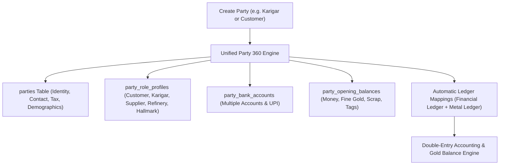
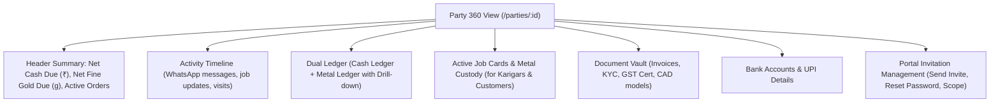

# ORNEXA — PARTY 360 ARCHITECTURE MASTER SPECIFICATION
**Authoritative Specification for Business Parties, Profile Data, Compliance, Multi-Bank Accounts, and Automatic Ledger Mapping**
*Version: 3.1.0 (Approved Source of Truth)*
*Last Updated: August 2026*

---

## 1. Unified Party 360 Philosophy

### 1.1 The Core Operating Principle
> **"USERS CREATE BUSINESS PARTIES (CUSTOMERS, KARIGARS, SUPPLIERS), NOT ACCOUNTING CHART-OF-ACCOUNTS NODES."**
>
> In legacy jewellery software, users are forced to understand complex accounting group trees merely to add a new goldsmith or wholesale buyer. In Ornexa, **Party 360** provides first-class, domain-specific party entities while automatically maintaining underlying double-entry ledgers and metal accounts.

---

## 2. Canonical Party Types & Role Classifications

Ornexa natively supports explicit party types with role-specific operational parameters:

| Party Type | Description & Operational Role | Core Role-Specific Attributes | Auto-Created Ledgers |
|---|---|---|---|
| **Customer** | Retail buyer, wholesale client, corporate jewellery buyer | Credit limit (₹ & Gold g), Price tier, CAD approval portal access | `Sundry Debtors`, `Customer Metal Deposit A/c` |
| **Supplier** | Bullion dealer, gemstone importer, casting house vendor | Payment terms, Metal purity supply terms, Vendor portal access | `Sundry Creditors`, `Supplier Metal Payable A/c` |
| **Karigar (Internal)** | In-house workshop goldsmith / bench artisan | Allowed wastage %, Making charge rate card, Gold custody limit, App login | `Karigar Labour Payable`, `Karigar Gold Custody A/c` |
| **Outside Karigar** | External specialized contractor (Setting, Mina, Polish) | Process rate card, Outside work challan terms, Metal tolerance | `Outside Jobwork Charges`, `Subcontractor Metal Custody` |
| **Refinery** | Metal refiner / assaying testing laboratory | Melting recovery tolerance, Assaying charge per batch, Assay certificate | `Refinery Charges`, `Gold at Refinery A/c` |
| **Hallmark Vendor** | BIS Hallmarking & Laser Engraving Centre (HUID) | HUID charge per piece, Turnaround SLA, Hallmark challan history | `Hallmarking Expense`, `Gold at Hallmark Centre A/c` |
| **Employee / Staff** | Sales executives, vault operators, workshop managers | Salary ledger, Incentive rate card, Branch assignment, ERP Role | `Salaries Payable`, `Staff Advance Ledger` |
| **Agent / Broker** | Jewellery commission broker / intermediary | Commission % on sales/purchase, Brokerage ledger | `Commission Payable A/c` |
| **Service Provider** | Utilities, logistics, security, software, machinery maintenance | GST classification, TDS section (194C / 194J) | `Operating Expense Ledgers`, `TDS Payable` |
| **Other Party** | General sundry parties and counterparties | General accounting classification | Configurable Chart of Accounts node |

---

## 3. Comprehensive Party Data Schema

### 3.1 Basic Business Identity (Mandatory & Core Fields)
- `party_name`: Official legal / business name (e.g. *Maa Tara Jewellers* or *Raju Das*).
- `display_name`: Familiar trade name or alias.
- `party_type`: Primary classification (from approved party types).
- `party_code`: Unique tenant-scoped alphanumeric code (e.g. `CUST-00142`, `KAR-0028`).
- `contact_person`: Primary point of contact.
- `mobile_primary`: Primary 10-digit mobile number (used for WhatsApp & SMS).
- `mobile_secondary`: Alternate mobile / landline.
- `email`: Official email address for invoices and account statements.
- `address_line1`, `address_line2`, `city`, `district`, `state`, `state_code` (2-digit GST state code), `pin_code`, `country`.

### 3.2 Optional Demographics & Personal Info (Strictly Non-Mandatory)
> *Rule: Personal details are strictly optional and configurable per tenant. Never block party creation on personal trivia.*
- `gender`, `date_of_birth`, `anniversary_date`, `marital_status`, `spouse_name`.
- `education`, `known_through` / `referral_source`, `general_notes`.

### 3.3 Statutory Compliance & Tax Configuration
- `gstin`: 15-character GST Identification Number (with live regex validation).
- `gst_registration_type`: `Regular`, `Composition`, `Unregistered`, `Consumer`, `Overseas / SEZ`.
- `pan`: 10-character Permanent Account Number.
- `tan`: Tax Deduction and Collection Account Number (where applicable).
- `msme_udyam_no`: MSME / Udyam registration number for MSME 45-day payment tracking.
- `business_type`: `Proprietorship`, `Partnership`, `Private Limited`, `Public Limited`, `HUF`, `Individual`.
- `legal_name` vs `trade_name`.
- `place_of_supply`: Default 2-digit state code for GST destination determination.
- `tds_tcs_applicability`: Configurable TDS section (194Q / 206C(1H)) and tax rates.

### 3.4 Multi-Bank Account Registry
Parties can maintain multiple verified bank accounts:
- `bank_name`: Registered bank (e.g. *State Bank of India*, *HDFC Bank*).
- `account_holder_name`: Name as per bank records.
- `account_number`: Bank account number (masked in UI for non-authorized roles).
- `account_type`: `Current`, `Savings`, `Cash Credit / OD`.
- `ifsc_code`: 11-character IFSC code (with automatic branch lookup).
- `branch_name`: Physical bank branch.
- `upi_id`: Direct UPI VPA (e.g. `merchant@upi`).
- `is_primary`: Boolean flag designating default bank for RTGS/NEFT payouts.

---

## 4. Multi-Dimensional Credit Controls

Ornexa enforces independent financial and physical metal credit boundaries:
1. **Financial Credit Limit (₹):** Maximum allowed outstanding monetary balance.
2. **Gold Weight Credit Limit (Grams):** Maximum raw/pure gold weight a karigar or customer can hold before new issues/deliveries are hard-blocked.
3. **Credit Period (Days):** Default invoice payment due window (e.g. *15 Days Trade Credit*).
4. **Stop-Billing Date:** Administrative lock date to freeze transactions for defaulting parties.

---

## 5. Party 360 Command Workspace

When opening any party in `/parties/:id`, Ornexa presents the **Party 360 Workspace**:

