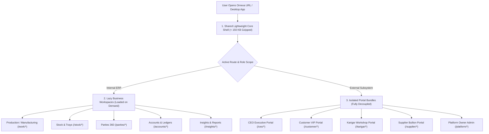

# ORNEXA — PERFORMANCE & MODULAR SLICING MASTER
**Authoritative Specification for Code Splitting, Lazy Workspace Slicing, Bundle Size Budgets, and Asset Optimization**
*Version: 3.2.0 (Approved Source of Truth)*
*Last Updated: August 2026*

---

## 1. Modular Slicing Philosophy

### 1.1 The Core Operating Principle
> **"NEVER LOAD CODE OR ASSETS UNTIL THE ACTIVE ROUTE OR ACTION SPECIFICALLY DEMANDS THEM."**
>
> To deliver desktop-fast responsiveness on low-end workshop laptops and mobile 4G factory floor connections, Ornexa partitions the application into three isolated layers.

---

## 2. Heavy Library On-Demand Deferral

The following heavy engines are **strictly prohibited** from bundling into the initial startup chunk:

| Heavy Engine / Library | Typical Uncompressed Size | On-Demand Loading Trigger |
|---|:---:|---|
| **PDF Generation Engine** (`@react-pdf` / `pdfmake`) | ~1.2 MB | Loaded only when clicking **[ Print ]** or **[ Preview PDF ]** |
| **Excel / CSV Migration Importer** (`xlsx` / `papaparse`) | ~800 KB | Loaded only when opening **Migration Wizard** or **Bulk Importer** |
| **Advanced Charting & Visualization** | ~600 KB | Loaded only when navigating to **Insights & Reports** dashboards |
| **AI Speech & Runtime Engine** | ~950 KB | Loaded only when clicking the **Assistant Mic / Chat Trigger** |
| **Rich Text & Block Template Designer** | ~450 KB | Loaded only when opening **Document Template Designer** |

---

## 3. Strict Performance Budgets

| Metric | Target Threshold | Measurement Condition |
|---|:---:|---|
| **App Shell First Paint (FCP)** | `< 1.2 seconds` | Standard 4G connection / Mid-tier laptop |
| **Time to Interactive (TTI)** | `< 1.8 seconds` | Post-login dashboard hydration |
| **Internal Route Transition** | `< 250 ms` | Client-side TanStack Router transition |
| **Initial App Bundle Size** | `< 450 KB (Gzipped)` | Vite production build analyzer |
| **Document Preview Render** | `< 400 ms` | Canvas / Iframe print preview |
| **Memory Footprint** | `< 120 MB` | Active tab RAM usage after 1 hour operation |
