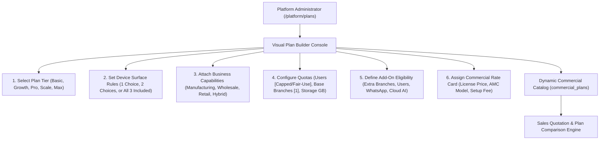

# ORNEXA — PLAN BUILDER & COMMERCIAL PACKAGING MASTER
**Authoritative Architectural Specification for the Platform Owner Plan Builder, Commercial Plan Ladder, Quotation Engine, and Add-On Infrastructure**
*Version: 3.2.0 (Approved Source of Truth)*
*Last Updated: August 2026*

---

## 1. Visual Plan Builder Philosophy

### 1.1 The Core Operating Principle
> **"PLATFORM OPERATORS CAN CREATE, BUNDLE, VERSION, PRICE, AND PUBLISH NEW COMMERCIAL PLANS WITHOUT MODIFYING CODE."**
>
> The Platform Owner Plan Builder (`/platform/plans`) empowers administrators to assemble the 5 approved commercial tiers (*Basic*, *Growth*, *Professional*, *Scale*, *Max*), licensable business capabilities, device surface quotas, and scale limits into commercial SKUs.
>
> **NO HARDCODED PRICES:** All commercial amounts, AMC percentages, and add-on rates are maintained dynamically in database configuration tables.



---

## 2. The 5 Approved Commercial Tiers in Plan Builder

| Plan Tier Code | Standard Name | Allowed Device Choices | Included Surfaces | User Quota Mode | Base Branches Included | Standard AI / Customization Scope |
|---|---|:---:|---|---|:---:|---|
| `ORNEXA_BASIC` | **Ornexa Basic** | **1 Choice** | `Web` **OR** `Desktop`<br>*(Mobile strictly excluded)* | Configurable Seat Cap | **1 Branch** | Core double-entry & gold tracking; no portals, no AI, no custom vouchers |
| `ORNEXA_GROWTH` | **Ornexa Growth** | **1 Choice** | `Web` **OR** `Desktop` **OR** `Mobile` | Configurable Seat Cap | **1 Branch** | Basic + expanded inventory/reports, standard documents, 1 standard portal |
| `ORNEXA_PRO` | **Ornexa Professional** | **2 Choices** | Any 2 of (`Web`, `Desktop`, `Mobile`) | Configurable Seat Cap | **1 Branch** | Growth + advanced manufacturing, Party 360, CEO Portal, 2 portals, 10 doc templates, print profiles, standard automation |
| `ORNEXA_SCALE` | **Ornexa Scale** | **2 Choices** | Any 2 of (`Web`, `Desktop`, `Mobile`) | Configurable Seat Cap | **1 Branch** | Pro + Universal Custom Transactions, Full Formulas, Workflow Designer, Report Builder, Rollback, Context AI |
| `ORNEXA_MAX` | **Ornexa Max** | **All 3 Included** | `Web + Desktop + Mobile`<br>*(Unrestricted access)* | **Uncapped / Fair-Use** | **1 Branch** *(Add-on branches available)* | Complete Hybrid Suite, full customization, all portals, full CEO portal, context AI + framework, priority support |

---

## 3. Dynamic Plan Comparison Engine

The public marketing website and client pricing pages generate feature comparison tables **dynamically from `commercial_plans`**:
- Eliminates out-of-sync hardcoded HTML pricing tables.
- Changes made in the Plan Builder reflect instantly on the public website and client quotation modals.

---

## 4. Sales Quotation & Deal Configuration Engine (`/platform/quotes`)

Platform Sales Operators assemble custom client contracts without writing custom code:

```
┌─────────────────────────────────────────────────────────────────────────────┐
│                       ORNEXA SALES DEAL BUILDER                             │
├─────────────────────────────────────────────────────────────────────────────┤
│ 1. Prospect / Firm:          Kalyani Jewellers Pvt Ltd                      │
│ 2. Base Plan Tier:           [ ORNEXA PROFESSIONAL (v2.1) ▼ ]               │
│ 3. Primary Business Product: [ ORNEXA MANUFACTURING ▼ ]                     │
│ 4. Client Surface Choices:   [✓] Desktop Native App   [✓] Mobile iOS/Android│
│ 5. Primary Physical Branch:  Kolkata Central Workshop (Branch 1 of 1)       │
│                                                                             │
│ ➕ COMMERCIAL EXPANSION ADD-ONS:                                             │
│  [✓] Wholesale Distribution Add-On   (business.wholesale)                   │
│  [✓] Additional Branch License (x2)  (Total 3 Branches Licensed)            │
│  [✓] Extra User Seat Pack (+10 Users)(Total 30 User Seats)                  │
│  [✓] WhatsApp Meta WABA Integration  (5,000 Messages/Month)                 │
│  [✓] Tally Prime XML Export Pipeline (addon.tally_export)                   │
│  [ ] Cloud AI Pro Tier Pack          (Unchecked)                            │
│                                                                             │
│ 📜 AMC & SERVICE TERMS:                                                     │
│  • Implementation Support:  [ Assisted 12-Stage Onboarding Wizard ]         │
│  • AMC Support Model:       [ 18% Annual Platform Care Warranty ]           │
│                                                                             │
│  [ Generate Official PDF Quote ]  [ Save Draft Deal ]  [ Activate Tenant ]  │
└─────────────────────────────────────────────────────────────────────────────┘
```

---

## 5. Generic Add-On Registry

| Add-On Code | Description | Generated Entitlement / Limit Mutation |
|---|---|---|
| `ADDON_BRANCH_EXTRA` | Additional Physical Branch License | Increments `branch.additional_count` by 1 |
| `ADDON_USER_PACK_5` | 5 Additional User Seats | Increments `quota.users` limit by 5 |
| `ADDON_BIZ_WHOLESALE`| Wholesale Distribution Hub Add-On | Grants `business.wholesale` |
| `ADDON_BIZ_RETAIL` | Retail Showroom POS Counter Add-On | Grants `business.retail` |
| `ADDON_PORTAL_EXTRA` | Additional External Subsystem Portal | Grants specific `portal.*` access |
| `ADDON_WHATSAPP_WABA`| Official Meta WhatsApp Partner Integration | Grants `feature.whatsapp_waba` + message quota |
| `ADDON_AI_CLOUD_LITE`| Metered Cloud LLM Intelligence Pack | Grants `feature.cloud_ai` + monthly token budget |
| `ADDON_TALLY_EXPORT` | Tally Prime XML Integration Pipeline | Grants `addon.tally_export` |
| `ADDON_STORAGE_100GB`| 100 GB Cloud Storage Pack | Increments `quota.storage_gb` by 100.00 |
| `ADDON_PREMIUM_CARE` | 24/7 Dedicated Account Manager & SLA | Grants `support.tier = 'PRIORITY'` |
