# ORNEXA — PLATFORM OWNER / SAAS ADMIN MASTER SPECIFICATION
**Authoritative Specification for SaaS Operations Control Centre**
*Version: 3.0.0 (Approved Source of Truth)*
*Last Updated: August 2026*

---

## 1. Platform Identity & Role

The **Platform Owner Control Centre** (`/platform` or `/saas-admin`) is the complete operational cockpit for Ornexa SaaS administrators (`saas_admin` role). It is not merely a monitoring dashboard; it is the comprehensive operations hub for managing multi-tenant subscriptions, infrastructure, Meta WhatsApp partner onboarding, AI model provisioning, and security compliance.

### 1.1 Responsive Navigation Architecture
- **Desktop:** Dedicated collapsible left sidebar with grouped operational categories.
- **Tablet:** Icon-rail navigation with slide-out secondary panels.
- **Mobile:** Full-featured drawer navigation optimized for on-the-go administrative interventions.

---

## 2. Core Operational Sections

```mermaid
graph TD
    PlatformOwner["Platform Owner Control Centre"]
    PlatformOwner --> Overview["1. Overview & Health Metrics"]
    PlatformOwner --> Tenants["2. Tenants / Firms & Tenant 360"]
    PlatformOwner --> Billing["3. Plans, Subscriptions & Metering"]
    PlatformOwner --> MetaOps["4. WhatsApp / Meta Partner Operations"]
    PlatformOwner --> AIOps["5. AI Providers, Models & Quotas"]
    PlatformOwner --> StorageOps["6. Storage (R2/S3) & Health"]
    PlatformOwner --> SupportOps["7. Support Operations & Live Chat"]
    PlatformOwner --> SecurityOps["8. Security Audit & Danger Zone"]
    PlatformOwner --> PlatformSettings["9. Feature Flags & Deployments"]
    PlatformOwner --> GlobalSettings["10. Commercial Rules & Defaults"]
```



---

## 3. Comprehensive Section Specifications

### Section 1: Overview & Real-Time Metrics
- **Platform Health:** Database latency, API response times, background cron worker status, real-time error rates.
- **Financial Summary:** Monthly Recurring Revenue (MRR), Annual Recurring Revenue (ARR), ARPU, Churn Rate.
- **Operational Alerts:** Expiring trials, payment failures, breached storage quotas, Meta webhook delivery failures.
- **Active Capacity:** Total active tenants, active concurrent users, today's database queries.

### Section 2: Tenants / Firms Management
- **Tenant Directory:** Status filters (`All`, `Active`, `Trial`, `Suspended`, `Expired`, `Churned`).
- **Tenant Onboarding Wizard:** Multi-step provisioning (Firm Name, Admin Email, Selected Plan, Initial Branch, Custom Subdomain, Automated Welcome Email).

---

## 4. The Complete Tenant 360 View

Clicking any tenant opens the **Tenant 360** — a comprehensive 360-degree cockpit containing everything about that customer:

```
┌─────────────────────────────────────────────────────────────────────────────┐
│                            TENANT 360 VIEW                                  │
├───────────────────┬─────────────────────────────────────────────────────────┤
│ Company Profile   │ Firm legal name, PAN, GSTIN, registered address, logo   │
│ Branches          │ Active physical branches, vault links, state codes      │
│ User Accounts     │ Directory of active staff, assigned roles, last active  │
│ Subscription/Plan │ Active tier, cycle (Monthly/Annual), renewal date, price│
│ Module Entitlement│ Multi-branch, Barcode, WhatsApp, AI Assistant, Portals  │
│ License Keys      │ Active hardware/device license seats, activation hash   │
│ WhatsApp / WABA   │ Embedded signup state, verified phone, credit balance   │
│ AI Intelligence   │ Monthly token usage, assigned model, quota limits       │
│ Storage & Media   │ Total R2 GB used, file count, media bandwidth usage     │
│ Billing History   │ SaaS tax invoices, payment records, outstanding balance │
│ Support Tickets   │ Customer support tickets, open incidents, SLA status    │
│ Security & Audit  │ Admin action trail, failed login attempts, IP history   │
│ Configuration     │ Active formula presets, custom fields count, print T&C  │
│ Health Score      │ Composite metric (Usage frequency, billing health)      │
└───────────────────┴─────────────────────────────────────────────────────────┘
```

---

## 5. Plans, Subscriptions & Metered Billing
- **Visual Plan Builder:** Configure the 5 approved commercial tiers (*Ornexa Basic*, *Ornexa Growth*, *Ornexa Professional*, *Ornexa Scale*, *Ornexa Max*), device surface allowances (1 choice, 2 choices, or all 3), 1 base branch limit, and user seat quotas without code changes. References: [`PLAN_BUILDER_MASTER.md`](./PLAN_BUILDER_MASTER.md), [`SAAS_ENTITLEMENT_AND_BILLING.md`](./SAAS_ENTITLEMENT_AND_BILLING.md), [`DEVICE_ACCESS_MASTER.md`](./DEVICE_ACCESS_MASTER.md), & [`BUSINESS_PRODUCT_AND_ENTITLEMENT_MASTER.md`](./BUSINESS_PRODUCT_AND_ENTITLEMENT_MASTER.md).
- **Tenant 360 Commercial Cockpit:** Manage tenant subscriptions, device surface choices, branch add-ons, and quotas at `/platform/tenants/:id`. Reference: [`TENANT_360_MASTER.md`](./TENANT_360_MASTER.md).
- **Module & Client Entitlements:** Cryptographically verifiable tokens (`client.web`, `client.desktop`, `client.mobile`, `business.manufacturing`, `business.wholesale`, `business.retail`, `wholesale.dispatch`, `retail.pos`, `addon.whatsapp_waba`, `addon.ai_assistant`).
- **Commercial Actions:** Instant sales quoting, add-on activation, time-bound trial issuance, renewal management, and plan migrations.
- **Grace Periods & Automation:** Automated email reminders at 30 days, 14 days, and 3 days before renewal; 7-day grace period followed by read-only historical transition (zero data deletion).
- **Discounts & Custom Taxes:** Support custom coupon codes and regional GST tax rates on software invoices.

---

## 6. WhatsApp / Meta Partner Operations
- **Partner Dashboard:** Status of Meta Tech Provider app, System User tokens, and Webhook endpoints.
- **Client WABA Onboarding:** Monitor Meta Embedded Signup completions, phone number verification states, and quality ratings.
- **Template Management:** Synced catalog of approved WhatsApp templates (Authentication, Utility, Marketing).
- **Billing & Cost Tracking:** Tracks raw Meta conversation costs vs billed tenant price per message.

---

## 7. AI Providers & Model Registry
- **Provider Multi-Tenancy:** Configure API keys for OpenAI, Anthropic, Google Gemini, Groq, and Local Small LLMs.
- **Model Routing:** Assign default model (e.g. `gemini-3.7-flash`, `gpt-4o-mini`, `claude-3-5-sonnet`) per tenant tier.
- **Quota & Cost Guards:** Hard monthly token budgets to prevent runaway API expenses.

---

## 8. Storage & Infrastructure Management
- **R2 / Storage Cockpit:** Track storage consumption by bucket (`firm-logos`, `stock-images`, `cad-designs`, `invoices-pdf`).
- **Integrity Checks:** Detect broken media links or orphaned upload objects.

---

## 9. Support Operations & Live Incident Response
- **Global Support Queue:** View, filter, and assign tickets across all tenants.
- **Live Support Chat:** Real-time chat console allowing platform staff to assist tenant administrators.
- **Incident Escalation:** Broadcast system maintenance banners or urgent notices directly to all tenant dashboards.

---

## 10. Security Audit & Danger Zone
- **Security Log:** Immutable record of all administrative actions, license regenerations, and plan alterations.
- **Danger Zone Controls:**
  - `Suspend Tenant:` Immediately revokes access while preserving all tenant data.
  - `Purge Demo Tenant Data:` Securely purges test records with dual-factor admin verification (Never permitted for live production firms).
