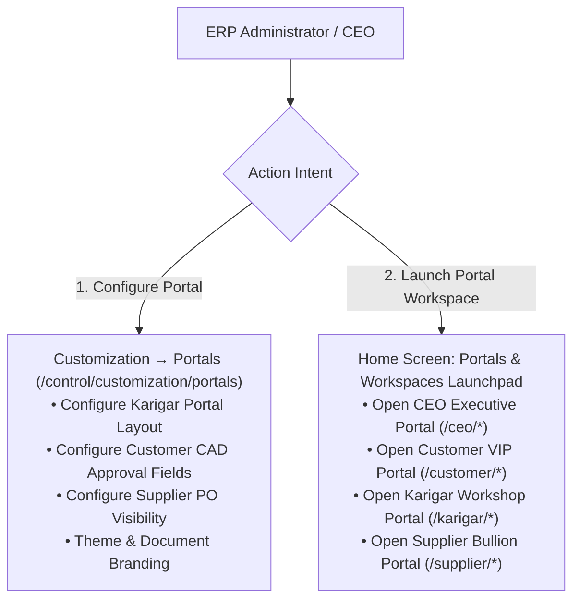

# ORNEXA — PORTAL CONFIGURATION & WORKSPACE ACCESS MASTER
**Authoritative Architectural Specification for Portal Configuration vs Portal Launching, Home Screen Portal Launchpad, and Visual Portal Designers**
*Version: 4.0.0 (Approved Source of Truth)*
*Last Updated: August 2026*

---

## 1. Architectural Distinction: Configure Portal vs Open Portal

### 1.1 The Core Operating Principle
> **"CONFIGURING A PORTAL AND OPENING A PORTAL ARE STRICTLY SEPARATE ACTIONS."**
>
> An administrator clicking *Karigar Portal* under Customization is configuring the portal's layout, allowed fields, and branding. They must **never be redirected or impersonated into the external user's portal view**.



## 2. Portal Identity Tables (August 2026)

| Table | Purpose |
|---|---|
| `portal_identities` | Maps `auth.users.id` → tenant (`firm_id`) + portal type |
| `portal_party_links` | Maps portal identity → authorized `people.id` party rows |

> **Invariant:** A portal identity belongs to one authorized tenant context and one or more explicitly linked Party relationships. No portal request may escape that authorization boundary.

---

## 3. Home Screen Portal Launchpad (`/home`)

For authorized internal staff and executives, the Home screen features a dedicated **Portals & Workspaces Launchpad**:

```
┌─────────────────────────────────────────────────────────────────────────────┐
│                           PORTALS & WORKSPACES                              │
├─────────────────────────────────────────────────────────────────────────────┤
│  🏢 [ Open CEO Portal → ]             👤 [ Open Customer Portal → ]         │
│  Executive dashboards & cash flow      VIP design approvals & digital bill  │
│                                                                             │
│  🔨 [ Open Karigar Portal → ]          📦 [ Open Supplier Portal → ]         │
│  Workshop job bags & metal custody     Bullion PO confirmation & challans   │
└─────────────────────────────────────────────────────────────────────────────┘
```

- **Role-Gated Display:** A workshop manager sees only the Karigar portal shortcut; the CEO sees CEO and Customer portals; external customers and karigars never see internal ERP workspaces.

---

## 3. Visual Portal Layout Designer (`/control/customization/portals/:portalId`)

Administrators configure each portal safely:
- **Visible Modules & Tabs:** Toggle visibility of CAD Approvals, Digital Invoices, Payment Receipts, Ledger Statement, Job Cards.
- **Field-Level Permissions:** Choose which custom fields are exposed to customers or karigars.
- **Safety Firewalls:** Total wholesale costs, raw supplier purchase prices, and internal manufacturing margin formulas are **hard-blocked** from ever being exposed to external portal endpoints.
