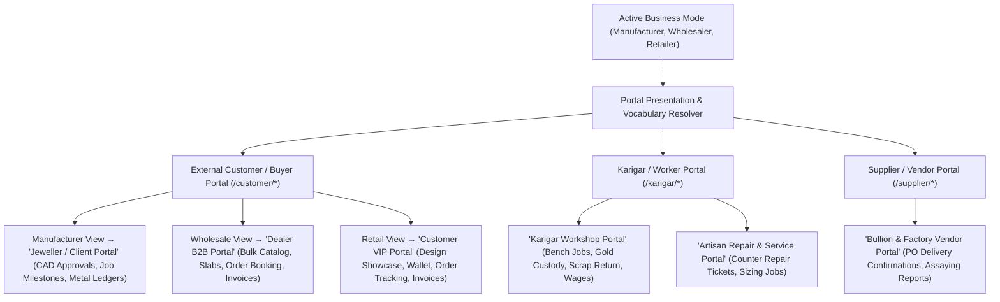

# ORNEXA — PORTAL TERMINOLOGY & B2B/B2C PRESENTATION MASTER
**Authoritative Architectural Specification for Business-Mode-Driven Portal Wording, Wholesale Dealer Portals, and Customer Privacy Firewalls**
*Version: 3.1.0 (Approved Source of Truth)*
*Last Updated: August 2026*

---

## 1. Business-Mode-Driven Portal Presentation

### 1.1 The Core Operating Principle
> **"EXTERNAL PORTALS ADAPT THEIR BRANDING, VOCABULARY, AND COMMERCIAL CAPABILITIES TO THE ACTIVE BUSINESS MODE WHILE PRESERVING ZERO-LEAK SECURITY FIREWALLS."**
>
> An external wholesale dealer ordering 500 grams of casting bangles requires a B2B ordering catalog with bulk weight ranges and trade credit statements; a retail consumer approving a diamond engagement ring CAD model requires a luxury custom milestone timeline.



---

## 2. Wholesale B2B Dealer Portal Specifications

When the Wholesaler preset is active, `/customer/*` transforms into an enterprise B2B Dealer Portal:

### 2.1 Wholesale Dealer Features
- **B2B Digital Catalogue:** High-resolution product images categorized by Collection, Gross Weight Range (e.g. *10g–15g Chokers*), and Purity (22K / 18K).
- **Price Display Tiers:** Configurable per dealer:
  - *Full Wholesale Price (Metal + Making)*
  - *Making Charges Only (Metal Spot Linked)*
  - *Inquire for Price (Catalog Only)*
- **Bulk Order Booking:** Add multiple piece counts across size variants in one tabular order sheet.
- **Real-Time Order Milestones:** `Booked` → `Allocated` → `Packing` → `Dispatched` (with Courier Tracking).
- **Dual Financial & Metal Statements:** Live view of outstanding Cash ₹ balance and Fine Gold balance.
- **Repeat Order Engine:** Instant one-click re-ordering of popular bestselling catalogue designs.

---

## 3. Strict Customer Safety Firewalls (Universal Invariant)

```
╔══════════════════════════════════════════════════════════════════════════════╗
║                   PORTAL PRIVACY & COMMERCIAL FIREWALL                       ║
╠══════════════════════════════════════════════════════════════════════════════╣
║ Across ALL business modes (Manufacturer, Wholesaler, Retailer), portal      ║
║ configuration is strictly prohibited from exposing:                          ║
║  1. Raw Bullion Procurement Costs & Vendor Purchase Bills                    ║
║  2. Internal Target Gross Margins & Profit Calculations                      ║
║  3. Karigar Names, Artisan Labour Wages, or Workshop Scrap Loss Allowances   ║
║  4. Internal Management Audit Notes, Risk Flags, or Credit Limits of Others  ║
╚══════════════════════════════════════════════════════════════════════════════╝
```
