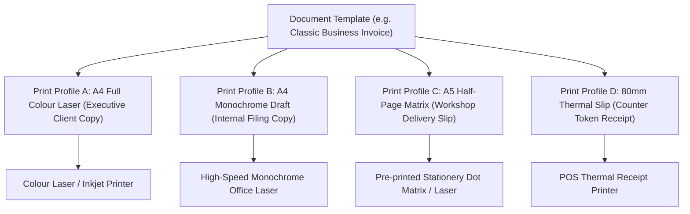
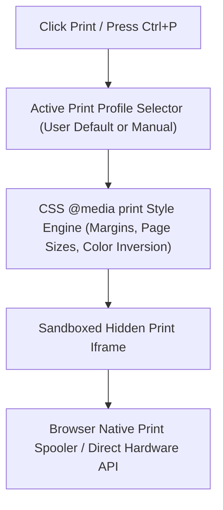

# ORNEXA — PRINT PROFILE ENGINE MASTER
**Authoritative Architectural Specification for Physical Print Targets, Printer Classes, and Output Calibration**
*Version: 3.1.0 (Approved Source of Truth)*
*Last Updated: August 2026*

---

## 1. Separation of Document Template vs Print Profile

### 1.1 The Core Operating Principle
> **"DOCUMENT TEMPLATES DEFINE WHAT THE DOCUMENT LOOKS LIKE. PRINT PROFILES DEFINE HOW IT IS PHYSICALLY PRINTED."**
>
> A single Document Template can be paired with **multiple Print Profiles** without modifying the underlying layout or business data.

---

## 2. Configurable Print Profile Attributes

Administrators can create unlimited custom print profiles with granular physical calibration controls:

| Print Profile Parameter | Available Values / Ranges | Operational Impact |
|---|---|---|
| **Media / Paper Size** | A4, A5, A6, Letter, Legal, Continuous Roll, Custom (W × H mm) | Adjusts page boundary and pagination splits |
| **Orientation** | Portrait, Landscape, Auto-Orientation | Rotates canvas for wide tables or job cards |
| **Physical Margins** | Top, Right, Bottom, Left (0.0 to 50.0 mm) | Calibrates physical printer feed offsets |
| **Scale Factor** | 50% to 150%, Fit-to-Page Width, Fit-to-Page Height | Scales content to avoid clipping |
| **Default Copy Count** | 1 to 5 copies with dynamic watermark (e.g. *Original*, *Duplicate*, *Triplicate*) | Auto-spools multiple copies in one print command |
| **Printer Class** | Laser/Inkjet, Thermal POS, Barcode/RFID Transfer, Dot Matrix Impact | Optimizes font rendering and line dithering |
| **Color Rendering Mode** | Full Color, Grayscale, High-Contrast Pure Monochrome (1-bit) | Ensures crisp text on monochrome thermal/laser |
| **Header/Footer Repeat** | Repeat on every page, First page only, Last page only | Prevents awkward duplicate headers on multi-page bills |
| **Page Breaking Rules** | Avoid row breaking (`page-break-inside: avoid`), Section break | Keeps line items and total blocks cleanly together |
| **Label Dimensions & Gaps**| Width × Height (mm), Horizontal Gap, Vertical Gap | Precision calibration for jewellery butterfly tags |

---

## 3. Built-In Default Print Profiles

Ornexa ships with pre-calibrated default print profiles covering standard jewellery operations:

1. **A4 Standard Laser (Color / Mono):** 210 × 297 mm, 12mm margins, full header/footer, high-res graphics.
2. **A4 Compact Dense:** 210 × 297 mm, 6mm margins, 90% scale factor, optimized for 15+ item invoices.
3. **A5 Half-Page Slip (Landscape / Portrait):** 148 × 210 mm, optimized for counter estimates, delivery notes, and cash receipts.
4. **80mm / 58mm Thermal Receipt:** Continuous roll, 0mm margins, bold monochrome typography, dynamic payment QR.
5. **Jewellery Tag / Butterfly Label:** 50 × 25 mm / 40 × 20 mm, high-contrast barcode + HUID + Gross/Net weight.
6. **Workshop Cardstock Slip:** A5 heavy cardstock, large margins, signature sign-off boxes for vault custody handoff.
7. **Continuous Dot Matrix Ledger:** 10 × 12 inch continuous stationery, tractor-feed margins, plain text ASCII mode.

---

## 4. Hardware Driver & Printing Pipeline

### 4.1 Zero-Clipping Print Pipeline
- **Isolated Iframe Generation:** Documents render in an isolated, headless iframe detached from main ERP DOM styles, guaranteeing zero leaking of UI sidebars or modals into print outputs.
- **Precision Millimeter CSS:** All dimensions use precise physical units (`mm`, `pt`, `in`), completely eliminating DPI scaling distortion across different monitors and OS display scaling settings.
- **Direct Thermal API Integration:** Optional Web Serial / Web USB support for direct raw ESC/POS and TSPL/ZPL label commands, bypassing operating system print dialogs for instant 1-click counter printing.
