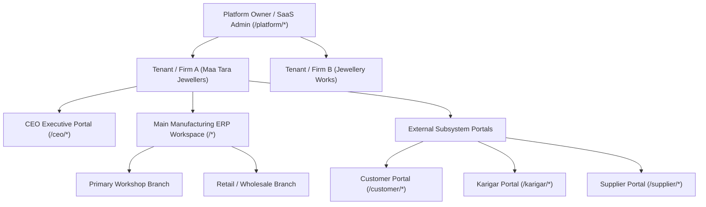

# ORNEXA — PRODUCT MASTER SPECIFICATION
**Authoritative Product Scope, Architecture & Governance Model**
*Version: 3.1.0 (Approved Source of Truth)*
*Last Updated: August 2026*

---

## 1. Product Identity & Core Mission

**Ornexa / AVS Jewellery Manufacturing ERP** is an integrated, enterprise-grade cloud operating system designed specifically for jewellery manufacturers, wholesalers, karigar workshops, and multi-branch retail-manufacturing businesses (originated from Maa Tara Jewellers real-world operations).

### 1.1 The Ultimate Ornexa Rule
> **"Ornexa must adapt to the jewellery manufacturer rather than forcing the jewellery manufacturer to adapt to Ornexa."**
>
> A legitimate business variation should normally be solved through:
> **Configuration → Custom Master → Custom Field → Formula → Workflow → Transaction Type → Document Configuration**
> before considering source-code modification.
>
> At the same time, configuration must **NEVER compromise**:
> **Security, tenant isolation, audit integrity, historical accuracy, accounting integrity, or statutory compliance.**

### 1.2 Permanent User Experience (UX) Rule
> **"Complex underneath. Simple for the person using it."**
>
> - A **Worker / Karigar** should see only what the worker needs (assigned jobs, gold custody, wages).
> - An **Accountant** should see accounting, ledgers, vouchers, and taxes.
> - A **Manufacturing Manager** should see job cards, custody, melting, stages, and QC.
> - A **CEO / Owner** should have a separate executive command portal (`/ceo/*`).
> - A **Customer** should see the customer portal (`/customer/*`).
> - A **Supplier** should see the vendor portal (`/supplier/*`).
> - **Platform Operators** should operate SaaS tenants through the Platform Owner portal (`/platform/*`).
> - The **AI Assistant** should provide a natural-language/voice route into these same authorized capabilities—not become a second, disconnected ERP.

### 1.3 Online-Authoritative Architecture
- **Production Backend:** Supabase (PostgreSQL 15+, Supabase Auth, Row Level Security, RPC functions, and Edge Functions).
- **Storage:** Secure Cloudflare R2 / Supabase Storage with signed token delivery.
- **Client App:** Modern React + TypeScript + TanStack Router & Query with Vite.
- **Obsolete Architecture Removed:** All legacy local SQLite, Electron file-protocol fallbacks, and offline-first synchronization architectures are completely deprecated. Supabase online-only is the authoritative single source of truth.

### 1.4 Permanent Product Rules (Non-Negotiable)
1. **EVERYTHING BUSINESS-SPECIFIC SHOULD BE CONFIGURABLE WITHIN SAFE SYSTEM BOUNDARIES.**
2. **CUSTOMIZATION APPLIES TO MAIN ERP, ALL PORTALS, WORKFLOWS, TRANSACTIONS, FORMULAS, DOCUMENTS AND PRESENTATION.**
3. **DESKTOP, TABLET AND MOBILE ARE THREE INTENTIONAL EXPERIENCES, NOT ONE RESPONSIVE SCREEN STRETCHED THREE WAYS.**
4. **DESKTOP MUST SUPPORT SERIOUS KEYBOARD-FIRST ERP OPERATION.**
5. **EVERY DOCUMENT TYPE MUST USE THE UNIVERSAL CONFIGURABLE DOCUMENT ENGINE.**
6. **ORNEXA SHIPS WITH AT LEAST 10 PROFESSIONAL DOCUMENT TEMPLATE FAMILIES AND SUPPORTS SAFE CUSTOM TEMPLATE IMPORT/EXPORT.**
7. **CUSTOMIZATION MUST NEVER COMPROMISE SECURITY, RLS, ACCOUNTING INTEGRITY, HISTORICAL ACCURACY OR COMPLIANCE.**
8. **COMPLEX ENGINE. SIMPLE INTERFACE. CONSISTENT ORNEXA IDENTITY.**
9. **ONE PLATFORM. MULTIPLE LICENSABLE JEWELLERY BUSINESS CAPABILITIES.** Ornexa technically supports Manufacturing, Wholesale, and Retail from one maintainable architecture. But the tenant operates only the business capabilities included in its purchased license.
10. **ASSISTED SETUP WIZARDS CONFIGURE LICENSED PRODUCTS.** The onboarding wizard assists the customer in configuring the licensed product. Terminology, labels, formulas, workflows and other business-specific behaviour remain highly customizable inside that licensed capability.
11. **EXPANSION WITHOUT CODEBASE FORKS OR DATA MIGRATIONS.** If the customer expands into another business model (e.g. adding Wholesale to Manufacturing), they purchase/activate another Ornexa business capability, run the assisted expansion wizard, and continue with their existing parties, stock, accounts, and history.
12. **WORDS ARE CONFIGURABLE; BUSINESS CAPABILITY IS LICENSED.** The tenant may customize terminology freely (*Karigar ↔ Worker*, *Bhav ↔ Metal Rate*, *Jama/Udhar*). But unlocking an additional business model requires a valid commercial license entitlement.
13. **ONE ORNEXA PLATFORM. DIFFERENT COMMERCIAL ENTITLEMENTS. ONE AUTHORITATIVE DATA SOURCE. NO PRODUCT FORKS.** Ornexa's 5 commercial tiers (*Basic*, *Growth*, *Professional*, *Scale*, *Max*) and client surface choices (Web, Desktop, Mobile) operate on a single codebase and authoritative PostgreSQL database.
14. **JWELLY IS A REFERENCE BENCHMARK; ORNEXA IS THE MODERN IMPLEMENTATION.** Jwelly is a reference for mature jewellery-business functionality; Ornexa is the modern configurable implementation of those business requirements. We do not copy old Windows forms, source code, branding, or local database sprawl.
15. **SETTINGS CONFIGURES THE SYSTEM; CUSTOMIZATION ADAPTS THE BUSINESS.** Customization is a first-class top-level workspace (`/control/customization`), not a dumping ground inside Settings. Terminology, custom dropdowns, dynamic forms, making charge rules, workflows, document templates, print profiles, and portal layouts belong under organized Customization categories.
16. **NO EMOJIS. NO AI SLOP. PROFESSIONAL JEWELLERY ERP IDENTITY.** Centralized low-radius (0–6px) design tokens, dense data tables (32px rows), keyboard-first power entry, and serious business ergonomics. No giant bubble cards, emoji icons, or fake AI gradient fluff.

---

## 2. Global System Hierarchy & User Portals

### 2.1 User Onboarding & Portal Invitation Model
- **External Portal Users (Customers, Karigars, Suppliers):** Invited directly from the main ERP (**Customer 360**, **Karigar 360**, **Supplier 360**). The recipient receives a secure single-use invitation link, sets a password, and the account maps strictly to their underlying Party record.
- **Internal ERP Operators (Managers, Accountants, Staff):** Invited exclusively by the CEO / Owner through the **CEO Portal User Administration Console** with role and branch scope assignments.
- **Password & Optional OTP Login:** All portals support standard Email/Phone + Password authentication. OTP is an optional policy-driven method.

---

## 3. Canonical Architecture & Master Documentation Index

Ornexa's authoritative domain specifications are partitioned into specialized master documents:

| Specification Area | Master Document | Key Focus & Scope |
|---|---|---|
| **Full ERP A-to-Z Master Map**| [`ORNEXA_FULL_ERP_A_TO_Z_MAP.md`](./ORNEXA_FULL_ERP_A_TO_Z_MAP.md) | Exhaustive A-to-Z encyclopedic operating map of every domain, ledger & engine |
| **Master Architecture Map** | [`ORNEXA_MASTER_ARCHITECTURE_MAP.md`](./ORNEXA_MASTER_ARCHITECTURE_MAP.md) | Global system topology, navigation, plan ladder, lifecycle & workstream map |
| **Jwelly Functional Audit** | [`JWELLY_REFERENCE_MASTER.md`](./JWELLY_REFERENCE_MASTER.md) | Reverse-audit of legacy jewellery ERP menus, fields, and transaction mechanics |
| **Jwelly to Ornexa Gap Matrix**| [`JWELLY_TO_ORNEXA_GAP_MATRIX.md`](./JWELLY_TO_ORNEXA_GAP_MATRIX.md) | Feature-by-feature gap analysis and consolidation into 8 modern engines |
| **Jewellery Baseline Matrix** | [`JEWELLERY_INDUSTRY_BASELINE_MATRIX.md`](./JEWELLERY_INDUSTRY_BASELINE_MATRIX.md) | Mandatory jewellery capability catalogue & 100% functional depth verification |
| **Customization Workspace** | [`CUSTOMIZATION_MASTER.md`](./CUSTOMIZATION_MASTER.md) | Dedicated top-level Customization hub, 11 categories, draft-publish, rollback |
| **Dynamic Forms & Custom Fields**| [`CUSTOM_FIELDS_AND_FORMS_MASTER.md`](./CUSTOM_FIELDS_AND_FORMS_MASTER.md) | Dynamic field designer, JSONB attributes, placement on UI, print & portals |
| **Masters & Dropdown Engine** | [`DROPDOWN_AND_MASTER_ENGINE.md`](./DROPDOWN_AND_MASTER_ENGINE.md) | Centralized custom lists, categories, worker types, reasons, statuses |
| **Calculation & Making Rules** | [`CALCULATION_AND_RULE_ENGINE.md`](./CALCULATION_AND_RULE_ENGINE.md) | Deterministic making charges (Gross/Net/Pcs/%), labour rules, wastage loss, GST |
| **Workflow & Stage Customization**| [`WORKFLOW_CUSTOMIZATION_MASTER.md`](./WORKFLOW_CUSTOMIZATION_MASTER.md) | Manufacturing stages, outside Mina/Polish challans, QC and approval gates |
| **Business Products & Entitlements** | [`BUSINESS_PRODUCT_AND_ENTITLEMENT_MASTER.md`](./BUSINESS_PRODUCT_AND_ENTITLEMENT_MASTER.md) | Single-engine multi-mode licensing (Manufacturing, Wholesale, Retail, Hybrid), 5 plan tiers |
| **Device Access & Client Surfaces** | [`DEVICE_ACCESS_MASTER.md`](./DEVICE_ACCESS_MASTER.md) | Licensable client surfaces (Web, Desktop, Mobile) across Basic, Growth, Pro, Scale, Max |
| **Platform Owner Tenant 360** | [`TENANT_360_MASTER.md`](./TENANT_360_MASTER.md) | SaaS Operator Tenant 360 cockpit, subscription meters, device choices, commercial actions |
| **Plan Builder & Commercial Packaging**| [`PLAN_BUILDER_MASTER.md`](./PLAN_BUILDER_MASTER.md) | Platform Owner Plan Builder, subscription tiers, multi-capability add-ons, pricing |
| **Assisted Setup & Onboarding** | [`ONBOARDING_MASTER.md`](./ONBOARDING_MASTER.md) | 12-stage assisted setup wizard, device selection, intelligent recommendations |
| **SaaS Entitlements & Billing** | [`SAAS_ENTITLEMENT_AND_BILLING.md`](./SAAS_ENTITLEMENT_AND_BILLING.md) | Multi-layer entitlement enforcement, PostgreSQL commercial schema, AMC renewals |
| **Industry Terminology Master** | [`JEWELLERY_TERMINOLOGY_MASTER.md`](./JEWELLERY_TERMINOLOGY_MASTER.md) | 42-term canonical dictionary, trade packs, Jama/Udhar vs Debit/Credit contextual rules |
| **Business Profile Designer** | [`BUSINESS_PROFILE_ENGINE.md`](./BUSINESS_PROFILE_ENGINE.md) | Profile designer, dynamic workspace renaming within licensed entitlements, versioning |
| **Workflow Presets & Lifecycles** | [`WORKFLOW_PRESET_MASTER.md`](./WORKFLOW_PRESET_MASTER.md) | Manufacturing, wholesale, retail, repair, and bespoke custom order workflow presets |
| **Transaction Preset Bundles** | [`TRANSACTION_PRESET_MASTER.md`](./TRANSACTION_PRESET_MASTER.md) | Domain starter transaction packs for Manufacturer, Wholesaler, and Retailer modes |
| **Portal Presentation & Wording** | [`PORTAL_TERMINOLOGY_MASTER.md`](./PORTAL_TERMINOLOGY_MASTER.md) | Jeweller/Dealer/Customer portal terminology, wholesale dealer features, privacy firewalls |
| **Report & Dashboard Presets** | [`REPORT_PRESET_MASTER.md`](./REPORT_PRESET_MASTER.md) | Business-mode-driven intelligence presets, executive dashboard cards, and report packs |
| **Reference Audit & Matrix** | [`JEWELLERY_ERP_REFERENCE_AUDIT.md`](./JEWELLERY_ERP_REFERENCE_AUDIT.md) | Legacy ERP capability audit, domain extraction, and modernization matrix |
| **Party 360 Architecture** | [`PARTY_360_MASTER.md`](./PARTY_360_MASTER.md) | Dedicated party types, profile data, multi-bank accounts, compliance, and auto-ledgers |
| **Opening Balances & Migration** | [`OPENING_BALANCE_AND_MIGRATION_MASTER.md`](./OPENING_BALANCE_AND_MIGRATION_MASTER.md) | Multi-dimensional opening positions (Money, Gold, Stock, WIP), 13-stage wizard |
| **Item, Material & Purity** | [`ITEM_AND_MATERIAL_MASTER.md`](./ITEM_AND_MATERIAL_MASTER.md) | Item masters, purity/stamp fineness, gemstone/diamond matrices, custom attributes |
| **Versioned Rate Book** | [`RATE_BOOK_MASTER.md`](./RATE_BOOK_MASTER.md) | Daily spot rates (bhav), branch rate cards, derived purities, and historical rate preservation |
| **Universal Transaction Engine** | [`UNIVERSAL_TRANSACTION_ENGINE.md`](./UNIVERSAL_TRANSACTION_ENGINE.md) | Declarative transaction contracts, custom lines, multi-ledger invariants, and approvals |
| **Custom Formula Engine** | [`CUSTOM_FORMULA_ENGINE.md`](./CUSTOM_FORMULA_ENGINE.md) | Deterministic math calculations, 7-tier precedence hierarchy, and snapshot immutability |
| **Manufacturing Book & Traceability**| [`MANUFACTURING_LEDGER_MASTER.md`](./MANUFACTURING_LEDGER_MASTER.md) | Job cards, karigar metal custody, stage lifecycles, and scrap/loss reconciliations |
| **Universal Reporting Engine** | [`REPORTING_ENGINE_MASTER.md`](./REPORTING_ENGINE_MASTER.md) | Central reporting architecture, multi-dimensional aggregations, and drill-down graphs |
| **Authoritative Report Catalogue** | [`REPORT_CATALOGUE.md`](./REPORT_CATALOGUE.md) | Master registry of all 10 report families, queries, metrics, RBAC, and portal visibility |
| **Tagging, HUID & RFID** | [`TAGGING_AND_TRACEABILITY_MASTER.md`](./TAGGING_AND_TRACEABILITY_MASTER.md) | Unique tag registers, 6-char HUID hallmarking, barcode/RFID, and stock audit discrepancies |
| **Tenant Backup & Portability** | [`BACKUP_RESTORE_MASTER.md`](./BACKUP_RESTORE_MASTER.md) | `.ornexa.enc` encrypted packages, 7-phase controlled restore engine, and recovery audits |
| **Accounting & Period Control** | [`ACCOUNTING_AND_PERIOD_CONTROL.md`](./ACCOUNTING_AND_PERIOD_CONTROL.md) | Dual cash/metal accounting, configurable chart of accounts, period locks, and Tally XML |
| **Universal Customization** | [`UNIVERSAL_CUSTOMIZATION_MASTER.md`](./UNIVERSAL_CUSTOMIZATION_MASTER.md) | Cross-portal configuration, safe metadata engine, staged loading, validation & rollback |
| **Adaptive UI & Design System** | [`ADAPTIVE_UI_MASTER.md`](./ADAPTIVE_UI_MASTER.md) | Desktop, Tablet, Mobile intentional ergonomics, anti-AI cliché rules, accessibility |
| **Keyboard Navigation & Input** | [`KEYBOARD_AND_INPUT_MASTER.md`](./KEYBOARD_AND_INPUT_MASTER.md) | Full keyboard operation, configurable shortcuts, conflict engine, multi-input hardware |
| **Portal Configuration** | [`PORTAL_CONFIGURATION_MASTER.md`](./PORTAL_CONFIGURATION_MASTER.md) | Visual layout designer, widget management, Customer/Karigar/Supplier/CEO firewalls |
| **Document Template Engine** | [`DOCUMENT_TEMPLATE_ENGINE.md`](./DOCUMENT_TEMPLATE_ENGINE.md) | 10 base template families, controlled block designer, conditional logic, immutability |
| **Print Profiles & Hardware** | [`PRINT_PROFILE_MASTER.md`](./PRINT_PROFILE_MASTER.md) | Separation of template vs print profile, physical margins, thermal POS & label tags |
| **Universal Localization** | [`LOCALIZATION_MASTER.md`](./LOCALIZATION_MASTER.md) | Marathi, Hindi, Gujarati, Bengali, numbers to words, jewellery terminology overrides |
| **Interactive Tutorials & FTUX**| [`ONBOARDING_AND_TUTORIAL_MASTER.md`](./ONBOARDING_AND_TUTORIAL_MASTER.md) | Role/mode-aware guided tutorials, Manufacturing Master Tutorial, sandbox demo mode |
| **Training Centre & Learning** | [`TRAINING_CENTRE_MASTER.md`](./TRAINING_CENTRE_MASTER.md) | Self-service Help & Learning Hub (`/help`), written SOPs, micro-videos, FAQ |
| **Adaptive Tutorial Ergonomics**| [`ADAPTIVE_TUTORIAL_MASTER.md`](./ADAPTIVE_TUTORIAL_MASTER.md) | Desktop keyboard guides, tablet master-detail, mobile touch, terminology binding |
| **Session & Security Governance** | [`SESSION_AND_SECURITY_MASTER.md`](./SESSION_AND_SECURITY_MASTER.md) | Inactivity timeouts, token rotation, session lifecycles, and Clear Browser Session |
| **AI Runtime Architecture** | [`AI_RUNTIME_ARCHITECTURE.md`](./AI_RUNTIME_ARCHITECTURE.md) | 3-layer AI engine, permission-aware tool registry, lazy loading, and voice flow |
| **Performance & Modular Slicing** | [`PERFORMANCE_ARCHITECTURE.md`](./PERFORMANCE_ARCHITECTURE.md) | Code splitting, lazy workspace slicing, heavy library deferral, performance budgets |
| **Future Extensibility Roadmap** | [`FUTURE_ROADMAP.md`](./FUTURE_ROADMAP.md) | Deferred retail extensions (Gold Schemes, Girvi Pawn Loans, Loyalty) without dead UI |
| **Document Printing** | [`DOCUMENT_PRINTING_MASTER.md`](./DOCUMENT_PRINTING_MASTER.md) | Central document printing architecture, high-fidelity previews, and WhatsApp delivery |
| **AI Assistant Architecture** | [`ASSISTANT_MASTER.md`](./ASSISTANT_MASTER.md) | Functional natural-language & voice assistant within authorized security bounds |
| **Database & Supabase Model** | [`DATABASE_AND_SUPABASE_MASTER.md`](./DATABASE_AND_SUPABASE_MASTER.md) | Tables, RLS, indexes, and stored procedures |
| **Implementation Matrix** | [`IMPLEMENTATION_MATRIX.md`](./IMPLEMENTATION_MATRIX.md) | Authoritative feature status, bounded workstreams, and gap analysis |

---

## 4. Code Slicing & Fast Startup Architecture

Ornexa is one connected platform, but **must never load as one monolithic JavaScript bundle**:
1. **Shared Core Bundle:** Authentication, Tenant Context, Role/Permissions, Design System, Navigation Shell, Global Services.
2. **Lazy Business Slices:**
   - `/work/*` → Manufacturing & Job Cards
   - `/stock/*` → Ready Stock, Gold Stock, Vault & Lots
   - `/parties/*` → Unified Party 360 Directory
   - `/accounts/*` → Financial Ledgers, Vouchers & Expenses
   - `/insights/*` → Reports, Intelligence & GST
   - `/communication/*` → WhatsApp, Email & Notification Hub
   - `/control/*` → Tenant Settings & Configuration
3. **Isolated Portal Slices:**
   - `/ceo/*` → CEO Executive Command Workspace
   - `/customer/*` → Customer Account & Approval Portal
   - `/karigar/*` → Artisan Job & Gold Return Portal
   - `/supplier/*` → Vendor PO & Delivery Portal
   - `/platform/*` → SaaS Platform Owner Control Centre
4. **On-Demand Heavy Utilities:**
   - PDF Print Engine & Canvas renderers
   - CSV / Excel Importers & Exporters
   - Barcode / QR / RFID Generators
   - AI Voice & LLM Engine
   - Backup & Recovery Encrypted Archive Exporter

---

## 5. Multi-Layered Backup & Recovery Architecture

Ornexa enforces an enterprise 5-layer disaster recovery model:
1. **Platform PostgreSQL Snapshots:** Continuous WAL archiving and automated point-in-time recovery.
2. **Versioned Migration History:** Git-tracked Supabase migration history.
3. **Storage Redundancy:** Cross-region R2 bucket object versioning.
4. **Tenant-Accessible Export Package:** Self-service encrypted business data export (`.ornexa.enc`) containing masters, transactions, ledgers, custom fields, and document metadata.
5. **Controlled Restoration Engine:** Pre-restore verification, checksum check, impact preview, recovery point creation, and full dual-ledger reconciliation reporting.
