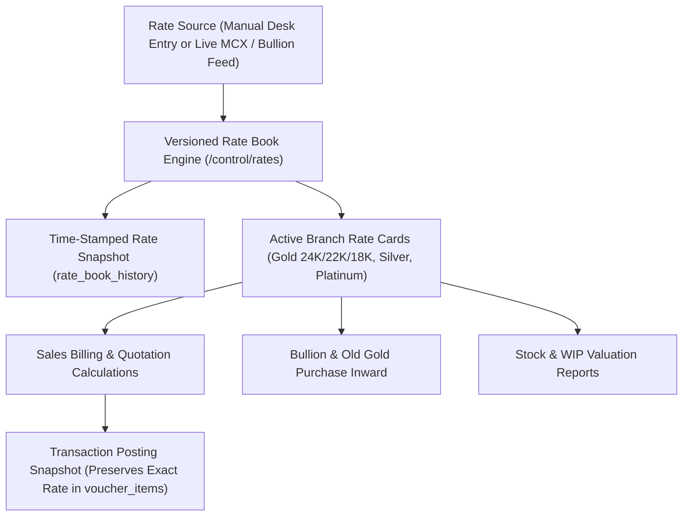

# ORNEXA — VERSIONED RATE BOOK & DAILY BHAV MASTER
**Authoritative Architectural Specification for Precious Metal Spot Rates, Branch Rate Cards, and Immutable Historical Pricing**
*Version: 3.1.0 (Approved Source of Truth)*
*Last Updated: August 2026*

---

## 1. Precious Metal Rate Book Philosophy

### 1.1 The Core Operating Principle
> **"DAILY BHAV (SPOT RATE) DRIVES ALL COMMERCIAL VALUATIONS, BUT POSTED TRANSACTIONS PERMANENTLY RETAIN THE RATE ACTIVE AT THE EXACT MOMENT OF EXECUTION."**
>
> In jewellery manufacturing and bullion trading, market prices fluctuate continuously. Ornexa's **Versioned Rate Book** maintains time-stamped rate cards across metals, purities, and branches while guaranteeing strict historical immutability.

---

## 2. Rate Book Schema & Data Model

Each rate update is stored in the immutable `rate_book_history` table:

| Rate Record Field | Data Type | Purpose & Business Logic |
|---|---|---|
| `rate_id` | `UUID` | Primary Key |
| `effective_from` | `TIMESTAMPTZ` | Exact timestamp when rate becomes active |
| `branch_id` | `UUID` (Optional) | Specific branch location (`NULL` for global tenant default) |
| `metal_type` | `VARCHAR(20)` | `GOLD`, `SILVER`, `PLATINUM`, `PALLADIUM` |
| `purity_id` | `UUID` | Purity Master reference (24K, 22K 916, 18K 750, 14K 585) |
| `touch_pct` | `NUMERIC(5,2)` | Purity fineness percentage (e.g. `91.60`) |
| `sell_rate_per_gram`| `NUMERIC(12,2)`| Retail/Wholesale Selling Rate (₹/g) |
| `buy_rate_per_gram` | `NUMERIC(12,2)`| Old Gold Buyback Rate (₹/g) |
| `reference_rate` | `NUMERIC(12,2)`| Benchmark Commodity / MCX Spot Rate (₹/10g or ₹/kg) |
| `day_high_rate` | `NUMERIC(12,2)`| Intraday High (for market monitoring) |
| `day_low_rate` | `NUMERIC(12,2)`| Intraday Low (for market monitoring) |
| `source_type` | `VARCHAR(20)` | `MANUAL_ENTRY`, `LIVE_MCX_FEED`, `BULK_BOOKING_CONTRACT` |
| `entered_by_user_id`| `UUID` | Staff user who keyed in the rate |
| `approved_by_user_id`| `UUID` | Manager/Owner who signed off on rate release |
| `status` | `VARCHAR(20)` | `ACTIVE`, `SUPERSEDED`, `DRAFT` |

---

## 3. Branch-Specific Rate Cards & Derivation Logic

Firms operating multiple showrooms or manufacturing centers across cities can maintain independent rate spreads:

### 3.1 Derived Purity Calculations
When the primary 24K Pure Gold rate is updated, Ornexa can automatically calculate secondary purity rates using tenant-configured derivation rules:
- $\text{22K Rate} = \text{24K Rate} \times \frac{91.60}{99.90} \pm \text{Branch Premium (₹/g)}$
- $\text{18K Rate} = \text{24K Rate} \times \frac{75.00}{99.90} \pm \text{Branch Premium (₹/g)}$
- $\text{14K Rate} = \text{24K Rate} \times \frac{58.50}{99.90} \pm \text{Branch Premium (₹/g)}$

*Administrators can either accept auto-derived rates or manually override individual purities.*

---

## 4. Bulk Gold Booking & Rate-Fixing Contracts

For wholesale clients and bullion suppliers who lock in gold prices in advance:
1. **Rate Booking Voucher:** Records booked rate, advance money received (₹), and locked fine gold quantity (e.g. *Booked 500.000g Gold @ ₹7,150/g*).
2. **Execution / Consumption:** When customer places orders, the transaction draws from the unfulfilled booked rate balance rather than the current day's spot bhav.
3. **Audit History:** Full log of contract creation, utilization, and remaining unhedged metal position.
