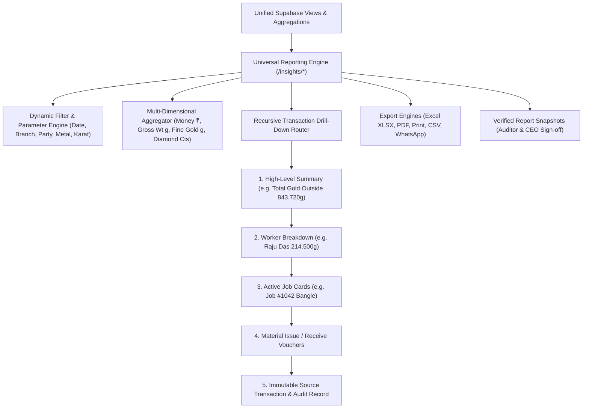

# ORNEXA — UNIVERSAL REPORTING ENGINE MASTER
**Authoritative Architectural Specification for Dynamic Datasets, Multi-Dimensional Aggregations, Drill-Down Graphs, and Verified Report Snapshots**
*Version: 3.1.0 (Approved Source of Truth)*
*Last Updated: August 2026*

---

## 1. Central Reporting Engine Philosophy

### 1.1 The Core Operating Principle
> **"DO NOT BUILD 150 UNRELATED HARDCODED REPORT PAGES. BUILD ONE CENTRAL CONFIGURABLE REPORTING ENGINE THAT POWERS THE ENTIRE JEWELLERY INTELLIGENCE CATALOGUE."**
>
> In Ornexa, a report is not a static PDF or isolated table view. It is an **interactive, multidimensional navigation layer** over the underlying immutable transaction graph.



---

## 2. Multi-Dimensional Aggregations & Columns

Standard enterprise ERPs sum only financial amounts. Ornexa's reporting engine natively computes 4 parallel aggregation totals across every table and group header:

1. **Monetary Totals (₹):** Taxable Amount, Tax, Making Charges, Discounts, Net Payable / Receivable.
2. **Gross Physical Weight (Grams):** Total physical mass on weighing scales.
3. **Pure Fine Metal Equivalent (Grams):** Calculated pure gold/silver weight based on purity touch %.
4. **Gemstone & Diamond Metrics:** Total Diamond Carats, Sieve Sizes, Piece counts, and Color/Clarity weights.

---

## 3. Recursive Drill-Down Navigation Graph

Every summary metric in an Ornexa report acts as a hyperlink down into the granular transaction graph:

```
[ Executive KPI: Gold Outstanding with Karigars = 843.720g Fine ]
   │
   ├──▶ Click metric → Opens "Karigar Gold Custody Summary"
         │
         ├──▶ Select "Raju Das (Gold Custody: 214.500g Fine)"
               │
               ├──▶ Opens "Raju Das Active Jobs & Metal Register"
                     │
                     ├──▶ Select "Job Card #JB-2026-089 (Temple Choker)"
                           │
                           ├──▶ Opens "Job Card Timeline & Material Movements"
                                 │
                                 └──▶ Click "Issue Voucher #IS-042" → Opens Original Immutable Voucher & Weigh Scale Log
```

---

## 4. Verified Report Snapshots & Period Locks

To solve the accounting dilemma of retrospective ledger changes:
- **Save As Verified Snapshot:** When an accountant or auditor finalizes a monthly reconciliation (e.g. *Monthly Metal Balance Reconciliation - July 2026*), the CEO can click **Verify & Lock**.
- **Immutable Snapshot Store:** The exact calculated numbers, active rates, and row arrays are cryptographically hashed and saved in `report_snapshots`.
- **Historical Reproducibility:** Even if underlying transaction tags are updated in subsequent months, viewing the verified snapshot renders the exact figures signed off by management.

---

## 5. Report UX Standards & Clean Empty States

1. **Zero Technical Error Leakage:** If a query returns 0 rows, the UI displays a clean, contextual empty state:
   - ✅ *"No gold is currently outstanding with outside workers."*
   - ✅ *"No unpaid invoices found for this date range."*
   - ❌ **NEVER DISPLAY:** *"Could not load data from Supabase"* or technical SQL stack traces.
2. **Saved Views & Personal Presets:** Users can bookmark complex filter combinations (e.g. *Filter: 22K Gold + Branch Kolkata + Ageing > 14 Days*) as a one-click tab on their dashboard.
3. **High-Speed Virtualized Data Grids:** Tables rendering 10,000+ rows use virtualized scrolling (TanStack Table) with fixed headers, sticky column pins, and live client-side sorting.
