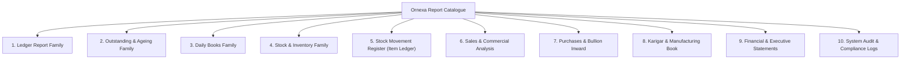

# ORNEXA — AUTHORITATIVE JEWELLERY REPORT CATALOGUE
**Complete Master Registry of Financial, Metal, Manufacturing, Stock, and Audit Intelligence Reports**
*Version: 3.1.0 (Approved Source of Truth)*
*Last Updated: August 2026*

---

## 1. Report Catalogue Taxonomy & Structure

This catalogue defines every standard jewellery intelligence report in the Ornexa ecosystem. Each report specification details:
- **Purpose & Target Audience**
- **Source Tables / SQL Views**
- **Supported Dynamic Filters & Groupings**
- **Aggregated Column Metrics (Money ₹, Gross Wt g, Fine Gold g, Diamond Cts)**
- **Drill-Down Navigation Target**
- **Export & Print Capabilities**
- **RBAC Security Grants & Portal Visibility**
- **Implementation Status** (`EXISTS`, `PARTIAL`, `MISSING`, `PLANNED`)

---

## 2. Master Report Family Registry

---

### Family 1: Ledger Reports (Financial & Metal Grams)

#### 1.1 Dual Cash & Metal Account Ledger
- **Purpose:** Full chronological statement of monetary debits/credits and physical metal (Gross & Fine Gold) movements for a specific party.
- **Audience:** Accountants, Business Owners, Customers, Karigars, Bullion Suppliers.
- **Source View:** `v_party_dual_ledger` (joins `journal_entries`, `gold_ledger_entries`, `voucher_headers`).
- **Required Filters:** `party_id` (Mandatory), `date_range`, `branch_id`, `metal_type` (Gold / Silver / All).
- **Columns:** Date, Voucher Type, Voucher No, Narration, Cash Debit (₹), Cash Credit (₹), Cash Balance (₹), Metal Gross In (g), Metal Gross Out (g), Metal Gross Balance (g), Fine Gold In (g), Fine Gold Out (g), Fine Gold Balance (g).
- **Totals:** Opening Balance, Period Debits/Credits, Period Metal In/Out, Closing Cash & Fine Gold Balance.
- **Drill-Down:** Clicking any Voucher No opens the immutable source transaction document.
- **Export / Print:** PDF Statement (A4), Excel XLSX, WhatsApp Direct Delivery.
- **RBAC / Portals:** `accountant`, `owner`, `manager`; Available on Customer Portal (filtered to own party) & Karigar Portal (filtered to own wages/gold).
- **Status:** `PARTIAL`

#### 1.2 Bill-Wise Outstanding Ledger
- **Purpose:** Tracks unsettled sales and purchase invoices with partial payments and days overdue.
- **Audience:** Credit Managers, Cashiers, Accountants.
- **Source View:** `v_bill_wise_open_items`.
- **Columns:** Bill Date, Bill No, Due Date, Days Overdue, Original Amount (₹), Paid Amount (₹), Balance Due (₹), Original Gold (g), Gold Received (g), Balance Gold (g).
- **Totals:** Total Billed, Total Paid, Total Outstanding (₹ & Gold g).
- **Status:** `PARTIAL`

---

### Family 2: Outstanding & Ageing Analysis

#### 2.1 Debtors & Creditors Ageing Schedule
- **Purpose:** Classifies outstanding receivables and payables across standard credit age brackets.
- **Audience:** CEO, CFO, Credit Control Officers.
- **Source View:** `v_party_ageing_summary`.
- **Filters:** `party_type` (Customer / Supplier), `as_of_date`, `branch_id`, `min_balance`.
- **Columns:** Party Code, Party Name, Contact, Credit Limit (₹), Total Outstanding (₹), Current (<30 Days), 31–60 Days, 61–90 Days, >90 Days Overdue.
- **Totals:** Sum across all age buckets.
- **Drill-Down:** Clicking a party opens their detailed Bill-Wise Ledger.
- **Status:** `PARTIAL`

#### 2.2 Karigar Gold Custody Outstanding
- **Purpose:** Identifies all internal and outside artisans holding company metal and tracks metal ageing.
- **Audience:** Workshop Managers, Vault Custodians, CEO.
- **Source View:** `v_karigar_gold_custody_ageing`.
- **Columns:** Karigar Code, Name, Mobile, Workshop Location, Active Jobs Count, Total Gross Wt (g), Average Touch %, Total Fine Gold Held (g), Max Holding Days, Oldest Issue Date.
- **Totals:** Total Physical Gold at Outside Benches (Gross & Fine g).
- **Drill-Down:** Clicks down into Karigar Job Cards and Material Issue slips.
- **Status:** `PARTIAL`

---

### Family 3: Daily Books & Treasury

#### 3.1 Daily Day Book
- **Purpose:** Comprehensive journal of every financial, metal, and stock transaction executed on a single business day.
- **Audience:** Cashiers, Vault Officers, Day-Close Auditors.
- **Source View:** `v_daily_day_book`.
- **Columns:** Time, Voucher No, Type, Party Name, Cash In (₹), Cash Out (₹), Bank In (₹), Bank Out (₹), Gold In (g), Gold Out (g), User.
- **Totals:** Opening Cash/Gold + Day Receipts - Day Payments = Closing Balance.
- **Status:** `EXISTS`

#### 3.2 Daily Gold Vault Movement Book
- **Purpose:** Tracks vault in-and-out handovers: Raw gold inward, issue to melting, receive from karigars, delivery to hallmarking.
- **Audience:** Vault Custodians, Production Heads.
- **Columns:** Time, Source Vault, Destination (Karigar/Refinery/Counter), Metal Type, Gross Wt, Touch %, Fine Gold, Handoff Signatory.
- **Totals:** Daily Inward Fine Gold, Daily Outward Fine Gold, Vault Net Balance.
- **Status:** `PARTIAL`

---

### Family 4: Stock & Inventory Management

#### 4.1 Finished Tag Stock Status
- **Purpose:** Catalog of all serialized/barcoded jewellery items in inventory by counter, tray, or box.
- **Audience:** Showroom Managers, Inventory Audit Staff.
- **Source View:** `v_tag_inventory_active`.
- **Filters:** `category_id`, `purity_id`, `box_tray_id`, `weight_range`, `status` (`IN_STOCK`, `ON_MEMO`, `SOLD`).
- **Columns:** Tag No, Barcode, HUID, Item Name, Category, Purity, Gross Wt (g), Less Wt (g), Net Wt (g), Stone Carats, Making Rate, Cost Price, MRP (₹), Tray Location, Stock Age (Days).
- **Totals:** Total Pieces, Total Gross Wt, Total Net Wt, Total Diamond Carats, Total Value.
- **Drill-Down:** Clicks into Tag History (Date manufactured, Karigar, Source Job Card, Sales Invoice).
- **Status:** `PARTIAL`

#### 4.2 Raw Material & WIP Inventory Summary
- **Purpose:** Consolidated breakdown of unmanufactured bullion, scrap metal, alloy, and active workshop WIP.
- **Audience:** Production Directors, CEO.
- **Columns:** Material Category, Physical Location (Vault, Melting Furnace, Bench WIP, Outside Mina, Refinery), Gross Wt (g), Fine Wt (g), Valuation (₹).
- **Totals:** Total Company Metal Assets (Liquid Vault vs In-Process WIP).
- **Status:** `PARTIAL`

---

### Family 5: Stock Movement Register (Item Ledger)

#### 5.1 Drillable Item Movement Ledger
- **Purpose:** Complete traceability of any SKU or bulk metal item proving:
  $$\text{Opening} + \text{Inward} + \text{Produced} + \text{Transfers In} - \text{Issued} - \text{Sold} - \text{Transfers Out} \pm \text{Adjustments} = \text{Closing}$$
- **Audience:** Auditors, Inventory Controllers.
- **Source View:** `v_stock_movement_ledger`.
- **Columns:** Date, Voucher Type, Ref No, Inward Qty/Wt, Outward Qty/Wt, Balance Qty/Wt, Inward Fine Gold, Outward Fine Gold, Balance Fine Gold.
- **Drill-Down:** Hyperlinks directly to underlying purchase, job card, or sale voucher.
- **Status:** `PARTIAL`

---

### Family 6: Sales & Commercial Analysis

#### 6.1 Sales Register (Detailed & Bill-Wise)
- **Purpose:** Comprehensive tax and revenue breakdown for B2B and retail sales invoices.
- **Audience:** Sales Managers, Tax Accountants.
- **Source View:** `v_sales_register_detailed`.
- **Columns:** Bill Date, Invoice No, Customer Name, GSTIN, State Code, Gross Wt, Net Wt, Fine Gold, Metal Value, Making Charges, Other Charges, Taxable Amount, CGST, SGST, IGST, Round Off, Net Bill Total (₹).
- **Totals:** Total Revenue, Total Metal Sold (Gross & Fine g), Total Tax Collected.
- **Status:** `EXISTS`

---

### Family 7: Purchases & Bullion Inward

#### 7.1 Bullion & Old Gold Purchase Register
- **Purpose:** Inward audit of purchased 24K bullion bars and customer old gold buybacks.
- **Audience:** Purchase Managers, Bullion Vault Officers.
- **Columns:** Purchase Date, Bill No, Supplier/Party Name, Material (Bullion / Scrap / Diamonds), Gross Wt, Assaying Touch %, Fine Gold Wt, Purchase Rate (₹/g), Total Bill Amount (₹), Payment Status.
- **Totals:** Total Metal Procured, Total Fine Weight Added to Vault, Total Vendor Payables.
- **Status:** `PARTIAL`

---

### Family 8: Karigar & Manufacturing Book

#### 8.1 Karigar Job Card Status & WIP Register
- **Purpose:** Real-time operational board of every active manufacturing job in the workshop.
- **Audience:** Workshop Supervisors, Karigars.
- **Columns:** Job Card No, Order Ref, Customer, Item Description, Assigned Karigar, Target Gross Wt (g), Metal Issued (g), Current Stage (Melting, Filing, Setting, Mina, Polish, QC, Hallmark), Start Date, Promised Delivery, Stage Status.
- **Status:** `EXISTS`

#### 8.2 Karigar Wastage, Loss & Settlement Register (Hisab)
- **Purpose:** Reconciles metal issued against finished ornaments and scrap returned to compute actual loss vs allowed tolerance.
- **Audience:** Production Managers, Accounts Settlement Officers.
- **Columns:** Settlement ID, Karigar Name, Period, Total Metal Issued (Fine g), Total Finished Received (Fine g), Total Scrap Returned (Fine g), Actual Loss (g), Allowed Wastage (g), Excess Deficit (g), Labour Charges Payable (₹), Penalty / Deduction (₹), Net Settlement Amount (₹).
- **Drill-Down:** Clicks into detailed Job-by-Job Hisab statement.
- **Status:** `PARTIAL`

---

### Family 9: Financial & Executive Statements

#### 9.1 Double-Entry Trial Balance
- **Purpose:** Complete verification of general ledger debits and credits across all account groups.
- **Audience:** Chartered Accountants, CFO, CEO.
- **Source View:** `v_trial_balance`.
- **Columns:** Account Code, Account Group, Account Name, Opening Debit/Credit, Period Transactions (Dr/Cr), Closing Debit (₹), Closing Credit (₹).
- **Integrity Rule:** Total Closing Debits MUST exactly equal Total Closing Credits.
- **Status:** `PARTIAL`

#### 9.2 Manufacturing Trading & Profit/Loss Statement
- **Purpose:** Executive statement of sales revenue, raw material cost of goods sold (COGS), karigar manufacturing expenses, and gross/net profit.
- **Audience:** CEO / Platform Owner (`/ceo/*`).
- **Safety Rule:** Strictly hidden from non-executive roles, Karigar Portal, and Customer Portal.
- **Status:** `PARTIAL`

---

### Family 10: System Audit & Compliance Logs

#### 10.1 Transaction Revision & Deletion Audit Trail
- **Purpose:** Immutable forensic log tracking every modification, reversal, rate change, and opening balance edit.
- **Audience:** Internal Auditors, System Administrators.
- **Source Table:** `system_audit_logs`.
- **Columns:** Timestamp, User ID, Role, IP Address, Entity Name, Entity ID, Action (`INSERT`, `UPDATE`, `REVERSAL`, `DELETE`), Diff Snapshot (Old Value vs New Value), Reason for Change.
- **Status:** `PARTIAL`
